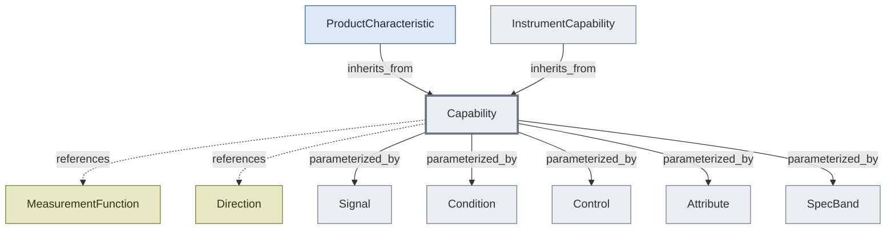

# Capability Shape — Products and Instruments Share It

ProductCharacteristic and InstrumentCapability inherit the same Capability base. Matching pairs DUT OUTPUT with instrument INPUT by direction flip — same fields, same shape, different sides of the bench. SpecBand drives condition-dependent overrides on both.

## Concepts in this slice

- [attribute](../index.md#attribute) — Fixed hardware fact (bandwidth, sample rate, scpi_version) — value or range or options, optionally banded.
- [capability](../index.md#capability) — What a signal endpoint can do — base of both ProductCharacteristic (DUT side) and InstrumentCapability (bench side). Function + direction + signals/conditions/controls/attributes. ATML/IVI/ IEEE 1641 lineage.
- [condition](../index.md#condition) — Operating condition that affects accuracy (frequency, temperature, NPLC, …). NOT user-adjustable — describes the envelope under which specs were characterized.
- [control](../index.md#control) — A user-configurable knob (coupling, autorange, setpoint, …).
- [direction](../index.md#direction) — Signal direction (INPUT / OUTPUT). Capability matching pairs DUT OUTPUT with instrument INPUT.
- [instrument_capability](../index.md#instrument-capability) — Capability + channel list + operational metadata. The instrument- side dialect of the shared Capability shape.
- [measurement_function](../index.md#measurement-function) — Canonical measurement-function vocabulary — dc_voltage, ac_current, resistance, frequency, waveform, etc. ATML/IVI-derived.
- [product_characteristic](../index.md#product-characteristic) — A DUT capability tied to a physical interface (pin/pins/net/ signal_group) with optional datasheet ref. Extends Capability — the matching service pairs DUT OUTPUT characteristics with instrument INPUT capabilities by direction flip.
- [signal](../index.md#signal) — A measurable/sourceable parameter (range + accuracy + resolution).
- [spec_band](../index.md#spec-band) — Condition-dependent spec override — "at this operating point, here are the specs." Empty `when:` always matches. Anchors the shared "top-level default + optional when:-keyed override" pattern.
