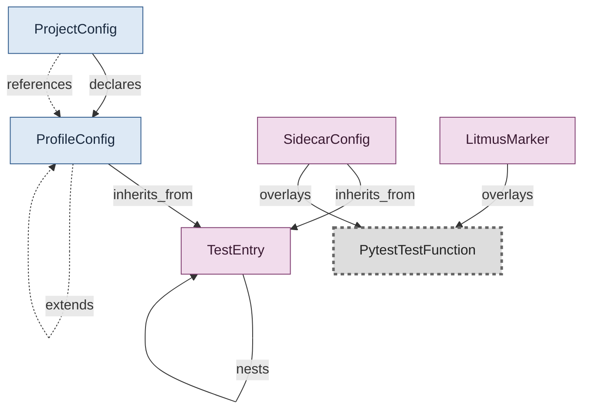

# Config Layering — Profile, Sidecar, Marker

Three authoring paths that overlay onto a pytest test function: profile (session-wide), sidecar (per-module), marker (per-function). All converge on the same TestEntry shape; profiles can extend each other via last-wins merge.

## Concepts in this slice

- [litmus_marker](../index.md#litmus-marker) — A @pytest.mark.litmus_* decorator on a test. Anything authorable in a sidecar's marker fields can also be written as a marker. Same vocabulary; the marker form is closer to the code.
- [profile_config](../index.md#profile-config) — Named config set applied to a pytest session. Same flat shape as a TestEntry plus profile-only description/facets/extends and an optional station_type / fixture binding. Selected via CLI facets.
- [project_config](../index.md#project-config) — Project root config. Names the default station/fixture/profile, data dir, multi-slot knobs, profiles, and required operator inputs.
- [pytest_test_function](../index.md#pytest-test-function) — A pytest test function (`def test_...`) or test method. Owned by pytest; Litmus markers and sidecar config overlay on top of it.
- [sidecar_config](../index.md#sidecar-config) — Top-level shape of a per-test-module sidecar YAML. Same flat TestEntry shape; the file root carries file-level marker fields and a nested tests: tree.
- [test_entry](../index.md#test-entry) — Recursive node in a sidecar/profile tests: tree. Mirrors pytest's node-id structure: class = branch with own marker fields + nested tests:; function = leaf. Reserved keys at every level: runner, tests. Every other key is a typed Litmus-marker sub-model.
