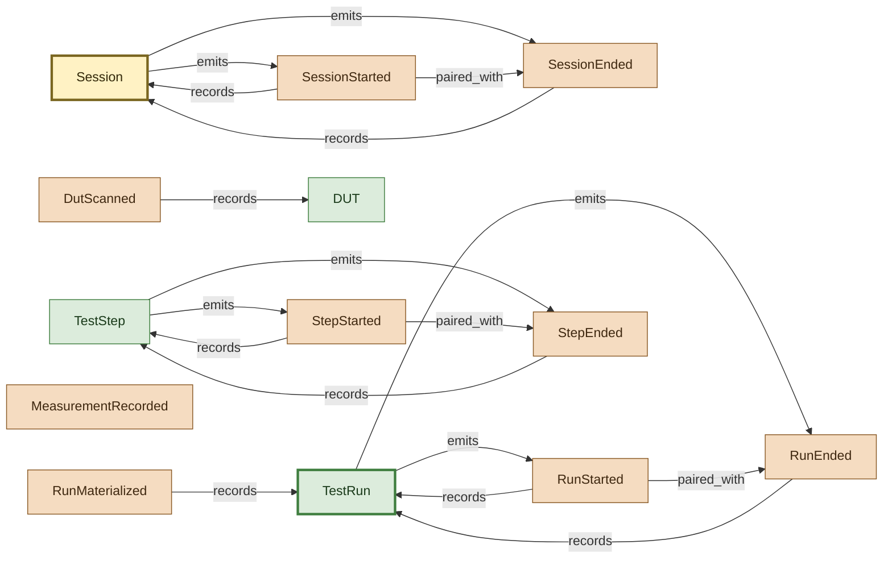

# Event Lifecycle of a Run

Session and run events with their start/end pairings and what each event is about. Shows how a single TestRun fans out into ~10 events across its life, and where `emits` and `about` align versus diverge.

## Concepts in this slice

- [dut](../index.md#dut) — Physical instance of a Product — serial, part_number, revision, lot_number. Created at run start from operator scan or CLI.
- [dut_scanned](../index.md#dut-scanned) — DUT serial scanned at run start (operator or barcode).
- [measurement_recorded](../index.md#measurement-recorded) — One measurement landed — name, value, units, outcome, limits, full signal path, plus dynamic vector columns (inputs/outputs/custom).
- [run_ended](../index.md#run-ended) — Emitted at the end of a test run with its final outcome.
- [run_materialized](../index.md#run-materialized) — Emitted by a materializer after a run's state lands in a durable, query-optimized backend. Distinct from run.ended — run can be ended without yet being materialized.
- [run_started](../index.md#run-started) — Emitted once per test run. Full run context — station/DUT/product/ operator/test phase/git/environment.
- [session](../index.md#session) — A pytest session or interactive Connect context, identified by a session_id (UUID). Every event carries session_id; cross-store joins use it as the parent key. No single Pydantic model — the lifecycle is bracketed by SessionStarted/SessionEnded events.
- [session_ended](../index.md#session-ended) — Emitted at session end. Must NOT carry run_id.
- [session_started](../index.md#session-started) — Emitted once at session start (interactive or test orchestrator). Session-wide metadata only — must NOT carry run_id.
- [step_ended](../index.md#step-ended) — Step (or step+vector) finished. Carries per-vector outcome and the step-level aggregate.
- [step_started](../index.md#step-started) — A step (or step+vector) is about to execute. Carries code identity and the commanded sweep inputs.
- [test_run](../index.md#test-run) — One complete test execution against one DUT on one Station. Carries DUT/product/station/fixture traceability, profile/facets, git context, operator, collected items, executed steps, custom metadata, and the final outcome.
- [test_step](../index.md#test-step) — One pytest test function invocation. Contains TestVectors expanded from sweep/parametrize. Carries code identity (node_id, file, module, class, function, markers) and a stamped outcome.
