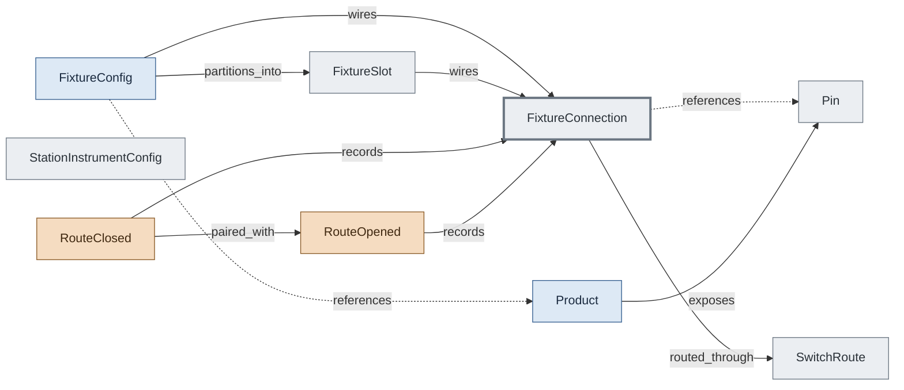

# Fixture Routing — DUT Pin to Instrument Channel

How a DUT pin reaches an instrument channel. FixtureConnection names the pairing; SwitchRoute handles intervening matrix/mux switching; RouteClosed/RouteOpened events record activation. Multi-DUT fixtures use FixtureSlot to scope per-slot channel maps.

## Concepts in this slice

- [fixture_config](../index.md#fixture-config) — Bench-to-DUT wiring. Either single-DUT connections or multi-slot slots; never both. station_types[] declares which abstract station layouts this fixture can wire against.
- [fixture_connection](../index.md#fixture-connection) — Named DUT-pin ↔ instrument-channel pairing — the addressable unit of fixture routing. Optionally carries a measurement function (DMM for DC, scope for AC) and a SwitchRoute for switched fixtures.
- [fixture_slot](../index.md#fixture-slot) — One DUT slot inside a multi-DUT fixture; has its own connection map.
- [pin](../index.md#pin) — Physical DUT pin with role classification (signal / ground / power / reference) for fixture routing.
- [product](../index.md#product) — Spec for a thing-under-test: identity, pins, signal groups, and characteristics. ATML "UUT Description".
- [route_closed](../index.md#route-closed) — Switch channels closed to activate a fixture route.
- [route_opened](../index.md#route-opened) — Switch channels opened to deactivate a fixture route.
- [station_instrument_config](../index.md#station-instrument-config) — Single instrument entry in a station file — type, driver, resource, optional catalog_ref, mock flag, channel mapping.
- [switch_route](../index.md#switch-route) — Switch channels to close before this connection's instrument can be used; carries settling time.
