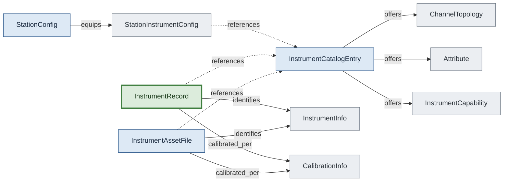

# Instrument Three-Tier Model

Universal (catalog) → unit (asset) → runtime (record). Catalog entries describe what a make/model can do; assets bind a serial to a catalog entry with calibration; records are the live, role-mapped runtime view the fixture/logger tracks.

## Concepts in this slice

- [attribute](../index.md#attribute) — Fixed hardware fact (bandwidth, sample rate, scpi_version) — value or range or options, optionally banded.
- [calibration_info](../index.md#calibration-info) — Calibration status from configuration (due/last/cert/lab). NOT queryable from device — comes from the asset file.
- [channel_topology](../index.md#channel-topology) — Physical topology of a single instrument channel — terminals, connector type, ground topology, optional flag.
- [instrument_asset_file](../index.md#instrument-asset-file) — Unit-specific tier of the 3-tier instrument model — a specific physical device (serial, calibration) referencing a catalog entry. Tier 2 of (catalog → asset → record).
- [instrument_capability](../index.md#instrument-capability) — Capability + channel list + operational metadata. The instrument- side dialect of the shared Capability shape.
- [instrument_catalog_entry](../index.md#instrument-catalog-entry) — Universal tier of the 3-tier instrument model — what a make/model can do. Channels, attributes, and a list of InstrumentCapability entries. Tier 1 of (catalog → asset → record).
- [instrument_info](../index.md#instrument-info) — Identity queried from device (manufacturer/model/serial/firmware). For VISA, parsed from *IDN?.
- [instrument_record](../index.md#instrument-record) — Tier 3 of the 3-tier instrument model — runtime view combining role + asset + identity + calibration + driver + catalog_ref + mock flag. What the fixture/logger tracks during a session.
- [station_config](../index.md#station-config) — Concrete bench deployment. Names a station_type for contract validation; hostname enables session-start auto-match against socket.gethostname().
- [station_instrument_config](../index.md#station-instrument-config) — Single instrument entry in a station file — type, driver, resource, optional catalog_ref, mock flag, channel mapping.
