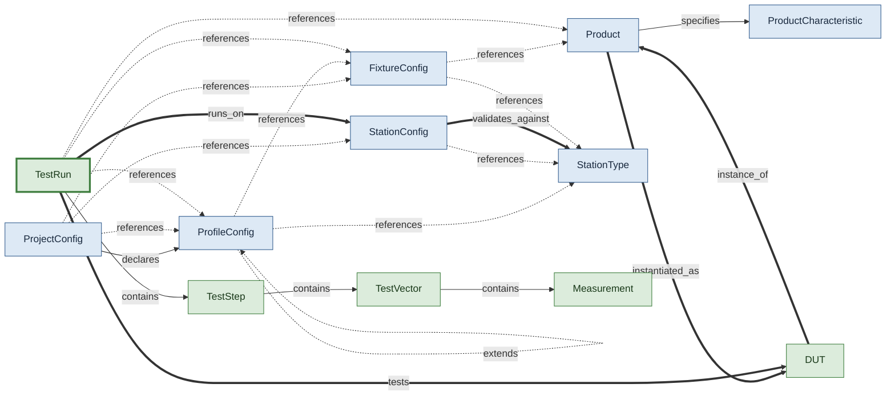

# Composing a Test Run

How a TestRun is composed from authored definitions (Product, Station, Fixture, Profile) and decomposed into runtime entities (DUT, steps, vectors, measurements). The canonical "what is a run made of" view.

## Concepts in this slice

- [dut](../index.md#dut) — Physical instance of a Product — serial, part_number, revision, lot_number. Created at run start from operator scan or CLI.
- [fixture_config](../index.md#fixture-config) — Bench-to-DUT wiring. Either single-DUT connections or multi-slot slots; never both. station_types[] declares which abstract station layouts this fixture can wire against.
- [measurement](../index.md#measurement) — Single measurement — name, value, units, limit fields, outcome. Carries full signal path (dut_pin, instrument_name, resource, channel, fixture_connection) for traceability. check_limit() is the single comparator-aware judgment path.
- [product](../index.md#product) — Spec for a thing-under-test: identity, pins, signal groups, and characteristics. ATML "UUT Description".
- [product_characteristic](../index.md#product-characteristic) — A DUT capability tied to a physical interface (pin/pins/net/ signal_group) with optional datasheet ref. Extends Capability — the matching service pairs DUT OUTPUT characteristics with instrument INPUT capabilities by direction flip.
- [profile_config](../index.md#profile-config) — Named config set applied to a pytest session. Same flat shape as a TestEntry plus profile-only description/facets/extends and an optional station_type / fixture binding. Selected via CLI facets.
- [project_config](../index.md#project-config) — Project root config. Names the default station/fixture/profile, data dir, multi-slot knobs, profiles, and required operator inputs.
- [station_config](../index.md#station-config) — Concrete bench deployment. Names a station_type for contract validation; hostname enables session-start auto-match against socket.gethostname().
- [station_type](../index.md#station-type) — Abstract station-type template. Declares required instrument roles + types that concrete StationConfig deployments must cover.
- [test_run](../index.md#test-run) — One complete test execution against one DUT on one Station. Carries DUT/product/station/fixture traceability, profile/facets, git context, operator, collected items, executed steps, custom metadata, and the final outcome.
- [test_step](../index.md#test-step) — One pytest test function invocation. Contains TestVectors expanded from sweep/parametrize. Carries code identity (node_id, file, module, class, function, markers) and a stamped outcome.
- [test_vector](../index.md#test-vector) — One parameter-set execution of a step. Carries params (in_*), observations (out_*), stimulus signal paths, measurements, retry counter, and a per-vector outcome.
