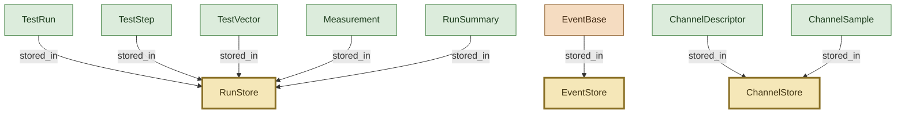

# The Three Stores

Which concepts live where. RunStore holds the materialized read model (runs/steps/vectors/measurements). EventStore is the append-only raw log every event lands in. ChannelStore is the live streaming-data tier.

## Concepts in this slice

- [channel_descriptor](../index.md#channel-descriptor) — Metadata for a live channel — data_type (scalar/array), instrument_role, resource, units. Written once when first seen.
- [channel_sample](../index.md#channel-sample) — Single channel data point delivered to subscribers — channel_id, timestamp, value, units, sample_interval, source_method.
- [channel_store](../index.md#channel-store) — Live waveform / streaming-data store served over Arrow Flight. Subscribers receive ChannelSample batches in real time.
- [event_base](../index.md#event-base) — Base for all event log events. Carries id, occurred_at, received_at, session_id, run_id (None for session-scope events).
- [event_store](../index.md#event-store) — Append-only parquet log of every emitted Event. The source of truth before materialization; subscribers tail it for live UI.
- [measurement](../index.md#measurement) — Single measurement — name, value, units, limit fields, outcome. Carries full signal path (dut_pin, instrument_name, resource, channel, fixture_connection) for traceability. check_limit() is the single comparator-aware judgment path.
- [run_store](../index.md#run-store) — Materialized parquet read model for runs, steps, vectors, measurements. Backed by a long-lived daemon ingesting RunEnded cohorts into DuckDB-queryable parquet.
- [run_summary](../index.md#run-summary) — Lightweight run header read from the parquet index (no steps or measurements). Powers the runs list view.
- [test_run](../index.md#test-run) — One complete test execution against one DUT on one Station. Carries DUT/product/station/fixture traceability, profile/facets, git context, operator, collected items, executed steps, custom metadata, and the final outcome.
- [test_step](../index.md#test-step) — One pytest test function invocation. Contains TestVectors expanded from sweep/parametrize. Carries code identity (node_id, file, module, class, function, markers) and a stamped outcome.
- [test_vector](../index.md#test-vector) — One parameter-set execution of a step. Carries params (in_*), observations (out_*), stimulus signal paths, measurements, retry counter, and a per-vector outcome.
