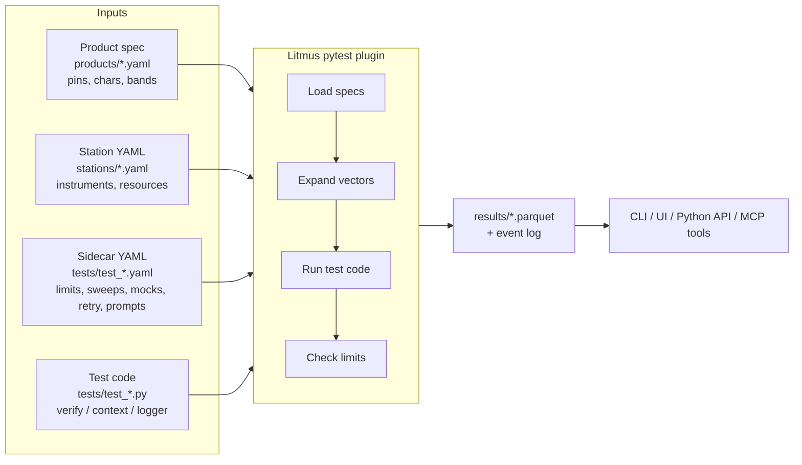
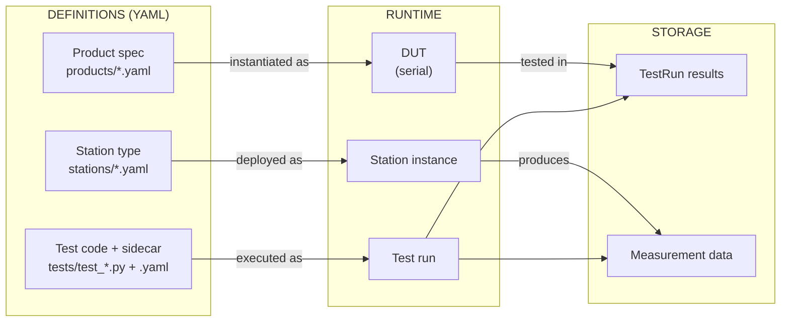
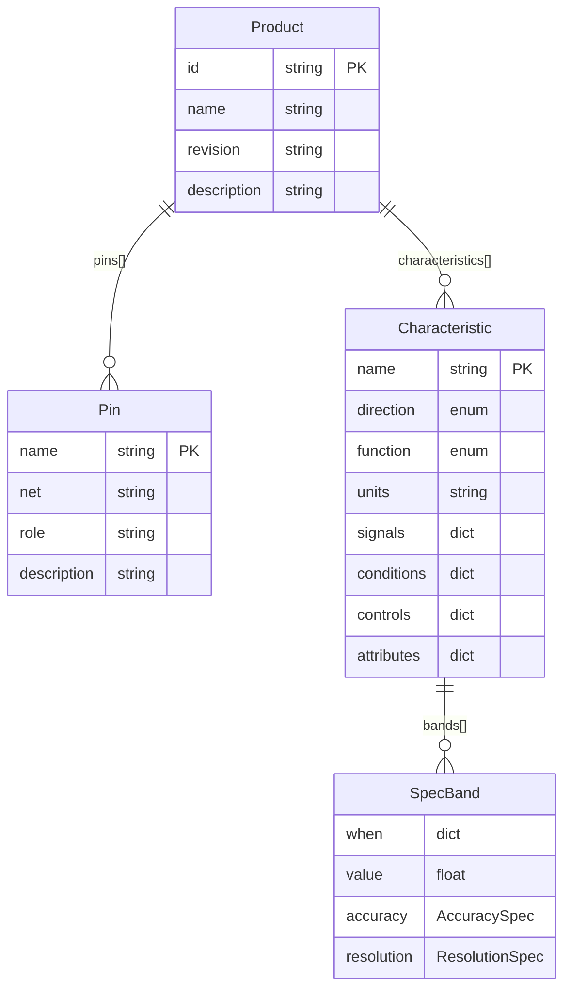
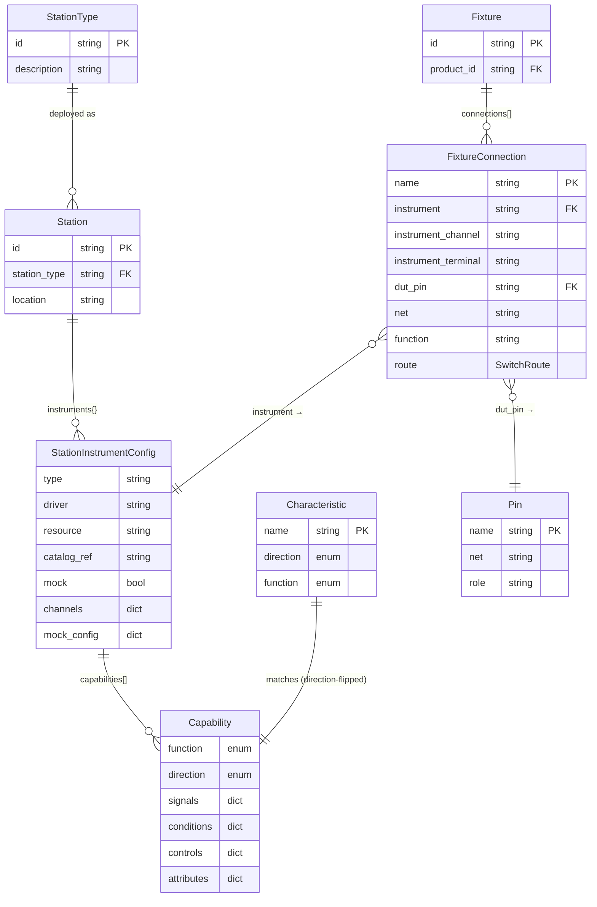
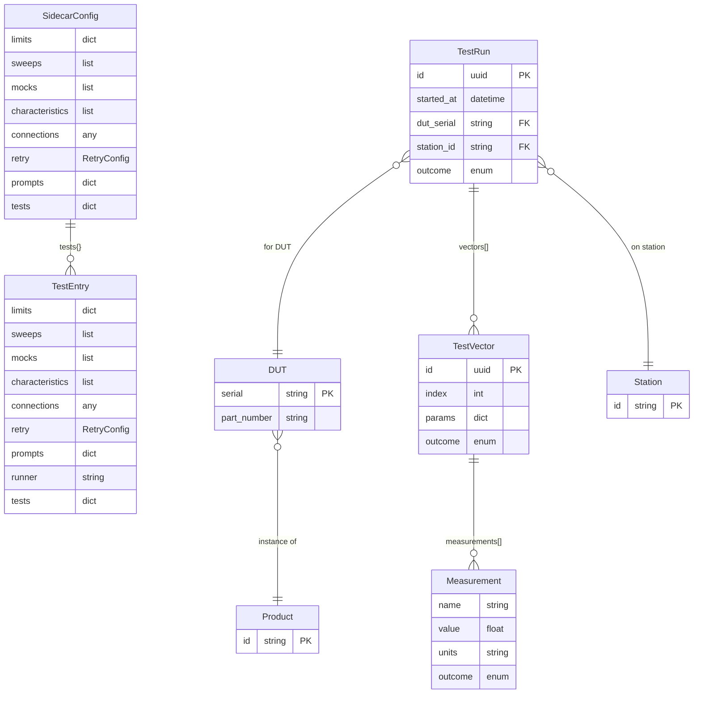
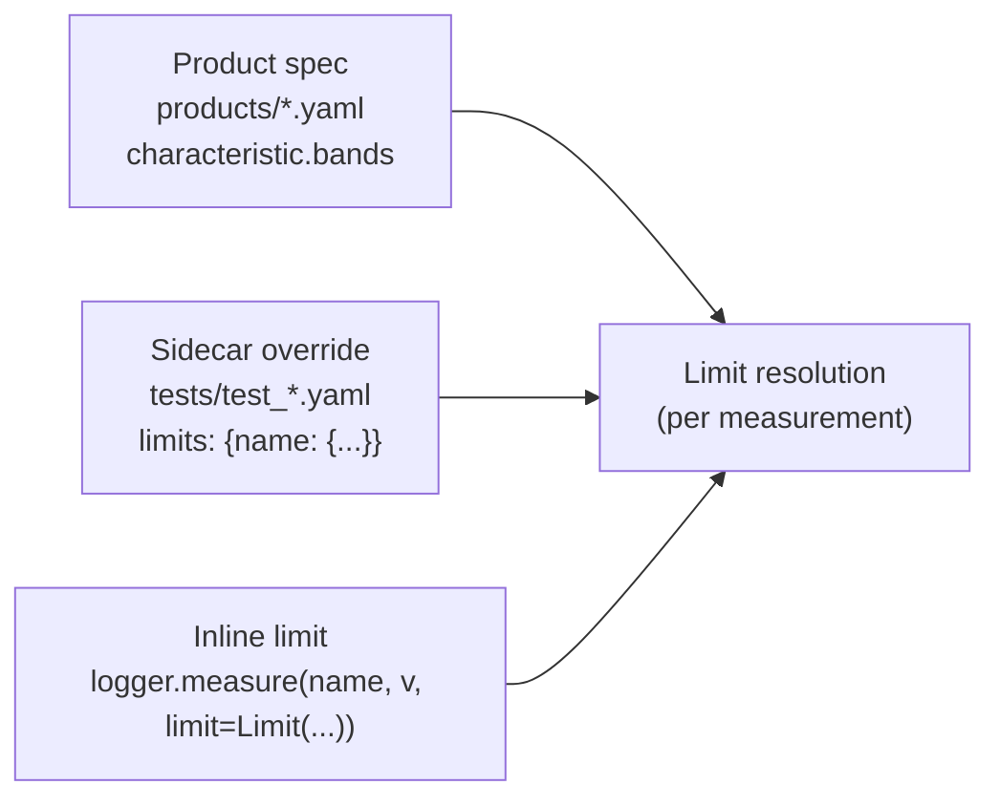
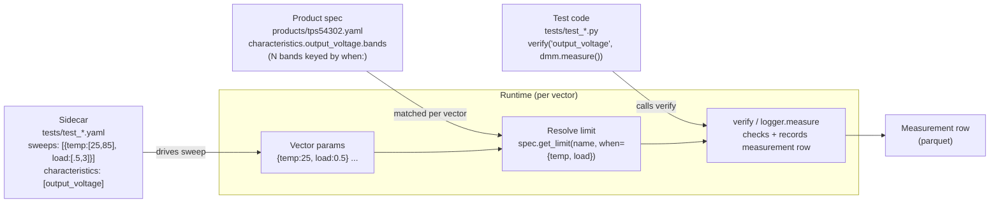
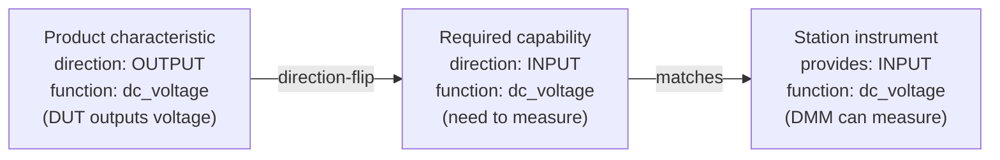
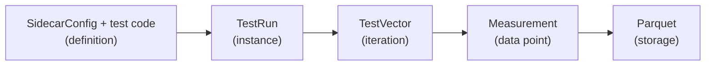

# Litmus Architecture

## How the Framework Works

> **Vocabulary primer.** This page drops a lot of names into one diagram. If you haven't seen them yet: **[product](products.md)** and **[station](stations.md)** are YAML definitions; **[sidecar](../reference/configuration.md)** is the per-test YAML carrying limits / sweeps / mocks; **`verify` / `context` / `logger`** are three of the 20 pytest fixtures Litmus adds — the common per-test entry points (see [reference/litmus-fixtures](../reference/litmus-fixtures.md)); **[characteristic](capabilities.md)** is a measurable property on a product; **[capability](capabilities.md)** is what an instrument can do.

## Key Concepts

| Concept | What It Is | Example |
|---------|-----------|---------|
| **[Product](products.md)** | Spec defining what you're testing | TPS54302 DC-DC converter |
| **[Characteristic](capabilities.md)** | Measurable property of product | output_voltage: 3.3V ±5% |
| **[Station](stations.md)** | Physical test bench with instruments | Bench 1 with DMM, PSU, ELoad |
| **[Capability](capabilities.md)** | What an instrument can do | DMM: measure DC voltage |
| **[Sidecar](../reference/configuration.md)** | YAML alongside a test file declaring limits, sweeps, mocks, retry, prompts | `tests/test_power.yaml` |
| **[TestRun](../reference/models.md)** | One execution of a test file | Run abc123 on SN001 |
| **Measurement** | Single data point with pass/fail | VOUT = 3.31V PASS |

## System Overview

## Entity Relationships

The platform's data model splits cleanly into three concerns: **what you're testing** (products and their specs), **how you test it** (stations, fixtures, capabilities), and **what gets executed and recorded** (sidecar configuration and runs). Each diagram below covers one concern. For the full per-model schema with every field, see [reference/models](../reference/models.md) and [reference/catalog-schema](../reference/catalog-schema.md). Click any diagram to expand.

### 1. Products & Specs

What the DUT is, what its measurable characteristics are, and how spec bands attach.

### 2. Stations, Fixtures & Capability Matching

The bench side: physical stations, the instruments they hold, the capabilities those instruments expose, and the optional fixture layer that routes instrument channels to DUT pins.

### 3. Test Configuration & Execution

The sidecar YAML tree on the left, the runtime objects it produces on the right. `TestEntry` is a recursive node — file-scope, class-scope, method-scope all share the same shape; the recursion is described in the field list rather than drawn as a self-edge (Mermaid routes self-edges through neighbouring entities and the line reads as a phantom relationship).

## Type vs Instance

| Concept | Type (YAML Definition) | Instance (Runtime) |
|---------|------------------------|-------------------|
| What to test | `Product` | `DUT` |
| Where to test | `StationType` | `StationConfig` |
| What to run | `SidecarConfig` (file scope) + pytest collection | `TestRun` |
| Single iteration | `TestEntry` (per-method scope) | `TestVector` |
| Expected value | `Limit` / `SpecBand` | `Measurement` |

## Core Flows

### 1. Spec → Config → Test Flow

**Limits can come from three places** — product spec, sidecar override, or inline in the test:

Product-spec bands derive a production limit by applying any configured guardband (tightening the spec for manufacturing margin). For example: `3.3V ± 5%` (3.135–3.465) with a 10% guardband becomes `3.152–3.449`.

**Full flow with conditions:**

### 2. Capability Matching

### 3. Test Execution

## File Locations

| Entity | Location |
|--------|----------|
| Product specs | `products/*.yaml` |
| Station configs | `stations/*.yaml` |
| Test code | `tests/test_*.py` |
| Test sidecars | `tests/test_*.yaml` |
| Fixtures | `fixtures/*.yaml` |
| Instrument catalog | `catalog/**/*.yaml` |
| Test results (Parquet) | `<data_dir>/runs/{date}/*.parquet` |
| Event logs (Arrow IPC) | `<data_dir>/events/{date}/{session_id}.arrow` |
| Channel data (Arrow IPC) | `<data_dir>/channels/{date}/{channel}_{session}.arrow` |

## Data Architecture

The storage layer uses three complementary stores:

| Store | Purpose | Format |
|-------|---------|--------|
| **EventStore** | All test activity as typed events | Arrow IPC + DuckDB via Flight |
| **ChannelStore** | Time-series instrument data | Arrow IPC segments |
| **ParquetBackend** | Denormalized test results | Parquet files |

Events are the source of truth. Parquet files are a materialized view produced by `materialize_run_to_parquet()`, called from the runs daemon on `RunEnded`. See [Three Stores Architecture](three-stores.md) and [Event Log Architecture](event-log.md) for details.
