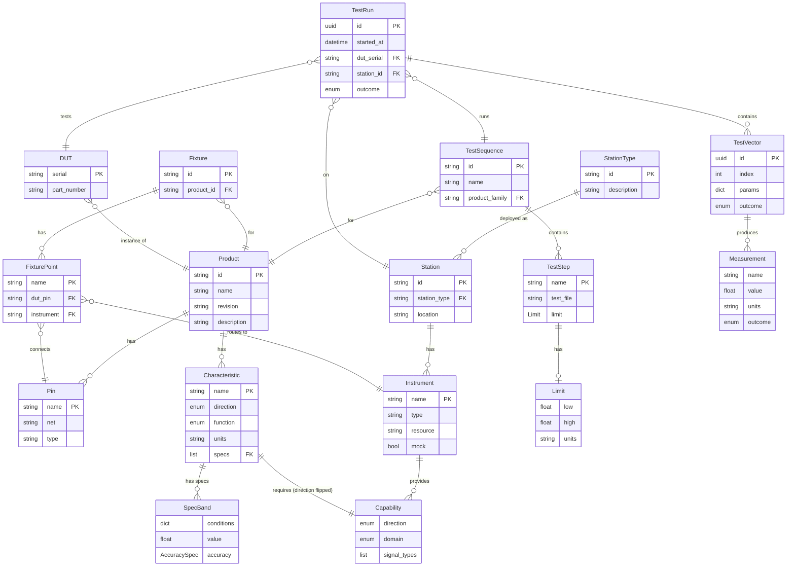

# Litmus Architecture

## How the Framework Works

```
┌─────────────────────────────────────────────────────────────────────────────┐
│                           TEST EXECUTION FLOW                                │
└─────────────────────────────────────────────────────────────────────────────┘

  1. SPEC                 2. CONFIG                3. CODE               4. RUN
  ───────                 ────────                 ──────                ──────

  products/*/spec.yaml            tests/config.yaml        tests/test_*.py       pytest
  ┌───────────┐          ┌────────────┐           ┌────────────┐       ┌───────┐
  │ Product   │          │ vectors    │           │ @litmus_   │       │ CLI   │
  │ - pins    │          │ - sweep    │           │   test     │       │  or   │
  │ - chars   │          │ - params   │           │            │       │  UI   │
  │ - limits  │          │ limits     │           │ measure()  │       │       │
  └───────────┘          │ - per-test │           │ return val │       └───────┘
                         │ retry      │           └────────────┘
  stations/*.yaml        │ - attempts │
  ┌───────────┐          │ dialogs    │
  │ Station   │          │ - prompts  │
  │ - instrs  │          └────────────┘
  │ - resource│
  └───────────┘

        │                      │                        │                  │
        ▼                      ▼                        ▼                  ▼
  ┌───────────────────────────────────────────────────────────────────────────┐
  │                      LITMUS PYTEST PLUGIN                                  │
  │                                                                           │
  │   Loads specs ──► Expands vectors ──► Runs test code ──► Checks limits   │
  │                                                                           │
  └───────────────────────────────────────────────────────────────────────────┘
                                         │
                                         ▼
                               5. STORE & ANALYZE
                               ─────────────────
                               ┌─────────────────┐
                               │ results/*.parq  │
                               │ litmus CLI      │
                               │ Python API      │
                               │ MCP tools       │
                               └─────────────────┘
```

## Key Concepts

| Concept | What It Is | Example |
|---------|-----------|---------|
| **Product** | Spec defining what you're testing | TPS54302 DC-DC converter |
| **Characteristic** | Measurable property of product | output_voltage: 3.3V ±5% |
| **Station** | Physical test bench with instruments | Bench 1 with DMM, PSU, ELoad |
| **Capability** | What an instrument can do | DMM: measure DC voltage |
| **TestSequence** | Ordered list of test steps | production_test.yaml |
| **TestRun** | One execution of a sequence | Run abc123 on SN001 |
| **Measurement** | Single data point with pass/fail | VOUT = 3.31V PASS |

## System Overview

```
┌─────────────────────────────────────────────────────────────────────────────┐
│                              LITMUS PLATFORM                                 │
├─────────────────────────────────────────────────────────────────────────────┤
│                                                                             │
│   DEFINITIONS (YAML)              RUNTIME                    STORAGE        │
│   ──────────────────              ───────                    ───────        │
│                                                                             │
│   ┌──────────┐                   ┌──────────┐              ┌──────────┐    │
│   │ Product  │──────────────────►│   DUT    │──────────────►│ TestRun  │    │
│   │  Spec    │  instantiated as  │ (serial) │   tested in  │ Results  │    │
│   └──────────┘                   └──────────┘              └──────────┘    │
│                                                                             │
│   ┌──────────┐                   ┌──────────┐              ┌──────────┐    │
│   │ Station  │──────────────────►│ Station  │──────────────►│Measuremt │    │
│   │  Type    │  deployed as      │ Instance │   produces   │  Data    │    │
│   └──────────┘                   └──────────┘              └──────────┘    │
│                                                                             │
│   ┌──────────┐                   ┌──────────┐                              │
│   │ Test     │──────────────────►│ Test     │                              │
│   │ Sequence │  executed as      │  Run     │                              │
│   └──────────┘                   └──────────┘                              │
│                                                                             │
└─────────────────────────────────────────────────────────────────────────────┘
```

## ERD Diagram



## Type vs Instance

| Concept | Type (YAML Definition) | Instance (Runtime) |
|---------|------------------------|-------------------|
| What to test | `Product` | `DUT` |
| Where to test | `StationType` | `Station` |
| What to run | `TestSequence` | `TestRun` |
| Single iteration | `TestStep` | `TestVector` |
| Expected value | `Limit` / `Condition` | `Measurement` |

## Core Flows

### 1. Spec → Config → Test Flow

**Limits can come from three places:**

```
┌─────────────────────────────────────────────────────────────────────────────┐
│                        WHERE DO LIMITS COME FROM?                            │
└─────────────────────────────────────────────────────────────────────────────┘

  OPTION A: Product Spec                OPTION B: Test Config        OPTION C: Inline
  (Derived from datasheet)              (Per-test overrides)         (In test code)

  products/product/spec.yaml                    tests/config.yaml            test_*.py
  ┌─────────────────────┐              ┌─────────────────────┐      ┌─────────────┐
  │ characteristics:    │              │ test_output:        │      │ harness.    │
  │   output_voltage:   │              │   limits:           │      │   measure(  │
  │     conditions:     │              │     output_voltage: │      │     "vout", │
  │       - nominal: 3.3│              │       low: 3.2      │      │     value,  │
  │         tolerance: 5%              │       high: 3.4     │      │     low=3.2,│
  │         temp: 25    │              │       units: V      │      │     high=3.4│
  │         load: 1.0   │              └─────────────────────┘      │   )         │
  │                     │                                           └─────────────┘
  │ specs
  │   verify_output:    │
  │     characteristic: │
  │       output_voltage│
  │     guardband: 10%  │◄─── Tightens limits for manufacturing margin
  └─────────────────────┘

        │
        │  Spec + guardband = production limit
        ▼
  ┌─────────────────────┐
  │ 3.3V ± 5% = 3.135   │
  │ With 10% guardband: │
  │   3.135 + 0.0165    │
  │   3.465 - 0.0165    │
  │ = 3.152 to 3.449    │
  └─────────────────────┘
```

**Full flow with conditions:**

```
Product Spec (YAML)              Test Config (YAML)           Test Code (Python)
────────────────────             ──────────────────           ──────────────────

products/tps54302/spec.yaml              tests/config.yaml            tests/test_*.py
┌────────────────────┐           ┌────────────────────┐       ┌────────────────┐
│ characteristics:   │           │ test_output:       │       │ @litmus_test   │
│   output_voltage:  │           │   vectors:         │       │ def test_output│
│     conditions:    │           │     expand: product│       │  (context, dmm):│
│       - temp: 25   │──────────►│     temp: [25, 85] │──────►│                │
│         load: 0.5  │  lookup   │     load: [0.5,3.0]│ sweep │  # context has  │
│         nominal:3.3│  limit    │                    │       │  # temp & load │
│         tol: 1%    │  for      │   limits:          │       │                │
│       - temp: 25   │  condition│     ref: specs.    │       │  return dmm.   │
│         load: 3.0  │           │       output_volt  │       │    measure()   │
│         nominal:3.3│           │     guardband: 10% │       └────────────────┘
│         tol: 1%    │           └────────────────────┘
│       - temp: 85   │
│         load: 1.0  │
│         nominal:3.3│
│         tol: 2%    │◄─── Different tolerance at high temp
└────────────────────┘

        │                              │                             │
        │ conditions define            │ vectors sweep               │ code runs
        │ valid operating points       │ across conditions           │ per vector
        ▼                              ▼                             ▼
┌─────────────────────────────────────────────────────────────────────────────┐
│                         RUNTIME (TestHarness)                                │
│                                                                             │
│   for vector in vectors:  # {temp:25, load:0.5}, {temp:25, load:3.0}, ...  │
│       # Create vector context and populate with vector params               │
│       context = Context(parent=step_context, prev=prev_vector_context)      │
│       context.set_inputs(vector.params())  # temp, load → context.inputs    │
│                                                                             │
│       # Resolve limit (may be callable using context)                       │
│       limit = spec.get_limit("output_voltage", ctx=context)                 │
│                                                                             │
│       # Call test with context (vector params inside)                       │
│       value = test_func(context, dmm)  # context.inputs["temp"], ["load"]   │
│                                                                             │
│       result = check(value, limit)  # PASS/FAIL                            │
│       store(Measurement(value, limit, result, params=context.inputs))       │
│                                                                             │
└─────────────────────────────────────────────────────────────────────────────┘
```

### 2. Capability Matching
```
Product.characteristic      →  Required Capability  →  Station.instrument
direction: OUTPUT              direction: INPUT        provides: INPUT
domain: VOLTAGE                domain: VOLTAGE         domain: VOLTAGE
(DUT outputs voltage)          (need to measure)       (DMM can measure)
```

### 3. Test Execution
```
TestSequence  →  TestRun   →  TestVector  →  Measurement  →  Parquet
(definition)     (instance)    (iteration)    (data point)    (storage)
```

## File Locations

| Entity | Location |
|--------|----------|
| Product specs | `products/*/spec.yaml` or `products/*/spec.yaml` |
| Station configs | `stations/*.yaml` |
| Test sequences | `sequences/*.yaml` |
| Fixtures | `fixtures/*.yaml` |
| Instrument library | `litmus/instruments/library/*.yaml` |
| Test results | `results/**/*.parquet` |
