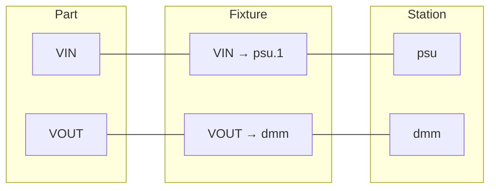

# Fixtures

A **fixture** in TesterKit is a YAML file at `fixtures/<name>.yaml` that maps UUT pins to station instruments. It's the bridge that lets a test say "measure the voltage at pin `VOUT`" without knowing which DMM channel `VOUT` happens to be wired to on this particular bench.

> **Naming collision.** "Fixture" overloads. Throughout this page, "fixture" means **hardware test fixture** — the YAML pin-map. When the test signature has `def test_x(pins, dmm, verify): ...`, the names `pins`, `dmm`, `verify` are **pytest fixtures** — Python objects the [pytest plugin](../../reference/pytest/fixtures.md) synthesizes (in part from your hardware fixture YAML). When this page needs the pytest sense it says "pytest fixture".

## What fixtures model

Three things have to line up before a test can measure anything:

1. The **part** declares pins (`VIN`, `VOUT`, `GND`) and their measurable characteristics (output voltage, current draw, etc.).
2. The **station** declares instruments by role (`dmm`, `psu`, `eload`) and where each is physically connected (a VISA address, a serial port).
3. The **fixture** declares which station instrument (and channel) is currently wired to which part pin.



The fixture is the only piece that changes when you move a board from one bench to another. The part stays the same (it's the device). The station stays the same (it's the bench). The fixture re-maps which pins are on which channels — and every test runs unchanged.

This is also what makes a measurement traceable: every value flows through a named fixture connection (`VOUT`, not `dmm channel 1`), and the recorded measurement row carries the UUT-side name. Six months later you can ask "which board's `VOUT` was reading 3.5 V?" — the connection name is the join key.

## When you need a fixture

| Setup | Fixture? |
|---|---|
| One UUT, one bench, you remember which instrument is on which pin | Optional — the `dmm` / `psu` per-role pytest fixtures from your station YAML are enough |
| Multiple parts on the same bench, or one part across multiple benches | Required — the pin-map is what lets the test code stay portable |
| Multiple UUTs running in parallel | Required — see [Multi-UUT scaling](#multi-uut-scaling-sites-shared-instruments-switching) |
| Production traceability — every measurement records its UUT-side pin | Required — `uut_pin` is the connection field that flows into the parquet row |

For development without any fixture, see [Mock mode](../../how-to/configuration/mock-mode.md) and the per-role auto-fixtures in [TesterKit fixtures](../../reference/pytest/fixtures.md#per-role-auto-fixtures).

## Data model

A fixture YAML loads into a `FixtureConfig`. Two top-level shapes:

- **Single-UUT** — fields directly on the fixture
- **Multi-UUT** — `sites:` with one `FixtureSite` per UUT position

Both share the same `FixtureConnection` shape underneath.

### `FixtureConfig` fields

| Field | Description |
|---|---|
| `id` | Unique fixture identifier |
| `name` | Optional display name |
| `part_id` | Specific part this fixture is wired for (preferred) |
| `part_family` | Or part family — for fixtures that work for multiple parts in a line |
| `part_revision` | Optional — for fixtures that differ by board revision |
| `station_types` | Optional — abstract station-type layouts this fixture can wire against. Validated at session start against the active profile's `station_type`. Empty list = "any station". |
| `uut_resource` | Optional UUT-side connection string (a COM port, USB serial number, etc.) for tests that talk to the UUT directly |
| `connections` | UUT-pin ↔ instrument-channel pairings. Single-UUT shape. |
| `sites` | Ordered list of per-UUT-position connections for multi-UUT fixtures. Multi-UUT shape. |
| `description` | Free-form documentation |

`connections` and `sites` are mutually exclusive — a fixture that sets both is rejected.

### `FixtureConnection` fields

A connection is the addressable unit — a name that identifies one UUT-side signal path:

| Field | Description |
|---|---|
| `name` | The connection's identifier (test code uses this; parquet rows record this) |
| `instrument` | Station role (must match a key in `station.instruments`) |
| `instrument_channel` | Channel on the instrument (`"1"`, `"CH2"`, `"ai0"`) |
| `instrument_terminal` | Physical terminal on the channel (`hi`, `lo`, `sense_hi`, `sense_lo`, `signal`). Optional. |
| `uut_pin` | Part pin this connection is wired to (must match a `pins.<name>` key in the part spec) |
| `net` | Schematic net name. Alternative to `uut_pin` when matching by net rather than physical pin. |
| `function` | Optional [`MeasurementFunction`](capabilities.md#measurementfunction) the connection is for. When set, the resolver matches by `(uut_pin, function)` — see [Function as a routing dimension](#function-as-a-routing-dimension). |
| `route` | Optional `SwitchRoute` for switched signal paths — see [Switched routing](#switched-routing). |
| `description` | Free-form documentation |

## Single-UUT shape

The simplest fixture: each UUT pin gets one connection, one instrument, one channel.

```yaml
# fixtures/power_board_fixture.yaml
id: power_board_fixture
name: "Power Board Test Fixture"
part_id: power_board

connections:
  VIN:
    name: VIN
    uut_pin: VIN
    net: VIN_5V
    instrument: psu
    instrument_channel: "1"
    instrument_terminal: hi
  VOUT:
    name: VOUT
    uut_pin: VOUT
    net: VOUT_3V3
    instrument: dmm
    instrument_channel: "CH1"
  GND:
    name: GND
    uut_pin: GND
    instrument: psu
    instrument_channel: "GND"
```

A test addresses each connection by its `uut_pin` through the `pins` [pytest fixture](../../reference/pytest/fixtures.md#pins-session):

```python
def test_output_voltage(pins, verify):
    pins["VIN"].set_voltage(5.0)
    pins["VIN"].enable_output()
    verify("output_voltage", pins["VOUT"].measure_voltage())
```

`pins["VIN"]` resolves to the connected `psu` instrument (because the fixture says `VIN → psu`). The measurement row records `uut_pin=VIN`, the connection's `instrument_channel`, and the resolved instrument identity — the test body never sees those details.

## How a measurement reaches the row

When `verify("output_voltage", pins["VOUT"].measure_voltage())` runs:

1. `pins["VOUT"]` looks up the fixture connection named `VOUT` → finds `{instrument: dmm, instrument_channel: "CH1"}`.
2. It finds the `dmm` on the bench and runs `measure_voltage()` on channel `CH1`.
3. `verify()` records the measurement row. Because the active connection is `VOUT`, the row carries `uut_pin=VOUT`, `instrument_channel=CH1`, and the resolved `instrument_name` / `instrument_resource` automatically.

That auto-population is the traceability payoff: tests stay clean, parquet rows know exactly which signal path each measurement came through.

## Routing one pin to different instruments by measurement

One UUT pin can route to different instruments depending on what you're measuring. Set `function:` on each connection and TesterKit picks the connection whose `(pin, function)` matches, instead of pin alone:

```yaml
connections:
  vout_dc:
    name: vout_dc
    uut_pin: VOUT
    function: dc_voltage      # DMM measures the DC level
    instrument: dmm
  vout_ac:
    name: vout_ac
    uut_pin: VOUT
    function: ac_voltage      # Scope captures the ripple
    instrument: scope
    instrument_channel: "1"
```

A test asking for `VOUT` with no function context falls back to first-match by pin. A test bound to a specific characteristic (via `testerkit_characteristics`) picks the connection whose `function` matches.

When `function` is unset, the first connection for that pin is used.

## Multi-UUT scaling: sites, shared instruments, switching

Three independent features scale the single-UUT shape to multiple boards:

### Sites — parallel UUT positions

A **site** is one parallel UUT position on the bench — the same concept STDF calls `SITE_NUM` and NI TestStand calls a "test socket." When the bench has multiple identical positions and you test them in parallel, use `sites` instead of `connections`. Sites are an ordered list; each site has its own `FixtureConnection` map and an optional `name`:

```yaml
# fixtures/dual_board_fixture.yaml
id: dual_board_fixture
part_family: power_board

sites:
  - name: left
    description: Left-side board
    uut_resource: /dev/ttyUSB0
    connections:
      vout_measure:
        name: vout_measure
        uut_pin: VOUT
        instrument: dmm
        instrument_channel: "1"
  - name: right
    description: Right-side board
    uut_resource: /dev/ttyUSB1
    connections:
      vout_measure:
        name: vout_measure
        uut_pin: VOUT
        instrument: dmm
        instrument_channel: "2"
```

TesterKit runs each site in parallel; each site's test sees only its own connections. A site's 0-based position in the list is its `site_index` — **never authored**, always the list position, so there's no field to typo or get out of sync with the actual order. This is the same shape as a bare single-UUT fixture: `connections:` directly on the fixture is site_index 0 with no list around it. `connections` and `sites` are two views of one model, not two separate features — the list is what makes a fixture multi-site, and its length is the site count. There's no way to declare a gap in the list; a site exists because it has an entry.

`name:` is an optional human label ("left", "right") for a site that otherwise has no identity beyond its index — it's frozen onto every row that site produces, so renaming a site in the fixture YAML later doesn't change what a historical run's rows say. Fixture loading rejects a bare-integer name (`name: "1"`) with a clear error: `--site` and `--uut-serials` resolve a token as an index first and a name second, so a numeric name would be unreachable (shadowed by the index it looks like) rather than silently wrong. Use a non-numeric label (`"S1"`, `"pos1"`) if you need a silkscreen-style number.

Per-site `uut_resource` overrides the fixture-level value. See [Multi-UUT testing](../../how-to/execution/multi-uut-testing.md) for the operational guide — CLI serial assignment, per-site parquet columns, and the events that carry `site_index` / `site_name`.

### Shared instruments

When multiple sites reference the same instrument role (e.g. both sites' `dmm` connections point at the bench's single DMM), TesterKit treats it as a **shared** instrument. It connects once and shares it across the parallel site workers — each one calls it as if it owned it.

Locking is per **resource** (the VISA address, COM port, or other connection identifier), so roles sharing one physical connection take turns, while roles on separate connections run at the same time.

### Switched routing

For a single instrument fanned out to multiple UUT positions through a relay matrix, add a `SwitchRoute` to the connection. The platform closes the listed switch channels before activating the instrument, waits the settling time, then runs the measurement:

```yaml
- name: left
  connections:
    vout_measure:
      name: vout_measure
      uut_pin: VOUT
      instrument: dmm
      route:
        switch: matrix          # role of the switch instrument
        channels: ["r0c0"]      # crosspoints to close
        settling_ms: 10
```

Switch routes activate on demand — the first time a test touches that instrument, TesterKit closes the listed switch channels, waits the settling time, then takes the measurement. Multiple sites can share one instrument through different routes. Switches (instruments with `type: switch`) are exempt from the take-turns locking — closing channels in parallel is the point of the matrix.

## Selecting a fixture at run time

Stations do not pin a fixture themselves. The active fixture is chosen per session via the `--fixture` CLI flag (or a [profile](../../how-to/execution/profiles.md) that sets it):

```bash
pytest tests/ \
  --station=bench_1 \
  --fixture=fixtures/power_board_fixture.yaml \
  --uut-serial=SN001
```

The fixture's `part_id` / `part_family` are scoping fields — the resolver uses them to pick the right fixture when multiple are present, but the plugin does not currently cross-check them against the active part spec.

## Worked example

A complete single-UUT setup, four files:

```yaml
# parts/power_board.yaml
id: power_board
pins:
  VIN:  {name: "J1.1", role: power}
  VOUT: {name: "J1.3", role: signal}
  GND:  {name: "J1.2", role: ground}
characteristics:
  output_voltage:
    function: dc_voltage
    direction: output
    unit: V
    pin: VOUT
    bands:
      - value: 3.3
        accuracy: {pct_reading: 5}
```

```yaml
# stations/bench_1.yaml
id: bench_1
instruments:
  psu:
    type: psu
    driver: pymeasure.instruments.keysight.KeysightE36312A
    resource: "GPIB0::5::INSTR"
  dmm:
    type: dmm
    driver: pymeasure.instruments.keysight.Keysight34461A
    resource: "TCPIP::192.168.1.100::INSTR"
```

```yaml
# fixtures/power_board_fixture.yaml
id: power_board_fixture
part_id: power_board
connections:
  VIN:
    name: VIN
    uut_pin: VIN
    instrument: psu
    instrument_channel: "1"
  VOUT:
    name: VOUT
    uut_pin: VOUT
    instrument: dmm
  GND:
    name: GND
    uut_pin: GND
    instrument: psu
    instrument_channel: "GND"
```

```python
# tests/test_power_board.py
def test_output_voltage(pins, verify):
    pins["VIN"].set_voltage(5.0)
    pins["VIN"].enable_output()
    verify("output_voltage", pins["VOUT"].measure_voltage())
```

Run it:

```bash
pytest tests/ \
  --part=parts/power_board.yaml \
  --station=stations/bench_1.yaml \
  --fixture=fixtures/power_board_fixture.yaml \
  --uut-serial=SN001
```

The recorded measurement row carries `uut_pin=VOUT`, `instrument_name=dmm`, `characteristic_id=output_voltage` — all pulled through the fixture connection automatically.

## See also

- [Parts](parts.md) — what pins and characteristics get declared on the UUT side
- [Stations](stations.md) — what instruments and roles get declared on the bench side
- [Capabilities](capabilities.md) — the function / direction / signal model that drives matching (and the `function:` field on connections)
- [Tutorial step 9 — Production ready](../../tutorial/09-production.md) — first hands-on with fixtures + sidecar config
- [How-to — Configuring stations](../../how-to/configuration/configuring-stations.md) — the station YAML reference
- [How-to — Multi-UUT testing](../../how-to/execution/multi-uut-testing.md) — sites, shared instruments, parallel workers in practice
- [TesterKit fixtures](../../reference/pytest/fixtures.md) — the `pins`, `instruments`, `instrument`, `fixture_manager`, `connections` pytest fixtures that read this YAML
- [Configuration reference](../../reference/configuration.md) — fixture YAML schema field-by-field
