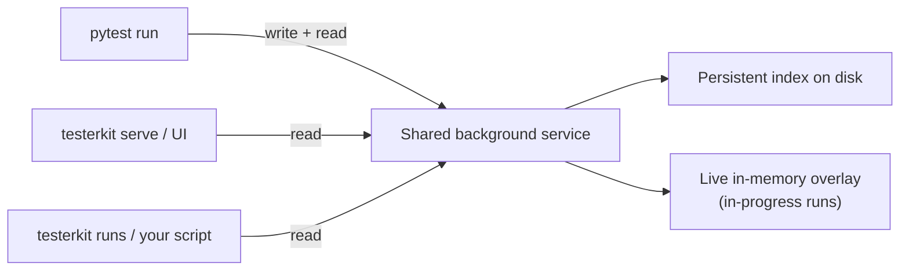

# Flight Cross-Process Model

TesterKit uses Apache Arrow Flight for cross-process data access. This enables real-time queries from any process — the operator UI, CLI tools, AI agents, or Grafana — without file locking or polling.

## Why Arrow Flight

Arrow Flight provides:

- **Zero-copy** — Arrow record batches transfer between processes without being copied or re-encoded, so live queries stay fast even with a lot of data
- **Cross-process** — Multiple processes query the same data through a shared background service
- **Language-agnostic** — Any Arrow Flight client (Python, Go, Rust, Java) can connect
- **SQL queryability** — [DuckDB](https://duckdb.org/) (an embedded analytical SQL engine that reads Parquet/Arrow directly) runs as the query engine behind the service

Reading the files directly from each process works, but processes can collide on file locks, and a reader can't see data still buffered in memory — the shared background service avoids both.

## How multiple processes see the same live data



Your pytest run, `testerkit serve`, `testerkit runs`, and any script you write all talk to the same shared background service. The service keeps data in two places: a persistent index on disk (a DuckDB file) and a live in-memory overlay for in-progress runs. The overlay is what lets a query see a result the instant after it's written — before the run is even complete.

The first tool that needs the data starts the shared background service automatically; everything else just connects to it. You never manage it yourself. The service shuts itself down after it has been idle for a while.

## On disk and live at the same time

The event data uses a dual-write pattern for crash safety and instant queryability:

1. **Arrow files on disk** — append-only, survive crashes. Date-partitioned, with one file per writing process.
2. **Live push to the shared service** — new data is sent to the service as it's written, making it available for SQL queries immediately.

If that live push fails, the data is still safe in the Arrow files on disk. On the next start, the service loads those files into the index and picks up where it left off.

Event data and channel (waveform) data each have their own shared service — separate background processes running the same mechanism — so a heavy waveform capture doesn't compete with event queries.

## Downsampling waveforms for display

A captured waveform can have millions of samples — too many to plot. The `max_points` parameter thins it to a target count using LTTB (Largest Triangle Three Buckets), a downsampling algorithm that preserves peaks and dips so the displayed shape still matches the real signal.

```python
# Query with decimation for visualization
table = channel_store.query(
    "scope.ch1_waveform",
    session_id="abc123",
    max_points=1000,  # LTTB downsample to 1000 points
)
```

## See also
- [Event Log Architecture](event-log.md) — How events flow through the system
- [Data stores](data-stores.md) — all four data stores
- [Querying Channels Guide](../../how-to/data/querying-channels.md) — Practical channel queries
