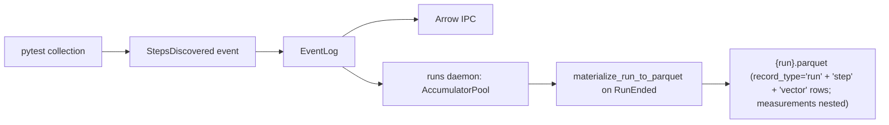

# Step Results & StepsDiscovered

Step results give a complete view of every planned test step — including the ones that never ran (early abort, `--maxfail`, skip markers).

## The Problem

Without explicit step records, you only know about steps that actually executed. If a run aborts after step 3 of 10, the Parquet file would only have 3 rows of evidence. There's no record that 7 other steps were planned but never ran.

That matters for:

- **Yield analysis** — A 3/3 pass result is not the same as a 3/10 partial result.
- **Coverage tracking** — Which steps are consistently skipped or never reached?
- **Compliance** — Auditors need to know the full test plan, not just what ran.

## StepsDiscovered event

The `StepsDiscovered` event fires after instruments connect but before any steps execute. It carries the complete list of pytest-collected items:

```python
class StepsDiscovered(EventBase):
    event_type: Literal["test.steps_discovered"] = "test.steps_discovered"
    items: list[dict[str, str | None]] = Field(default_factory=list)
```

Each item in `items` contains the pytest identity:

| Field | Description |
|-------|-------------|
| `node_id` | pytest node ID (e.g. `tests/test_power.py::test_voltage`) |
| `name` | Test function name |
| `file` | Source file path |
| `module` | Python module name |
| `class_name` | Test class name (if any) |
| `function` | Function name |

## How it flows



The runs daemon caches the discovered items in memory via its accumulator. When the run ends, `materialize_run_to_parquet()` emits one row per planned step into the unified parquet — executed steps with real outcomes and timing, plus synthetic rows with `step_outcome IS NULL` for items that never produced a `StepStarted` event.

## Storage

There is **one parquet file per run**. Run, step, and vector records share the same file, discriminated by the [`record_type`](../../reference/data/parquet-schema.md) column; measurements are nested under each vector row (the daemon projects them as a virtual `measurement` type at query time):

```
<data_dir>/runs/{date}/
└── {timestamp}_{serial}.parquet          # All rows for one run
   ├── record_type='run'                  # exactly one row, run-level metadata
   ├── record_type='step'                 # one row per (step_path, vector_index)
   └── record_type='vector'               # one row per execution; nests the measurements list
```

Key step-row columns (full list in [Parquet schema](../../reference/data/parquet-schema.md)):

- `step_name`, `step_path`, `step_index`, `parent_path`, `step_node_id`
- `step_started_at`, `step_ended_at`, `step_vector_count`
- `step_outcome` (rollup), `vector_outcome` (per vector), `run_outcome` (run-wide)
- Denormalized run context: `run_id`, `uut_serial`, `station_id`, `session_id`

## "Never ran" rows (`step_outcome IS NULL`) {#never-ran}

After `RunEnded`, `materialize_run_to_parquet()` compares the discovered items against actually-executed steps. Missing steps get synthetic rows where:

- `step_outcome`: **NULL** (field-missingness is the "never ran" receipt — there is no `"not_started"` literal; see `concepts/outcomes.md`)
- Timing fields: NULL
- Step identity columns: populated from the collected item

Every run thus has a complete picture — executed steps with real data, plus NULL-outcome rows for the rest. The display layer derives "Never Ran" from `outcome IS NULL` plus the run's finalized state.

## Querying step results

With DuckDB:

```sql
-- Step summary for one run
SELECT step_name, step_outcome, step_started_at, step_ended_at
FROM read_parquet('data/runs/**/*.parquet')
WHERE record_type = 'step'
  AND run_id = 'abc123'
ORDER BY step_index;

-- Find steps that are frequently skipped or never run
SELECT step_name,
       COUNT(*) AS total,
       SUM(CASE WHEN step_outcome IS NULL THEN 1 ELSE 0 END) AS never_ran
FROM read_parquet('data/runs/**/*.parquet')
WHERE record_type = 'step'
GROUP BY step_name
HAVING never_ran > 0;
```

From Python (via `RunStore`):

```python
from litmus.data.run_store import RunStore

steps = RunStore().get_steps("abc123")
for step in steps:
    print(f"{step['step_name']}: {step['step_outcome']}")
```

From the event store:

```python
store.events(event_type="test.steps_discovered", session_id=sid)
```

## See also

- [Event log](../data/event-log.md) — how events get to Parquet
- [Parquet schema](../../reference/data/parquet-schema.md) — full column list
- [Data stores](../data/data-stores.md) — EventStore, ChannelStore, FileStore, RunStore
