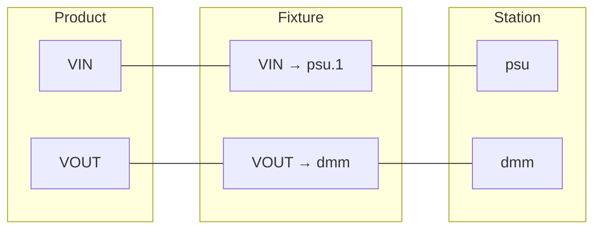

# Fixtures

**Fixtures** define pin-to-instrument mappings, bridging product pins to station instruments. They're optional but essential for production testing with traceability.

## When to Use Fixtures

| Approach | When to Use |
|----------|-------------|
| **Mock objects** | Development, CI, unit tests |
| **Direct instrument access** | Simple benches, quick prototyping |
| **Pin mapping (fixtures)** | Production, complex routing, compliance |

## Fixture Configuration

Fixtures are YAML files in `fixtures/`:

```yaml
# fixtures/power_board_fixture.yaml
fixture:
  id: power_board_fixture
  name: "Power Board Test Fixture"
  product_id: power_board

points:
  VIN:
    dut_pin: VIN
    net: VIN_5V
    instrument: psu
    instrument_channel: "1"
  VOUT:
    dut_pin: VOUT
    net: VOUT_3V3
    instrument: dmm
```

### Fixture Fields

| Field | Description |
|-------|-------------|
| `id` | Unique fixture identifier |
| `name` | Display name |
| `product_id` | Specific product this fixture is for |
| `product_family` | Or product family (for shared fixtures) |
| `product_revision` | Optional: specific revision |

### Fixture Point Fields

| Field | Description |
|-------|-------------|
| `dut_pin` | Reference to product pin |
| `net` | Or schematic net name |
| `instrument` | Station instrument name |
| `instrument_channel` | Channel on the instrument |

## Using the `pins` Fixture

With a fixture configured, tests can access instruments by DUT pin name:

```python
def test_output_voltage(pins):
    """Test using pin-based access."""
    pins["VIN"].set_voltage(5.0)
    pins["VIN"].enable_output()
    voltage = pins["VOUT"].measure_voltage()
    assert float(voltage) > 3.0
```

### Benefits

1. **Decouples tests from wiring** — Same test runs on different stations
2. **Self-documenting** — Code reads like the product spec
3. **Traceability** — Measurements link to DUT pins
4. **Portability** — Move tests between stations easily

## Fixture Without Pins

You don't always need pin mapping. For simple setups, access instruments directly:

```python
@litmus_test
def test_voltage(vector, instruments):
    """Direct instrument access."""
    psu = instruments["psu"]
    dmm = instruments["dmm"]

    psu.set_voltage(5.0)
    psu.enable_output()
    return dmm.measure_voltage()
```

## Multi-Channel Routing

For complex fixtures with switching or routing:

```yaml
# fixtures/multi_product_fixture.yaml
fixture:
  id: multi_product_fixture
  product_family: power_converters

points:
  # First product position
  DUT1_VIN:
    dut_pin: VIN
    instrument: psu
    instrument_channel: "1"
  DUT1_VOUT:
    dut_pin: VOUT
    instrument: dmm
    instrument_channel: "CH1"

  # Second product position
  DUT2_VIN:
    dut_pin: VIN
    instrument: psu
    instrument_channel: "2"
  DUT2_VOUT:
    dut_pin: VOUT
    instrument: dmm
    instrument_channel: "CH2"
```

## Fixture and Station Relationship

Fixtures connect products to stations:



## Active Fixture

Stations track which fixture is currently installed:

```yaml
# stations/bench_1.yaml
station:
  id: bench_1
  active_fixture: power_board_fixture

instruments:
  # ...
```

This enables runtime validation that the correct fixture is in place.

## Loading Fixtures

In Python:

```python
from litmus.config.loader import load_fixture

fixture = load_fixture("fixtures/power_board_fixture.yaml")
print(fixture.id)
print(fixture.points)
```

## CLI Usage

```bash
pytest tests/ \
  --station=bench_1 \
  --fixture-config=fixtures/power_board_fixture.yaml \
  --dut-serial=SN001
```

## Best Practices

1. **One fixture per product** — Or per product family
2. **Use descriptive point names** — Match product pin names
3. **Include all connections** — Even ground references
4. **Document channel assignments** — For complex routing
5. **Version fixtures** — Track changes with product revisions

## Example: Complete Setup

**Product spec:**
```yaml
# products/power_board/spec.yaml
product:
  id: power_board

pins:
  VIN:
    name: "J1.1"
    type: power
  VOUT:
    name: "J1.3"
    type: signal
  GND:
    name: "J1.2"
    type: ground
```

**Station config:**
```yaml
# stations/bench_1.yaml
station:
  id: bench_1

instruments:
  psu:
    type: power_supply
    resource: "GPIB0::5::INSTR"
  dmm:
    type: dmm
    resource: "TCPIP::192.168.1.100::INSTR"
```

**Fixture:**
```yaml
# fixtures/power_board_fixture.yaml
fixture:
  id: power_board_fixture
  product_id: power_board

points:
  VIN:
    dut_pin: VIN
    instrument: psu
    instrument_channel: "1"
  VOUT:
    dut_pin: VOUT
    instrument: dmm
  GND:
    dut_pin: GND
    instrument: psu
    instrument_channel: "GND"
```

**Test:**
```python
def test_output_voltage(pins):
    pins["VIN"].set_voltage(5.0)
    pins["VIN"].enable_output()
    voltage = pins["VOUT"].measure_voltage()
    assert 3.0 < float(voltage) < 3.6
```

## Next Steps

- [Architecture](architecture.md) — System data flow
- [Configuration Reference](../reference/configuration.md) — YAML schemas
- [Writing Tests](../guides/writing-tests.md) — pytest patterns
