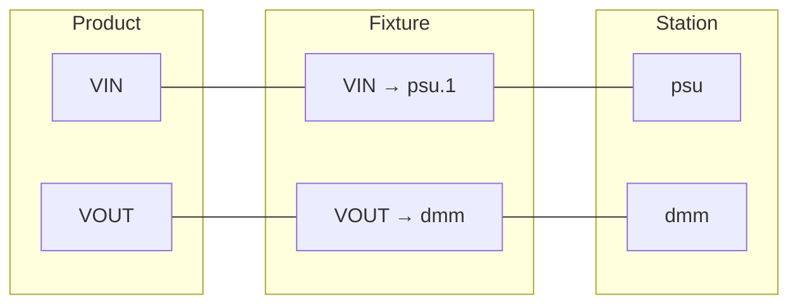

# Fixtures

**Fixtures** define pin-to-instrument mappings, bridging product pins to station instruments. They're optional but essential for production testing with traceability.

## When to Use Fixtures

| Approach | When to Use |
|----------|-------------|
| **Mock objects** | Development, CI, unit tests |
| **Direct instrument access** | Simple benches, quick prototyping |
| **Pin mapping (fixtures)** | Production, complex routing, compliance |

## Fixture Configuration

Fixtures are YAML files in `fixtures/`:

```yaml
# fixtures/power_board_fixture.yaml
id: power_board_fixture
name: "Power Board Test Fixture"
product_id: power_board

connections:
  VIN:
    dut_pin: VIN
    net: VIN_5V
    instrument: psu
    instrument_channel: "1"
  VOUT:
    dut_pin: VOUT
    net: VOUT_3V3
    instrument: dmm
```

### Fixture Fields

| Field | Description |
|-------|-------------|
| `id` | Unique fixture identifier |
| `name` | Display name |
| `product_id` | Specific product this fixture is for |
| `product_family` | Or product family (for shared fixtures) |
| `product_revision` | Optional: specific revision |

### Fixture Connection Fields

| Field | Description |
|-------|-------------|
| `dut_pin` | Reference to product pin |
| `net` | Or schematic net name |
| `instrument` | Station instrument name |
| `instrument_channel` | Channel on the instrument |

## Using the `pins` Fixture

With a fixture configured, tests can access instruments by DUT pin name:

```python
def test_output_voltage(pins):
    """Test using pin-based access."""
    pins["VIN"].set_voltage(5.0)
    pins["VIN"].enable_output()
    voltage = pins["VOUT"].measure_voltage()
    assert float(voltage) > 3.0
```

### Benefits

1. **Decouples tests from wiring** — Same test runs on different stations
2. **Self-documenting** — Code reads like the product spec
3. **Traceability** — Measurements link to DUT pins
4. **Portability** — Move tests between stations easily

## Without Pin Mapping

You don't always need pin mapping. For simple setups, instrument roles from the station config are auto-registered as pytest fixtures:

```python
def test_voltage(psu, dmm, logger):
    """Direct access by role -- auto-registered from station config."""
    psu.set_voltage(5.0)
    psu.enable_output()
    logger.measure("output_voltage", dmm.measure_voltage())
```

Or use the `instrument` accessor for programmatic access:

```python
def test_voltage(instrument, logger):
    """Accessor with grouping support."""
    psu = instrument("psu")
    dmm = instrument("dmm")

    psu.set_voltage(5.0)
    psu.enable_output()
    logger.measure("output_voltage", dmm.measure_voltage())
```

### Instrument Aliases

When a sequence defines per-step aliases, fixture names can resolve to different station instruments depending on which step is running:

```yaml
# sequences/full_test.yaml
steps:
  - id: precision_cal
    test: tests/test_cal.py::test_voltage
    aliases:
      dmm: precision_dmm
  - id: quick_screen
    test: tests/test_screen.py::test_voltage
    aliases:
      dmm: fast_dmm
```

Both tests use `dmm` as a fixture parameter, but each step gets a different physical instrument. Multiple aliases pointing to the same station role return the same instance (N:1 deduplication).

## Multi-Channel Routing

For complex fixtures with switching or routing:

```yaml
# fixtures/multi_product_fixture.yaml
id: multi_product_fixture
product_family: power_converters

connections:
  # First product position
  DUT1_VIN:
    dut_pin: VIN
    instrument: psu
    instrument_channel: "1"
  DUT1_VOUT:
    dut_pin: VOUT
    instrument: dmm
    instrument_channel: "CH1"

  # Second product position
  DUT2_VIN:
    dut_pin: VIN
    instrument: psu
    instrument_channel: "2"
  DUT2_VOUT:
    dut_pin: VOUT
    instrument: dmm
    instrument_channel: "CH2"
```

## Fixture and Station Relationship

Fixtures connect products to stations:



## Active Fixture

Stations track which fixture is currently installed:

```yaml
# stations/bench_1.yaml
id: bench_1
active_fixture: power_board_fixture

instruments:
  # ...
```

This enables runtime validation that the correct fixture is in place.

## Loading Fixtures

In Python:

```python
from litmus.store import load_fixture

fixture = load_fixture("fixtures/power_board_fixture.yaml")
print(fixture.id)
print(fixture.connections)
```

## CLI Usage

```bash
pytest tests/ \
  --station=bench_1 \
  --fixture-config=fixtures/power_board_fixture.yaml \
  --dut-serial=SN001
```

## Multi-Slot Fixtures

For multi-DUT testing, fixtures can define multiple **slots** instead of a single `connections` map. Each slot has its own set of fixture connections, allowing parallel testing of identical products:

```yaml
# fixtures/dual_board_fixture.yaml
id: dual_board_fixture
product_family: power_board

slots:
  slot_1:
    description: Left-side board
    connections:
      vout_measure:
        name: vout_measure
        instrument: dmm
        instrument_channel: "1"
        dut_pin: VOUT
  slot_2:
    description: Right-side board
    connections:
      vout_measure:
        name: vout_measure
        instrument: dmm
        instrument_channel: "2"
        dut_pin: VOUT
```

A fixture uses either `connections` (single-DUT) or `slots` (multi-DUT), never both.

## Shared Instruments

When multiple slots reference the same instrument role, that instrument is automatically detected as **shared**. The orchestrator connects shared instruments once and hosts them via an InstrumentServer (TCP RPC). Worker subprocesses access them through transparent proxy objects — tests never know the difference. Locking is per-resource (keyed on the instrument's connection string), so roles sharing a physical session serialize while roles on independent sessions run in parallel.

For instruments that need active signal switching (e.g., a single DMM routed to different DUT slots via a relay matrix), fixture connections include a `route` field:

```yaml
vout_measure:
  name: vout_measure
  instrument: dmm
  dut_pin: VOUT
  route:
    switch: matrix
    channels: ["r0c0"]
    settling_ms: 10
```

See the `examples/02-station/fixtures/` directory for complete working fixture examples.

## Best Practices

1. **One fixture per product** — Or per product family
2. **Use descriptive connection names** — Match product pin names
3. **Include all connections** — Even ground references
4. **Document channel assignments** — For complex routing
5. **Version fixtures** — Track changes with product revisions

## Example: Complete Setup

**Product spec:**
```yaml
# products/power_board.yaml
id: power_board

pins:
  VIN:
    name: "J1.1"
    type: power
  VOUT:
    name: "J1.3"
    type: signal
  GND:
    name: "J1.2"
    type: ground
```

**Station config:**
```yaml
# stations/bench_1.yaml
id: bench_1

instruments:
  psu:
    type: psu
    driver: pymeasure.instruments.keysight.KeysightE36312A
    resource: "GPIB0::5::INSTR"
  dmm:
    type: dmm
    driver: pymeasure.instruments.keysight.Keysight34461A
    resource: "TCPIP::192.168.1.100::INSTR"
```

**Fixture:**
```yaml
# fixtures/power_board_fixture.yaml
id: power_board_fixture
product_id: power_board

connections:
  VIN:
    dut_pin: VIN
    instrument: psu
    instrument_channel: "1"
  VOUT:
    dut_pin: VOUT
    instrument: dmm
  GND:
    dut_pin: GND
    instrument: psu
    instrument_channel: "GND"
```

**Test:**
```python
def test_output_voltage(pins):
    pins["VIN"].set_voltage(5.0)
    pins["VIN"].enable_output()
    voltage = pins["VOUT"].measure_voltage()
    assert 3.0 < float(voltage) < 3.6
```

## Next Steps

- [Architecture](architecture.md) — System data flow
- [Configuration Reference](../reference/configuration.md) — YAML schemas
- [Writing Tests](../guides/writing-tests.md) — pytest patterns
