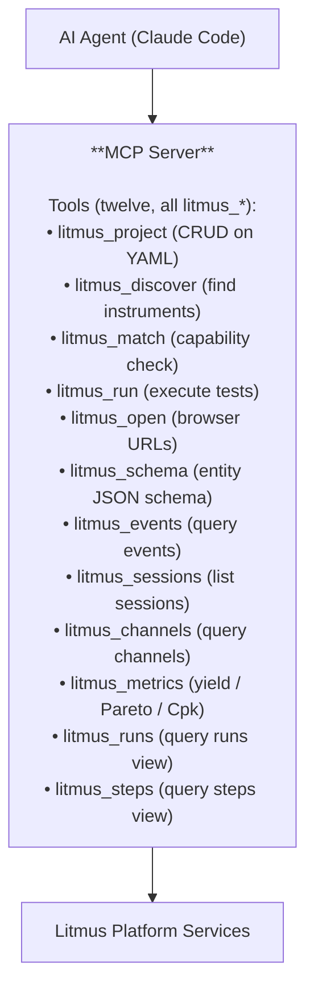
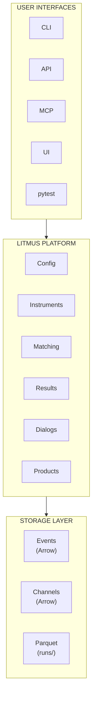

# Platform Architecture

Litmus is a **hardware test platform**, not a test framework. Understanding this distinction is key to using Litmus effectively.

## Platform vs framework

A test framework's job ends at "run the test." A test platform's job is everything around it: store the result, version the config, route signals to instruments, expose what happened to operators and dashboards and AI agents. Litmus does the platform job and delegates execution to pytest (the primary integration) or any other Python entry point that calls into `LitmusClient` to submit results.

## What Litmus provides

The infrastructure pieces a hardware-test team needs whether they're running pytest, a hand-written loop, or a bridge from a non-Python runner:

- **Configuration** — `litmus.yaml` (project), `stations/*.yaml` (benches), `fixtures/*.yaml` (DUT routing), `products/*.yaml` (specs), `catalog/*.yaml` (instrument capabilities). All YAML, all Pydantic-validated, all editable without touching test code.
- **Instrument plumbing** — auto-fixtures from station YAML, the `Mock` substitution for hardware-free tests, switch-route activation through fixture connections. Drivers themselves are user-supplied (PyMeasure, PyVISA, vendor SDK).
- **Capability matching** — does this station have what this product needs? See [capabilities](../configuration/capabilities.md).
- **Results storage** — three stores feeding one queryable surface: the [event log](../data/event-log.md), the parquet runs store, and the channel store for time-series. See [three stores](../data/three-stores.md) for the layout and tradeoffs.
- **Operator surface** — NiceGUI web UI, operator prompts during a test, real-time dashboards.
- **AI surface** — MCP server exposing tools an agent can drive: discovery, matching, run launching, results query. Platform never calls an LLM itself.

## What Litmus does not provide

- **A test execution engine.** Litmus delegates to pytest for new projects; non-pytest runners (LabVIEW / TestStand bridges, hand-written loops, etc.) use [`LitmusClient`](../../reference/client.md) to submit results.
- **Instrument drivers.** Bring your own — PyMeasure, PyVISA, vendor libraries, or your own classes derived from `Instrument` / `VisaInstrument` (importable from `litmus.instruments.base` and `litmus.instruments.visa` respectively). See [custom drivers](../../how-to/configuration/custom-drivers.md).

## Multiple Entry Points

Because Litmus is a platform, you can access it through multiple entry points:

| Entry Point | Use Case | How It Works |
|-------------|----------|--------------|
| **pytest** | New test development | pytest-native: [`context`](../../how-to/execution/test-context.md), `verify`, `logger` [fixtures](../../reference/litmus-fixtures.md) |
| **CLI** | Operations, debugging | `litmus runs`, `litmus show` |
| **HTTP API** | CI/CD, dashboards | `POST /api/runs`, `GET /api/runs/{id}` |
| **MCP Server** | AI integration | Claude Code, other AI agents |
| **Operator UI** | Production floor | NiceGUI web interface |

All entry points share the same:
- Configuration files
- Instrument drivers
- Result storage
- Data models

## pytest integration (primary path)

For new projects, use the pytest plugin. Station YAML declares your instruments; the plugin auto-registers a fixture per role (`dmm`, `psu`, etc.) and supplies `context` / `verify` / `logger` for the test body:

```python
def test_output_voltage(context, psu, dmm, verify):
    psu.set_voltage(context.get_param("vin", 5.0))
    psu.enable_output()
    verify("output_voltage", dmm.measure_dc_voltage())
```

`psu` and `dmm` come from `instruments:` in the active station YAML — they aren't built-in fixtures. See [writing-tests](../../how-to/execution/writing-tests.md) for the full pytest-native surface.

## Catch-all (results API)

For any test source that isn't pytest — LabVIEW shelling out, TestStand step calling Python, an ad-hoc characterization script:

```python
from litmus.client import LitmusClient

client = LitmusClient()

run = client.start_run(
    dut_serial="SN123",
    station_id="bench_01",
    test_phase="production",
)

with run.step("output_voltage") as step:
    step.measure("output_voltage", 3.31, units="V", low=3.135, high=3.465)

run.finish()
```

See the [Python client reference](../../reference/client.md) for the full surface (`start_run`, `RunBuilder.step`, `StepBuilder.measure`, `VectorBuilder` for parametrized steps).

## AI Integration (MCP)

Litmus exposes its platform services via MCP (Model Context Protocol):



**Important:** Litmus does NOT call LLMs. It exposes tools for AI agents to call.

## When to use what

| Scenario | Approach |
|---|---|
| New pytest project | pytest-native tests with `context` / `verify` / `logger` fixtures (see [tutorial step 3](../../tutorial/03-fixtures.md)). |
| Existing pytest tests | Drop in Litmus fixtures + sidecar YAML incrementally — see [integration/pytest-existing](../../integration/pytest-existing.md). |
| LabVIEW / TestStand / non-pytest runners | Use [`LitmusClient`](../../reference/client.md) to write run results from any Python boundary the other runner can shell out to. |
| AI-assisted test authoring | Run the [MCP server](../../how-to/overview/mcp-integration.md) and point Claude Code / Cursor / Cline at it. |

## Architecture Summary



Litmus is the infrastructure layer that connects your tests (top) to your data (bottom), regardless of how you choose to run them.
