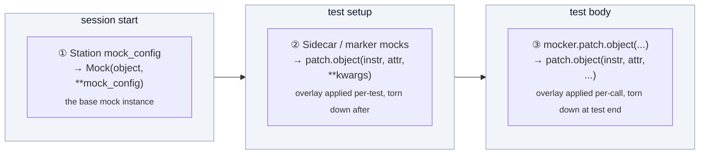

# Mock mode

Run tests without hardware. Litmus mocks instruments at the driver layer so your test code is identical to the real-hardware path.

## Quick start

Pass `--mock-instruments` to substitute mock instruments for every real driver the active station declares:

```bash
pytest tests/ --station=bench_1 --mock-instruments --uut-serial=SIM001
```

Or set the env var:

```bash
export LITMUS_MOCK_INSTRUMENTS=1
pytest tests/ --station=bench_1 --uut-serial=SIM001
```

Or set `mock_instruments: true` in your project's `litmus.yaml` so every run mocks by default; override per-run with `--no-mock-instruments`.

Take the [`mock_instruments`](../../reference/pytest/fixtures.md#mock_instruments-session) fixture inside a test if you need to branch:

```python
@pytest.fixture
def my_setup(mock_instruments):
    if mock_instruments:
        yield {"mode": "mock"}
    else:
        yield {"mode": "hardware"}
```

All four sources are checked in this priority order — first match wins:

1. `--mock-instruments` / `--no-mock-instruments` CLI flag (either explicit flag wins).
2. `LITMUS_MOCK_INSTRUMENTS=1` env var.
3. `litmus.yaml: mock_instruments:` project default.
4. `False` if nothing else set.

## What mock mode actually does

For each instrument in the active station YAML, Litmus substitutes a stand-in for the real driver. The driver class is never imported; `connect()` is never called. The substituted object behaves like this:

- **`isinstance(dmm, MyDMM)` is `False`.** The stand-in isn't a subclass of your driver class. Tests that rely on isinstance against the real driver class will fail; either don't do that, or build your own stand-in in a conftest fixture (see [bringup-tier conftest in custom-drivers.md](custom-drivers.md#conftestpy-bringup-tier-no-station-yaml-yet)).
- **Every method call is a silent no-op returning `None`** unless you've listed it in `mock_config:`. Missing methods don't raise `AttributeError`.
- **Methods you do list in `mock_config:` return the configured value** — a scalar (returned on every call), a **noise spec** `{nominal, sigma}` (a fresh `random.gauss(nominal, sigma)` draw each call), a dict (first positional arg is the lookup key), or a callable (invoked with the call args).
- `connect()` / `disconnect()` are wired automatically; the stand-in works as a context manager.
- When the station entry references an instrument-asset file (`instruments/<id>.yaml`), the stand-in carries the asset's identity fields (`manufacturer` / `model` / `serial` / `firmware`) so traceability rows still show meaningful values. Without an asset reference these stay `None`.

What the platform skips for mocked instruments:

- **`*IDN?` identity verification** — only runs against real hardware.
- **Resource locking** — mocks don't take the inter-process file lock on the resource string that real instruments take.

What still runs for mocks:

- **Calibration check.** Runs unconditionally. If the instrument's asset file (`instruments/<id>.yaml`) has a `calibration:` block with an expired or near-due date, you'll see the warning whether the instrument is real or mocked.
- **`test_phase` auto-demotion to `"development"`.** `--mock-instruments` (or any per-instrument `mock: true`) demotes the run's `test_phase` regardless of what `--test-phase=` requested. Dashboards and queries can filter mock data out of production yield by `WHERE test_phase = 'production'`.

## The three independent mock layers

Litmus has three places mock values get into a running test, applied in distinct passes. They are NOT a single priority chain — each layer adds or overrides values on top of the previous one.



Each layer's source of truth:

| Layer | Where it's configured | When it applies | What it can set |
|---|---|---|---|
| ① Station defaults | `stations/<id>.yaml` → `instruments.<role>.mock_config` | Built at session start, every test sees it | Default method return values for the role |
| ② Sidecar / marker | `tests/test_*.yaml` → `mocks:` (or `tests.<name>.mocks:`), or `@pytest.mark.litmus_mocks([...])` inline | Per-test, layered on top of ① for the duration of the test | Any kwarg `unittest.mock.patch.object` accepts (`return_value`, `side_effect`, `wraps`, `spec`, …) |
| ③ Test-body patch | Inside the test body | Per-call, inside one test only | Any per-vector / per-row override. Requires `pytest-mock` — add it to your project's dev dependencies; Litmus does not pull it in. |

Layer ② cascade walks file → class → test → profile. Later entries with the same `target` overwrite earlier ones. **A profile with `mocks: []` does NOT clear earlier entries** — it simply contributes nothing. To remove a specific target, re-declare it with the value you want.

The non-pytest `TestHarness` entry point has its own per-vector path: pass `_mocks: {...}` on a vector to apply method overrides for just that vector, falling back to the harness's `config["mocks"]` test-level dict when a vector doesn't carry one.

## Verify mocks are actually firing

Three signals to check before you trust a mock-mode result:

1. **The `mock_instruments` fixture is `True`**:
   ```python
   def test_check_mock_active(mock_instruments):
       assert mock_instruments
   ```

2. **The run record's `test_phase` is `"development"`** — `--mock-instruments` (or `mock: true` on any instrument) auto-demotes the phase. Read it from the parquet row, or via:
   ```python
   from litmus.queries import RunsQuery
   with RunsQuery() as q:
       row = q.get(run_id)
       assert row.test_phase == "development"
   ```

3. **`fixture.instrument_connected` events carry `mocked: true`** — each instrument logs whether it came up real or mocked:
   ```python
   from litmus.queries import EventStore
   store = EventStore()
   try:
       for ev in store.events(session_id=session_id, event_type="fixture.instrument_connected"):
           print(ev["role"], ev["mocked"])
   finally:
       store.close()
   ```

If a measurement comes back as `None`, the next `float(...)` cast or `verify(...)` will surface it as an `ERRORED` row — the most likely cause is that the method the test called (e.g. `dmm.measure_dc_voltage()`) wasn't listed in `mock_config:`. Add it, or layer a `mocks:` entry over it.

## Layer ① — Station `mock_config`

Default values that apply whenever the role is mocked (whether by `--mock-instruments`, env var, project default, or per-instrument `mock: true`). Keys are **method names on the driver class**, not signal names.

```yaml
# stations/bench_1.yaml
id: bench_1
name: "Production Bench 1"

instruments:
  dmm:
    type: dmm
    driver: pymeasure.instruments.keysight.Keysight34461A
    resource: "TCPIP::192.168.1.100::INSTR"
    mock_config:
      measure_dc_voltage: 3.31
      measure_current: 0.1
      measure_resistance: 1000

  psu:
    type: psu
    driver: pymeasure.instruments.keysight.KeysightE36312A
    resource: "GPIB0::5::INSTR"
    mock_config:
      measure_voltage: 5.0
      measure_current: 0.5
```

For [per-instrument `mock: true`](#per-instrument-mock-on-real-stations) (mocking one instrument while keeping others on real hardware), `mock_config:` works the same way.

### Noisy readings — `{nominal, sigma}`

A constant return is fine for a happy-path test, but it produces a single
repeated measurement value — no spread for distribution / Cpk / yield views.
To make a mocked reading vary, give it a **noise spec** instead of a scalar:

```yaml
    mock_config:
      measure_dc_voltage: {nominal: 3.31, sigma: 0.02}   # gauss(3.31, 0.02) each read
      measure_current:    {nominal: 0.042, sigma: 0.003}
```

Each call returns a fresh `random.gauss(nominal, sigma)` draw, so repeated
runs land a real distribution — some inside the limit, some outside if `sigma`
is wide enough relative to the spec. A dict is read as a noise spec when it has
a `nominal` key; without one it's the SCPI-style arg→return lookup above.


## Layer ② — Sidecar `mocks:` (the `litmus_mocks` marker)

Per-test overrides written in the sidecar YAML next to the test module, or inline via `@pytest.mark.litmus_mocks([...])`. The sidecar form is the YAML serialization of the marker; both feed the same [`litmus_mocks`](../../reference/pytest/markers.md#litmus_mocks) pipeline.

Each entry is a `target:` plus any kwargs `unittest.mock.patch.object` accepts. Unknown kwargs pass through verbatim. The ones `patch.object` actually does something useful with:

| Field | Effect |
|---|---|
| `target` | `<fixture_name>.<attr>` — the per-role auto-fixture (e.g. `dmm`) plus the method/property to patch. Required. |
| `return_value` | Constant return value for every call. |
| `side_effect` | A callable, an iterable (yields one value per call), or — **only when constructed in Python code** — an exception class to raise. |
| `wraps` | Pass-through to the underlying object (record calls without overriding return value). |
| `spec` / `spec_set` / `autospec` / `new_callable` | Forwarded verbatim to `patch.object`. |

File-level `mocks:` applies to every test in the file. Per-test override goes under `tests.<test_name>.mocks:`:

```yaml
# tests/test_power.yaml

# File-level: every test in test_power.py uses these unless overridden
mocks:
  - target: dmm.measure_dc_voltage
    return_value: 3.31

# Per-test override
tests:
  test_output_voltage:
    mocks:
      - target: dmm.measure_dc_voltage
        return_value: 3.32         # overrides the file-level value
      - target: psu.measure_current
        return_value: 0.5
```

The cascade order is file → class → test → profile, by `target`. Later wins; non-overlapping passes through. **`mocks: []` in a profile does not strip earlier entries.** To remove a specific target, re-declare it with the value you want.

### `side_effect`: sequence of values

Yields one value per call:

```yaml
tests:
  test_settling:
    mocks:
      - target: dmm.measure_dc_voltage
        side_effect: [3.1, 3.2, 3.28, 3.3, 3.3]   # one value per call
```

### `side_effect`: raise an exception

YAML cannot carry a Python exception class — a string like `"pyvisa.errors.VisaIOError"` would be passed verbatim to `patch.object` and used as a return value, not raised. To raise an exception, install the mock from test-body Python instead (layer ③):

```python
import pyvisa

def test_handle_timeout(dmm, mocker):
    mocker.patch.object(dmm, "measure_dc_voltage", side_effect=pyvisa.errors.VisaIOError)
    # ... exercise retry / error-handling code path ...
```

## Layer ③ — Test-body patches via `mocker`

For per-vector / per-row decisions, or for exception-raising side effects, patch inside the test body using `pytest-mock`'s `mocker` fixture. **`pytest-mock` is not bundled with Litmus** — add it to your project's dev dependencies (`uv add --dev pytest-mock`) before using `mocker`.

```python
import pytest

def test_load_regulation(load, dmm, verify, mocker):
    # decide the value based on the active vector
    expected = {0.1: 3.32, 0.5: 3.30, 0.8: 3.28}[load]
    mocker.patch.object(dmm, "measure_dc_voltage", return_value=expected)
    verify("output_voltage", dmm.measure_dc_voltage())
```

Pair with a sidecar sweep so pytest parametrizes the test:

```yaml
# tests/test_power.yaml
tests:
  test_load_regulation:
    sweeps:
      - {load: [0.1, 0.5, 0.8]}
```

`mocker.patch.object` runs after sidecar / marker mocks are installed, so it layers on top of them for the same test.

This is also the path for **dict-keyed and callable values** — useful for SCPI-style mocks that need to respond differently to different commands:

```python
def test_idn_and_measure(dmm, mocker):
    # Callable: dict-style lookup by first positional arg
    mocker.patch.object(dmm, "query", new=lambda cmd: {
        "*IDN?":           "Vendor,Model,SN001,1.0",
        "MEAS:VOLT?":      "3.31",
        "MEAS:CURR?":      "0.10",
    }.get(cmd, ""))
```

Layer ① accepts the same dict-form and callable-form values in `mock_config:` as `mocker.patch.object` does.

## Per-instrument mock on real stations

Mock one instrument while keeping others on real hardware. Set `mock: true` on the instrument's station entry. With `mock: true`, the entry doesn't need `driver:` or `resource:` — the validator skips both requirements when the instrument is declared as a mock:

```yaml
# stations/mixed_bench.yaml
id: mixed_bench
name: "Mixed Mode Bench"

instruments:
  psu:
    type: psu
    driver: pymeasure.instruments.keysight.KeysightE36312A
    resource: "GPIB0::5::INSTR"
    # Real hardware

  dmm:
    type: dmm
    mock: true                     # Always mock this instrument
    mock_config:
      measure_dc_voltage: 3.3

  eload:
    type: eload
    driver: drivers.eload.MyELoad
    resource: "TCPIP::192.168.1.101::INSTR"
    # Real hardware
```

Run **without** `--mock-instruments`:

```bash
pytest tests/ --station=mixed_bench --uut-serial=SN001
```

`psu` and `eload` connect to real hardware; `dmm` is mocked. With `--mock-instruments` (or the env var, or `mock_instruments: true` in `litmus.yaml`), every instrument is mocked regardless of per-instrument `mock:` flags — the per-instrument flag is OR'd with the session-wide flag.

Common scenarios:

- One instrument is in cal lab — set `mock: true` on it, leave the rest real.
- Hardware-in-the-loop CI where one expensive instrument isn't available.
- Testing instrument-specific edge cases without disturbing the rest of the bench.

## CI

Mock-only CI is the canonical path for the green/red check on every PR:

```yaml
# .github/workflows/test.yml
- name: Run tests
  run: |
    pytest tests/ \
      --station=ci_station \
      --mock-instruments \
      --uut-serial=CI-TEST \
      --test-phase=development
```

Pair with a `stations/ci_station.yaml` where every instrument's `mock_config:` covers every method the tests call. If a method isn't in `mock_config`, the mock returns `None`, and any downstream `float(...)` or arithmetic will fail loudly.

## Best practices

### Match limit nominals

When a test has a limit, set the mock's return value to the limit's nominal. The test passes in mock mode and any real-hardware failure is a real failure, not a mock-config mismatch:

```yaml
# stations/bench_1.yaml
instruments:
  dmm:
    mock_config:
      measure_dc_voltage: 3.3        # matches the nominal below
```

```yaml
# tests/test_power.yaml
limits:
  output_voltage:
    low: 3.135
    high: 3.465
    nominal: 3.3
    units: V
```

### Use realistic values

```yaml
# Good — values you'd see on real hardware
mock_config:
  measure_dc_voltage: 3.31
  measure_current: 0.102

# Bad — obvious sentinels make every test pass even when limits are wrong
mock_config:
  measure_dc_voltage: 1234
```

### Don't write per-vector `_mocks` in the sidecar

Sidecar YAML doesn't support per-vector mocks (only file-level / class-level / per-test). For per-vector values, drive them from the test body via `mocker.patch.object(...)` (layer ③ above).

### Method names, not signal names

`mock_config:` keys must match the **method names on the driver class**. `voltage:` doesn't work because the real driver doesn't have a `voltage()` method — it has `measure_dc_voltage()` (DMM), `measure_voltage()` (PSU/ELoad), `set_voltage()`, etc. If you're not sure what the driver class exposes, read its source.

## See also

- [Litmus fixtures → `mock_instruments`](../../reference/pytest/fixtures.md#mock_instruments-session) — the boolean fixture this page demonstrates
- [Litmus markers → `litmus_mocks`](../../reference/pytest/markers.md#litmus_mocks) — the marker that sidecar `mocks:` blocks compile to
- [Custom drivers](custom-drivers.md) — driver authoring, including the bringup-tier conftest pattern that uses `Mock(MyDMM, …)` directly
- [Configuration reference → Station YAML](../../reference/configuration.md#station-yaml) — `mock_config:`, `mock:` field shapes
- [Limits](../execution/limits.md) — limit resolution chain (what the nominal you matched feeds into)
- [Profiles](../execution/profiles.md) — sidecar / marker cascade rules including how `mocks:` lists merge
- [Configuring stations](configuring-stations.md) — full station YAML reference
- [Writing tests](../execution/writing-tests.md) — pytest-test authoring patterns
