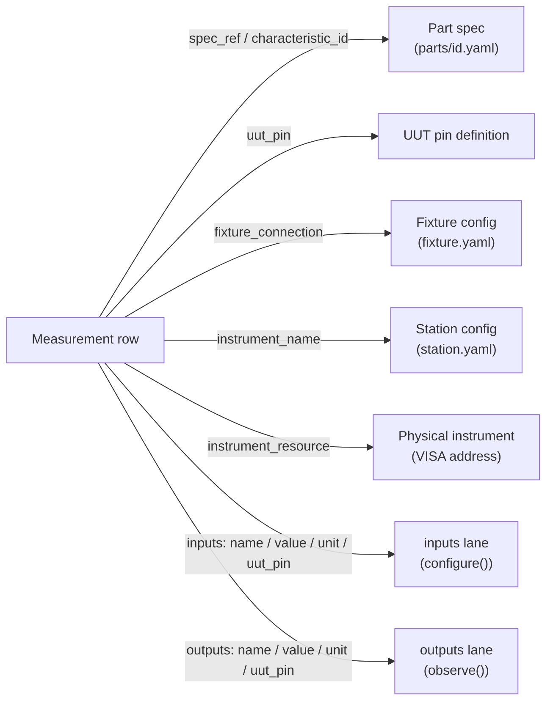

# Measurement Traceability

Every measurement Litmus records carries a fixed set of traceability fields. The platform stamps them automatically — you don't add them by hand unless you're passing raw values without using the `verify` fixture or a fixture connection.

## What gets recorded

### Per-measurement fields

These fields attach to each individual measurement. They come from the `verify` / `measure` call site, the active fixture connection, and the station config.

| Field | Description | Example |
|-------|-------------|---------|
| `measurement_name` | Name passed to `verify` / `measure` | `"output_voltage"` |
| `measurement_value` | Numeric result | `3.312` |
| `measurement_unit` | Unit string | `"V"` |
| `measurement_outcome` | Pass / fail verdict | `"passed"` |
| `uut_pin` | UUT pin the measurement was taken at | `"J1.3"`, `"TP_VOUT"` |
| `instrument_name` | Station-config logical name for the instrument | `"dmm"`, `"dmm_main"` |
| `instrument_resource` | VISA address or connection string | `"TCPIP::192.168.1.100::INSTR"` |
| `instrument_channel` | Channel on the instrument | `"CH1"`, `"ai0"` |
| `fixture_connection` | Fixture connection name | `"VOUT"`, `"VIN_SENSE"` |
| `characteristic_id` | Part-spec characteristic key | `"output_voltage"` |
| `spec_ref` | Spec reference string | `"output_voltage @ tolerance_pct=5"` |
| `limit_low` | Lower limit | `3.135` |
| `limit_high` | Upper limit | `3.465` |
| `limit_nominal` | Nominal value | `3.3` |
| `limit_comparator` | How value is compared to limits | `"GELE"` |

### Stimulus inputs and environmental readings

Values recorded with `context.configure()` (stimulus) and `context.observe()` (environmental readings) are stored in the parquet `inputs` and `outputs` nested columns. Each entry carries `name`, `value`, `unit`, and `uut_pin` for that specific entry. There are no per-input `instrument_name` or `resource` columns — instrument identity for measurements is on the measurement row itself.

The `inputs` and `outputs` columns are EAV (entity-attribute-value) lists, not wide columns. The DuckDB daemon projects them into the `measurements_dynamic` table for queries, keyed by `(role, name)` where `role` is `"input"` or `"output"`.

### Run context

Every measurement row also carries the run's context fields — `uut_serial`, `uut_part_number`, `station_hostname`, `operator_id`, `test_phase`, `git_commit`, and others. These come from the run record, not from individual test functions.

## Setting traceability in tests

### Automatic (via `verify` with fixture connections)

When your test uses `context.connections` or declares `@pytest.mark.litmus_characteristics`, `verify` stamps `uut_pin` and `characteristic_id` automatically from the active connection.

```python
@pytest.mark.litmus_characteristics(["rail_3v3", "rail_5v"])
def test_all_rails(self, context, dmm, verify):
    for conn in context.connections:
        verify("voltage", dmm.measure_dc_voltage())
        # uut_pin and characteristic_id are stamped from conn
```

### Manual instrument traceability

When using instruments directly without fixture connections, pass traceability fields to `verify`:

```python
def test_output_voltage(self, dmm, verify):
    voltage = dmm.measure_dc_voltage()
    verify(
        "output_voltage",
        voltage,
        uut_pin="J1.3",
        instrument_name="dmm",
        instrument_channel="CH1",
    )
```

### Recording stimulus conditions with `configure()`

Stamp stimulus values that aren't already sweep params using `context.configure()`. These land in the `inputs` lane on the measurement row.

```python
def test_rails(self, context, psu, dmm, verify):
    psu.set_voltage(5.0)
    actual = psu.read_voltage()
    context.configure("psu.actual_voltage", actual, unit="V")
    verify("output_voltage", dmm.measure_dc_voltage())
```

See [Read and write the test context](test-context.md) for the full `configure()` / `observe()` API.

### Custom run-level metadata with `run_context`

Add metadata that should appear on every measurement row in the run:

```python
def test_with_metadata(self, run_context, psu, dmm, verify):
    run_context.set("operator_badge", "EMP-12345")
    run_context.set("fixture_serial", "FIX-001")
    run_context.set("ambient_temp", 23.5)

    psu.set_voltage(5.0)
    verify("output_voltage", dmm.measure_dc_voltage())
```

`run_context.set(...)` fields are run-level `custom_metadata` — stored in the parquet file's metadata (and exported as `custom_<key>` columns in CSV), not on the per-measurement rows.

## Comparators (IEEE 1671)

The `limit_comparator` field controls how the measured value is checked against limits.

### Range comparators

| Comparator | Pass condition |
|------------|----------------|
| `GELE` | `low <= value <= high` (default) |
| `GELT` | `low <= value < high` |
| `GTLE` | `low < value <= high` |
| `GTLT` | `low < value < high` |

### Single-bound comparators

| Comparator | Pass condition |
|------------|----------------|
| `GE` | `value >= low` |
| `GT` | `value > low` |
| `LE` | `value <= high` |
| `LT` | `value < high` |

### Equality comparators

| Comparator | Pass condition |
|------------|----------------|
| `EQ` | `value == nominal` |
| `NE` | `value != nominal` |

Set the comparator in the sidecar YAML alongside the limit:

```yaml
tests:
  test_output_voltage:
    limits:
      output_voltage:
        low: 3.135
        high: 3.465
        nominal: 3.3
        comparator: GELE
        unit: V

  test_minimum_current:
    limits:
      load_current:
        low: 0.1
        comparator: GE
        unit: A
```

## Querying traceable results

### From the CSV export

The CSV exporter writes one row per measurement with fixed columns plus dynamic `input_{name}` and `output_{name}` columns from `context.configure()` and `context.observe()`.

```python
import pandas as pd

df = pd.read_csv("reports/abc12345.csv")

# Filter by UUT pin
j1_3 = df[df["uut_pin"] == "J1.3"]

# Filter by instrument
dmm_rows = df[df["instrument_name"] == "dmm_main"]

# Find failures at a specific stimulus condition
# (assuming you recorded vin via context.configure("vin", ...))
failures = df[(df["outcome"] == "failed") & (df["input_vin"] == 12.0)]
```

Key CSV columns: `measurement_name`, `value`, `unit`, `outcome`, `uut_pin`, `instrument_name`, `spec_ref`, `characteristic_id`, `limit_low`, `limit_high`, `limit_comparator`, `uut_serial`, `step_name`. Dynamic inputs appear as `input_{name}` and dynamic outputs as `output_{name}`.

### From the DuckDB query API

For cross-run analytics, use `MeasurementsQuery`. The `measurements` view exposes fixed columns (`measurement_name`, `measurement_value`, `measurement_outcome`, `uut_pin`, `instrument_name`, etc.) directly. Input and output fields live in the `measurements_dynamic` EAV table and are accessed via `FieldRef`:

```python
from litmus.analysis.measurements_query import MeasurementsQuery
from litmus.analysis.measurement_facets import FieldRef, FilterSet

with MeasurementsQuery() as q:
    # Yield summary by part
    rows = q.yield_summary(part="PN-123", period="week")

    # Cpk for a specific measurement
    cpk_rows = q.cpk(field="output_voltage", part="PN-123")

    # Parametric: output_voltage vs vin (input) across runs
    points = q.parametric(
        y=FieldRef.measurement("output_voltage"),
        x=FieldRef.input("vin"),
    )
```

`FieldRef.input("vin")` selects values recorded via `context.configure("vin", ...)`. `FieldRef.output("temp")` selects values recorded via `context.observe("temp", ...)`. `FieldRef.measurement("output_voltage")` selects a named measurement's value column.

### Direct DuckDB (advanced)

For ad-hoc queries, the `measurements_materialized` table in the DuckDB index carries the full flattened measurement fact. Dynamic inputs and outputs are in `measurements_dynamic` (EAV, keyed by `run_id, step_index, vector_index, vector_retry, role, name`):

```sql
-- All failed measurements with their UUT pin and instrument
SELECT
    uut_serial,
    measurement_name,
    measurement_value,
    instrument_name,
    uut_pin,
    spec_ref
FROM measurements_materialized
WHERE measurement_outcome = 'failed';

-- Measurements joined with a specific input condition (vin)
SELECT
    m.uut_serial,
    m.measurement_name,
    m.measurement_value,
    d.value_double AS vin
FROM measurements_materialized m
LEFT JOIN measurements_dynamic d
    ON  d.run_id       = m.run_id
    AND d.step_index   = m.step_index
    AND d.vector_index = m.vector_index
    AND d.vector_retry IS NOT DISTINCT FROM m.vector_retry
    AND d.role         = 'input'
    AND d.name         = 'vin'
WHERE m.measurement_outcome = 'failed';
```

> **Note:** Direct parquet queries via `read_parquet()` see the nested `inputs` / `outputs` list columns (EAV structs), not flat `input_vin` columns. Use the DuckDB index (`measurements_materialized` + `measurements_dynamic`) for flat access, or use the CSV export for pandas workflows.

## The traceability chain



## See also

- [Read and write the test context](test-context.md) — `configure()`, `observe()`, and how inputs and outputs land on measurement rows
- [Test limits](limits.md) — comparator shapes, condition-indexed bands
- [Spec-driven testing](spec-driven-testing.md) — `characteristic_id` and `spec_ref` from the part YAML
- [Parquet schema reference](../../reference/data/parquet-schema.md) — complete column definitions for the at-rest format
