# Measurement Traceability

Litmus provides ATML-style traceability for every measurement, enabling compliance reporting, root cause analysis, and calibration tracking.

**The framework automatically captures ALL metadata when a measurement is produced.** No user effort required.

## What is ATML?

**ATML (Automatic Test Markup Language)** is an IEEE standard (IEEE 1671) for exchanging test information. It defines:

- Standard vocabulary for test outcomes (IEEE-1671 uses PASS / FAIL / SKIP / ERROR; Litmus maps these onto its lowercase `passed / failed / skipped / errored / done / terminated / aborted` enum)
- Standard comparator types (GELE, GTLT, EQ, NE, etc.)
- Signal routing concepts (how measurements trace back to UUT pins and instruments)

Litmus adopts ATML terminology and concepts to enable interoperability with other test systems and compliance with industry standards.

## Traceability Fields

Every Measurement in Litmus includes traceability fields:

### Measurement Signal Path

| Field | Description | Example |
|-------|-------------|---------|
| `spec_ref` | Reference to specification | `"output_voltage"` |
| `uut_pin` | Which UUT pin was measured | `"J1.3"`, `"TP_VOUT"` |
| `instrument_name` | Station config instrument name | `"dmm"`, `"dmm_main"` |
| `instrument_resource` | VISA address or connection | `"TCPIP::192.168.1.100::INSTR"` |
| `instrument_channel` | Channel on the instrument | `"CH1"`, `"ai0"`, `"1"` |
| `fixture_connection` | Fixture connection name | `"VOUT"`, `"VIN_SENSE"` |

### Stimulus Signal Path (Dynamic)

For each input parameter, Litmus captures the full signal path:

| Column Pattern | Description | Example |
|----------------|-------------|---------|
| `in_{param}` | Value commanded | `in_vin = 12.0` |
| `in_{param}_instrument` | Instrument name | `in_vin_instrument = "psu_main"` |
| `in_{param}_resource` | VISA address | `in_vin_resource = "TCPIP::..."` |
| `in_{param}_channel` | Channel | `in_vin_channel = "CH1"` |
| `in_{param}_uut_pin` | UUT pin driven | `in_vin_uut_pin = "VIN"` |
| `in_{param}_fixture_connection` | Fixture routing | `in_vin_fixture_connection = "vin_supply"` |

## The Traceability Chain

Every measurement can be traced from result back to source:

```mermaid
flowchart LR
    meas["Measurement Output"]
    spec["Part Spec<br/>(parts/id.yaml)<br/><sub>Characteristic ID from datasheet</sub>"]
    pin["Part Pin Definition<br/><sub>Physical location: J1.3, net: VOUT</sub>"]
    fix["Fixture Config<br/>(fixture.yaml)<br/><sub>Maps UUT pin to instrument</sub>"]
    sta["Station Config<br/>(station.yaml)<br/><sub>Logical name: dmm_main</sub>"]
    res["Physical Connection<br/><sub>VISA: TCPIP::192.168.1.100::INSTR</sub>"]
    ch["Instrument Channel<br/><sub>Specific input: CH1, ai0</sub>"]

    meas -- spec_ref --> spec
    meas -- uut_pin --> pin
    meas -- fixture_connection --> fix
    meas -- instrument_name --> sta
    meas -- instrument_resource --> res
    meas -- instrument_channel --> ch

    stim["Stimulus Inputs<br/>(in_&#123;param&#125;)"]
    sinstr["Source instrument"]
    sres["VISA address"]
    sch["Channel on instrument"]
    spin["UUT pin driven"]
    sfix["Fixture routing"]

    stim -- in_{param}_instrument --> sinstr
    stim -- in_{param}_resource --> sres
    stim -- in_{param}_channel --> sch
    stim -- in_{param}_uut_pin --> spin
    stim -- in_{param}_fixture_connection --> sfix
```



## Setting Traceability in Tests

### Automatic (via Fixture)

When you use the `pins` fixture, traceability is captured automatically:

```python
def test_output_voltage(pins, measure):
    # pins["VOUT"] knows:
    # - uut_pin (from part spec)
    # - instrument_name (from fixture)
    # - instrument_resource (from station)
    # - instrument_channel (from fixture)
    measure("output_voltage", pins["VOUT"].measure_voltage())
```

### Manual (Direct Instruments)

When using instruments directly, set traceability manually:

```python
def test_output_voltage(dmm, measure):
    voltage = dmm.measure_dc_voltage()

    measure(
        "output_voltage",
        voltage,
        uut_pin="J1.3",
        instrument_name="dmm",
        instrument_channel="CH1",
    )
```

### Using PartContext

For spec-driven traceability:

```python
def test_output_voltage(dmm, verify):
    # verify resolves the limit and traceability from the active
    # PartContext (configured via --part=parts/power_board.yaml)
    verify("output_voltage", dmm.measure_dc_voltage())
```

### Hierarchical Context

The [harness](../../integration/runtime/harness.md) (Litmus's runner-agnostic execution wrapper) provides hierarchical context with scoped inheritance:

```python
from litmus.execution.harness import TestHarness

harness = TestHarness(step_name="my_test")

# Run-level: visible to all steps and vectors
harness.run_context.configure("operator", "jane")

with harness.step():
    # Step-level: visible to all vectors in this step
    harness.context.configure("fixture.id", "FIX-01")

    with harness.run_vector(vector) as tv:
        # Vector-level: inherits from step and run
        harness.context.observe("temp_probe.temp", 24.8)

        # tv.params includes: operator, fixture.id, temp
```

### Custom Metadata with run_context

Add custom traceability fields that become Parquet columns:

```python
def test_with_context(run_context, psu, dmm, measure):
    # Custom fields for your organization's needs
    run_context.set("operator_badge", "EMP-12345")
    run_context.set("fixture_serial", "FIX-001")
    run_context.set("ambient_temp", 23.5)
    run_context.set("calibration_due", "2026-06-15")

    # Normal test code...
    psu.set_voltage(5.0)
    measure("output_voltage", dmm.measure_dc_voltage())
```

## Comparators (ATML/IEEE 1671)

The `comparator` field defines how values are compared against limits:

### Range Comparators

| Comparator | Meaning | Pass Condition |
|------------|---------|----------------|
| `GELE` | Greater-equal, less-equal (default) | `low <= value <= high` |
| `GELT` | Greater-equal, less-than | `low <= value < high` |
| `GTLE` | Greater-than, less-equal | `low < value <= high` |
| `GTLT` | Greater-than, less-than | `low < value < high` |

### Single-Bound Comparators

| Comparator | Meaning | Pass Condition |
|------------|---------|----------------|
| `GE` | Greater-equal | `value >= low` |
| `GT` | Greater-than | `value > low` |
| `LE` | Less-equal | `value <= high` |
| `LT` | Less-than | `value < high` |

### Equality Comparators

| Comparator | Meaning | Pass Condition |
|------------|---------|----------------|
| `EQ` | Equal | `value == nominal` |
| `NE` | Not equal | `value != nominal` |

### Setting Comparators in `tests/test_<module>.yaml`

```yaml
tests:
  test_output_voltage:
    limits:
      output_voltage:
        low: 3.135
        high: 3.465
        nominal: 3.3
        comparator: GELE  # Default: inclusive range
        units: V
        spec_ref: "output_voltage @ tolerance_pct=5"

  test_minimum_current:
    limits:
      load_current:
        low: 0.1
        comparator: GE  # Only lower bound: must be >= 0.1A
        units: A

  test_exact_value:
    limits:
      calibration_ref:
        nominal: 1.000
        comparator: EQ  # Exact match required
        units: V
```

## Querying Traceable Results

Results are stored in Parquet files at `<data_dir>/runs/{date}/{timestamp}_{serial}.parquet` (UTC timestamps).

### By UUT Pin

```python
import pandas as pd

df = pd.read_parquet("data/runs/2026-01-15/20260115T143025Z_SN001.parquet")

# Find all measurements on pin J1.3
j1_3_measurements = df[df["uut_pin"] == "J1.3"]

# Find failures on specific pin
failures = df[(df["uut_pin"] == "J1.3") & (df["measurement_outcome"] == "failed")]
```

### By Instrument

```python
# Find all measurements from the main DMM
dmm_measurements = df[df["instrument_name"] == "dmm_main"]

# Find measurements from specific VISA address
visa_measurements = df[df["instrument_resource"] == "TCPIP::192.168.1.100::INSTR"]
```

### By Spec Reference

```python
# Find all measurements for output_voltage characteristic
output_v = df[df["spec_ref"] == "output_voltage"]
```

### By Input Conditions

```python
# Find measurements at specific input voltage
high_vin = df[df["in_vin"] == 12.0]

# Find measurements across input conditions
print(df.groupby(["in_vin", "in_load"])["measurement_value"].mean())
```

### Cross-Run Queries (DuckDB)

```sql
-- Query all runs with full traceability
SELECT
    uut_serial,
    measurement_name,
    value,
    instrument_name,
    uut_pin,
    in_vin,
    in_load
FROM read_parquet('data/runs/**/*.parquet')
WHERE measurement_outcome = 'failed';
```

## Compliance Reporting

Traceability enables compliance reports that link:

1. **Measurement** → **Spec Requirement** (via `spec_ref`)
2. **Measurement** → **Test Equipment** (via `instrument_name*` fields)
3. **Measurement** → **UUT** (via `uut_pin` and `uut_serial`)
4. **Stimulus** → **Source Equipment** (via `in_*` fields)

Example compliance report structure:

```
Test Report: SN12345
──────────────────────────────────────────────────────
Requirement: output_voltage
  Source: parts/power_board.yaml
  UUT Pin: J1.3 (VOUT_3V3)
  Instrument: dmm_main (Keithley 2000)
  Resource: TCPIP::192.168.1.100::INSTR
  Channel: CH1

  Input Conditions:
    VIN: 12.0V via psu_main (TCPIP::192.168.1.101::INSTR)
    Load: 0.5A via eload_main (USB0::0x1234::INSTR)

  Measured: 3.31 V
  Limits: 3.135 V to 3.465 V
  Outcome: passed
──────────────────────────────────────────────────────
```

## Benefits of Traceability

1. **Root Cause Analysis** — When a test fails, identify exactly which instrument and channel were involved, plus the input conditions that triggered the failure

2. **Calibration Tracking** — Link measurements to instrument calibration records via `instrument_resource`

3. **Fixture Debugging** — Verify signal routing through the fixture via `fixture_connection`

4. **Specification Compliance** — Prove that measurements satisfy specific spec requirements via `spec_ref`

5. **Audit Trail** — Complete chain from measurement to UUT pin to datasheet reference

6. **Stimulus Correlation** — Understand how input conditions affect outputs via `in_*` columns

## Best Practices

1. **Let the framework capture traceability** — Most fields are auto-captured when using fixtures and PartContext

2. **Use `run_context` for custom fields** — Add organization-specific metadata that becomes queryable columns

3. **Use fixtures for complex routing** — Let the framework handle signal path traceability automatically

4. **Use meaningful UUT pin names** — Match your schematic/PCB designators in part spec

5. **Query with DuckDB for big data** — Use glob patterns to analyze across all runs:
   ```sql
   SELECT * FROM read_parquet('data/runs/**/*.parquet')
   ```

## See also
- [Parquet Schema Reference](../../reference/data/parquet-schema.md) — Complete column definitions
- [Test Harness](../../integration/runtime/harness.md) — Recording measurements with traceability
