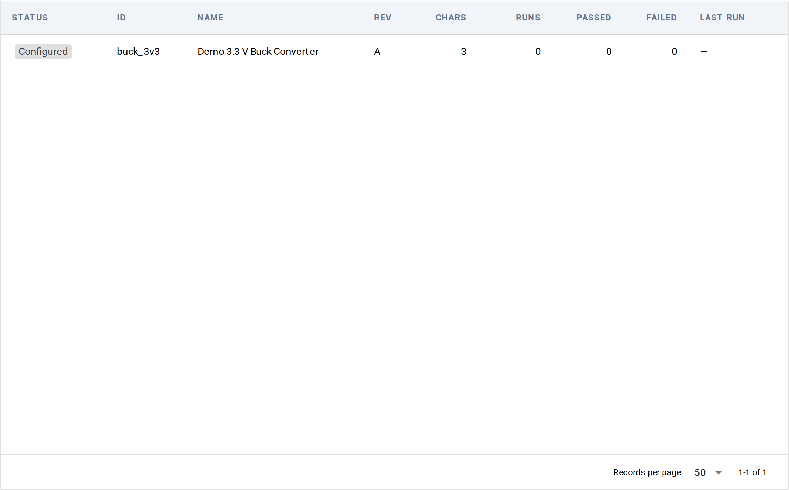
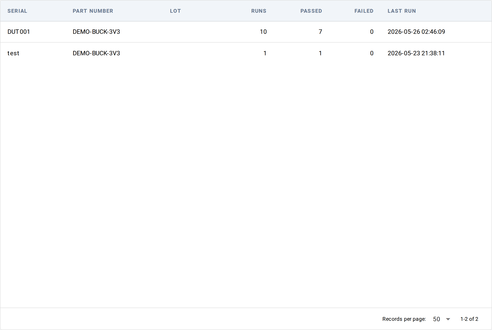

# Tour of the Operator UI

A map of the 15 sidebar entries behind `litmus serve`, grouped by
the same section bands the sidebar uses (14 functional screens
plus the in-app docs viewer). Use this as a "what does each
sidebar entry do" lookup; the per-screen [reference pages](../../reference/operator-ui/)
have the field-by-field detail.

The operator UI starts when you run `litmus serve` from a project
root — by default it listens on `http://localhost:8000`.

## ACTIVE TESTS (dynamic)

Above the static sidebar groups, an **ACTIVE TESTS** block appears
whenever a run is in progress. Each row is a link to that run's
live view at `/live/<run_id>`. If a test is paused waiting for an
operator dialog, the row is amber with a "N dialog(s) waiting"
hint — that's the signal to click in and respond. When no runs are
active, the block is hidden.

## NAVIGATION

The day-to-day workflow lives here: see a run, start a run, browse
results, inspect metrics, plot measurements.

### Dashboard — `/`

The landing page. Shows every station on the bench as a clickable
card (clicking opens `/launch?station=<id>` pre-filled to that
station) above a "Recent Runs" table of the last few runs across
the project. No product-based filtering happens here — every
station card is shown unconditionally.

→ [Dashboard reference](../../reference/operator-ui/dashboard.md)

### Launch Test — `/launch`

A single-form view for starting a test from the browser instead of
the CLI. Fields in order: Product, DUT Serial, Test Path, Station,
Mock Hardware, Operator. Click Start Test to redirect to the live
monitor at `/live/<run_id>`. Pre-fill via `?product=&station=&mock=1`
URL parameters.

→ [Launch Test reference](../../reference/operator-ui/launch.md)

### Results — `/results`

The run-history table. One row per run with filters above:
date range, product, station, outcome. Click any row to drill into
the detail view at `/results/<run_id>` (overview card, step tree,
measurements table).

→ [Results list](../../reference/operator-ui/results/list.md) ·
[Results detail](../../reference/operator-ui/results/detail.md)

### Metrics — `/metrics`

Six analytical lenses on the run history (Yield, Pareto, Cpk,
Retest, Time loss, Assets). Filters above the tab strip — same
filter set as the Results list, applied to whichever lens is
active. Best entry point for "is the line healthy" questions.

→ [Metrics reference](../../reference/operator-ui/metrics.md)

### Measurements — `/explore`

The measurement-level browser. One row per logged measurement, with
optional time-series plot above the table when a characteristic is
selected. The "if I plotted every reading for this characteristic
across the last week of runs, what would it look like" view.

→ [Measurements reference](../../reference/operator-ui/measurements.md)

## DATA STORES

The raw streams behind the analytical views.

### Events — `/events`

The event log browser — every event the framework emitted, in
chronological order. Filters by Session, Event type, Role, Since
(time cutoff), and row Limit. Useful for debugging "what actually
happened" when a run looks wrong.

→ [Events reference](../../reference/operator-ui/events.md)

### Channels — `/channels`

The channel store. One row per logged channel (a named time-series
written via `context.observe(key, value)`); click a row to see its
full time-series plot. The "what was the voltage doing over the
run" view.

→ [Channels list](../../reference/operator-ui/channels/list.md) ·
[Channels detail](../../reference/operator-ui/channels/detail.md)

## CONFIGURATION

The entities Litmus tests against — stations, products, fixtures,
instruments, tests, plus the visual designer that wires them
together.

### System Designer — `/designer`

The interactive fixture-wiring surface. Pick a product, pick a
station, click a pin, click a channel — wire saved to disk. The
fastest way to author or refine a fixture YAML without touching
the file directly.

→ [System Designer reference](../../reference/operator-ui/designer.md)

### Stations — `/stations`

Browse, edit, and create stations. One station = one bench's worth
of instruments. The list page also picks up stations Litmus has
seen in run history but doesn't have YAML for — tagged with a
`Configured` / `Observed` chip and filterable from the row above.

→ [Stations reference](../../reference/operator-ui/stations.md)

### Products — `/products`

Browse, edit, and create products. One product = one DUT type
(part number + revision) with its pin map and characteristics.
Same `Configured` / `Observed` treatment as Stations — a part
number that appears in run history with no YAML shows up tagged
`Observed`.

→ [Products reference](../../reference/operator-ui/products.md)

### Fixtures — `/fixtures`

Browse, edit, and create fixtures. One fixture = the wiring
between a product's pins and a station's instrument channels. The
detail view's Diagram tab renders the connection map as Mermaid.

→ [Fixtures reference](../../reference/operator-ui/fixtures.md)

### Instruments — `/instruments`

Two tabs: **Catalog** (instrument types — the templates that
describe capabilities) and **Inventory** (physical assets — the
actual units on the bench with serial numbers and calibration
dates). The Inventory tab carries the `Configured` / `Observed`
chip — an instrument id that appears in the per-step instrument
arrays without an asset YAML shows up as `Observed`.

→ [Instruments reference](../../reference/operator-ui/instruments.md)

### DUTs — `/duts`

The list of every DUT serial Litmus has seen in run history. DUTs
are never declared in YAML by design (the unit-under-test is
identified at runtime), so every row is observation-derived — no
`Configured` / `Observed` chip is needed. Columns: serial, part
number, lot, runs, passed, failed, last run.

### Tests — `/tests`

A flat table inventory of the test directories Litmus discovered
under `tests/`. Lightweight — no per-row actions. The Launch Test
form's Test Path dropdown is populated from the same source.

→ [Tests reference](../../reference/operator-ui/tests.md)

## DOCUMENTATION

### Documentation — `/docs`

The in-app docs viewer. Renders the same Markdown corpus
[pragmatest.com](https://pragmatest.com/litmus/docs) renders. Most
content is served locally; Mermaid diagrams load their renderer
from `cdn.jsdelivr.net`, so air-gapped benches see code blocks
where the diagrams would be.

## Common starting points

- **"My run failed and I want to know why"** → Results list, click
  the failing run, drill into Steps. [Find flaky tests](../data/find-flaky-tests.md)
  walks the deeper diagnostic flow.
- **"Is yield trending down?"** → Metrics → Yield tab, filter by
  product or station.
- **"What did this channel look like during the failure?"** →
  Channels, click the channel, scroll to the run time-range.
- **"I need to wire up a new fixture"** → System Designer, pick
  product + station, click pins → click channels.

## See also

- [Per-screen reference pages](../../reference/operator-ui/) — the
  field-by-field detail behind everything above
- [Find flaky tests](../data/find-flaky-tests.md) — a task-driven recipe
  that combines Results + Metrics views
- [Compare two runs](../data/compare-runs.md) — diff two run records
  side-by-side using the Results view
