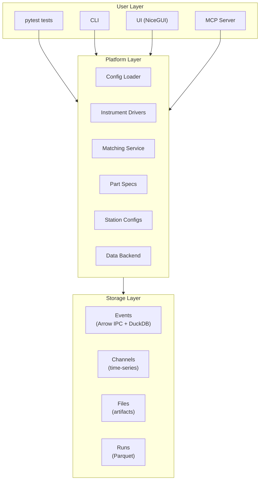

# Litmus Documentation

Litmus is a Python-native hardware test platform for the AI-assisted era.

## Documentation Sections

| Section | Description |
|---------|-------------|
| [Tutorial](tutorial/) | Engineer's First Project - progressive learning path |
| [How-To Guides](how-to/execution/writing-tests.md) | Step-by-step guides for common tasks |
| [Concepts](concepts/) | Parts, stations, capabilities, fixtures, and matching |
| [Reference](reference/runtime/api.md) | MCP tools, HTTP endpoints, CLI, models |
| [Integration](integration/) | Adopt Litmus with existing tests and infrastructure |
| [Examples](https://github.com/pragmatest-dev/litmus/tree/main/examples) | Seven runnable example projects, each one rung of the framework adoption ladder (01-vanilla → 07-profiles) |

## Quick Start

**Run an example:**
```bash
cd examples/01-vanilla && uv run pytest -v
```

**Start the UI:**
```bash
litmus serve
```

**Configure for [Claude Code](how-to/overview/mcp-integration.md):** (Anthropic's terminal AI coding assistant)
```bash
litmus setup claude-code
```

## Architecture Overview



## Key Features

- **pytest integration** — Use familiar pytest patterns with hardware
- **Config-driven** — YAML configuration, Pydantic validation
- **Capability matching** — Automatically match parts to compatible stations
- **Simulated mode** — Develop without hardware
- **AI-ready** — MCP server for Claude Code, Cursor, Cline
- **Event log** — Typed event stream with Arrow IPC storage and DuckDB queries
- **Channel store** — Time-series instrument data with LTTB decimation
- **Parquet storage** — Efficient columnar storage for analytics
- **Live monitoring** — Real-time event subscriptions via Arrow Flight

## Learning Paths

### New to Litmus?

Start with the [Tutorial](tutorial/) — a progressive learning path from your first test to production deployment.

### Have Existing Tests?

Check out [Integration](integration/) — guides for adopting Litmus incrementally with LabVIEW, TestStand, or existing pytest suites.

### Quick Reference

Jump to [Reference](reference/runtime/api.md) for API documentation, configuration schemas, and CLI commands.

## Project Structure

```
litmus/
├── models/          # Pydantic models for every YAML entity (project, station, part, capability, ...)
├── store.py         # Canonical YAML I/O — every read/write of catalog / station / part / fixture YAML
├── instruments/     # Instrument base classes (Instrument, VisaInstrument) + Mock factory
├── matching/        # Capability matching service
├── pytest_plugin/   # pytest plugin (fixtures, markers, sidecar loader)
├── execution/       # Test-execution helpers (verify, harness, logger, decorators)
├── data/            # Parquet schema + backend, event log/store, run store, channel store
├── mcp/             # MCP server (12 `litmus_*` tools)
├── api/             # HTTP API (FastAPI)
├── ui/              # Operator UI (NiceGUI)
└── client.py        # Python client library
```

## Getting Help

- **GitHub Issues:** [Report bugs and request features](https://github.com/pragmatest-dev/litmus/issues)
- **CLI Help:** `litmus --help`
