# Models reference

Every Litmus YAML file, on-the-wire API payload, parquet row, and event-log record is validated against a Pydantic model. This page enumerates those models grouped by source file, plus the shared enum vocabulary they reference.

The per-module field tables and the shared enums section are generated from source — `src/litmus/models/*.py` and `src/litmus/data/models.py`. To regenerate after touching the models, run:

```bash
uv run python scripts/generate_reference_docs.py models
```

The hand-written ERD below stays put; it changes only when relationships change shape, not on every field rename.

For conceptual framing of the capability-side models (`InstrumentCapability`, `PartCharacteristic`, `SpecBand`, `Signal`, `Condition`, `Control`, `Attribute`, `ChannelTopology`), see [concepts/capabilities](../../concepts/configuration/capabilities.md). For the event log subclasses of `EventBase`, see [event-types.md](event-types.md).

## Shared enums (`litmus.models.enums`)

These values are referenced from many of the per-module tables below.

<!-- GENERATED:models-shared-enums:start -->
### `Direction` {#enum-direction}

Direction of signal flow for a capability.

| Value | Description |
|---|---|
| `'input'` | Signal/sense from UUT |
| `'output'` | Source/drive to UUT |
| `'bidir'` | Both (SMU, VNA) |
| `'transform'` | Signal-path component (amplifier, filter, mixer) |

### `MeasurementFunction` {#enum-measurementfunction}

Named signal measurement/stimulus functions.

| Value | Description |
|---|---|
| `'dc_voltage'` |  |
| `'ac_voltage'` |  |
| `'dc_current'` |  |
| `'ac_current'` |  |
| `'resistance'` |  |
| `'resistance_4w'` |  |
| `'capacitance'` |  |
| `'inductance'` |  |
| `'impedance'` |  |
| `'frequency'` |  |
| `'period'` |  |
| `'temperature'` |  |
| `'waveform'` |  |
| `'dc_power'` |  |
| `'ac_power'` |  |
| `'rf_power'` |  |
| `'rf_cw'` |  |
| `'rf_am'` | Amplitude modulation of RF carrier |
| `'rf_fm'` | Frequency modulation of RF carrier |
| `'rf_pm'` | Phase modulation of RF carrier |
| `'rf_sweep'` | RF frequency/power sweep |
| `'rf_iq'` | IQ vector modulation |
| `'rf_pulse'` | Pulse on/off modulation of RF carrier |
| `'s_parameters'` |  |
| `'spectrum'` |  |
| `'phase_noise'` |  |
| `'noise_figure'` |  |
| `'harmonics'` |  |
| `'digital_pattern'` |  |
| `'digital_io'` |  |
| `'serial_data'` |  |
| `'diode'` |  |
| `'continuity'` |  |
| `'dc_ratio'` |  |
| `'quality_factor'` |  |
| `'dissipation_factor'` |  |
| `'time_interval'` |  |
| `'pulse_width'` |  |
| `'duty_cycle'` |  |
| `'rise_time'` |  |
| `'fall_time'` |  |
| `'phase'` |  |
| `'power_quality'` |  |
| `'jitter'` |  |
| `'eye_diagram'` |  |
| `'thd'` | Total harmonic distortion (also THD+N) |
| `'snr'` | Signal-to-noise ratio (also SINAD) |
| `'gain'` | Signal transfer ratio (RF amps, lock-in, signal chain) |
| `'return_loss'` | S11 magnitude — "return loss > 20 dB" |
| `'insertion_loss'` | S21 magnitude — "insertion loss < 0.5 dB" |
| `'vswr'` | Voltage standing wave ratio — "VSWR < 1.5:1" |
| `'group_delay'` | Phase derivative — "group delay < 2 ns" |
| `'optical_power'` |  |
| `'wavelength'` |  |
| `'humidity'` | Relative humidity measurement |
| `'charge'` | Accumulated charge (fC to µC) |
| `'magnetic_field'` |  |
| `'position'` |  |
| `'lock_in_detection'` | Phase-sensitive AC demodulation |
| `'heater_power'` | Heater output for cryogenic/furnace controllers |
| `'excitation_current'` | Precision current for bridge/RTD excitation |
| `'pulse_generation'` | Precision delay/pulse generator output |
| `'trigger'` | Trigger signal input/output |
| `'reference_clock'` | 10 MHz reference oscillator I/O |
| `'conductance'` | DC conductance (G = 1/R, siemens) |
| `'reactance'` | Reactive impedance component (Ω) |
| `'susceptance'` | Imaginary admittance (siemens) |
| `'dynamic_load'` | AC/transient electronic load mode |

### `WaveformShape` {#enum-waveformshape}

Waveform shapes for function generator outputs.

| Value | Description |
|---|---|
| `'sine'` |  |
| `'square'` |  |
| `'triangle'` |  |
| `'ramp'` |  |
| `'pulse'` |  |
| `'arbitrary'` |  |
| `'noise'` |  |
| `'dc'` |  |

### `TerminalRole` {#enum-terminalrole}

Physical terminal on an instrument channel (ATE/IVI standard names).

| Value | Description |
|---|---|
| `'hi'` | High-side force terminal (positive) |
| `'lo'` | Low-side / return terminal (negative/ground) |
| `'sense_hi'` | Remote sense high (Kelvin connection) |
| `'sense_lo'` | Remote sense low |
| `'guard'` | Guard terminal (triax center) |
| `'ground'` | Chassis / earth ground terminal |
| `'signal'` | Single-ended signal (BNC center, probe tip) |
| `'trigger'` | Trigger I/O |
| `'hcur'` | High current (impedance analyzer) |
| `'hpot'` | High potential (impedance analyzer) |
| `'lcur'` | Low current (impedance analyzer) |
| `'lpot'` | Low potential (impedance analyzer) |

### `GroundTopology` {#enum-groundtopology}

How channel grounds relate to each other and earth.

| Value | Description |
|---|---|
| `'floating'` | Channels isolated from each other (typical PSU) |
| `'shared'` | All channels share common ground (typical scope, DMM) |
| `'earth'` | Referenced to earth ground |

### `ConnectorType` {#enum-connectortype}

Physical connector type on instrument.

| Value | Description |
|---|---|
| `'binding_post'` |  |
| `'banana'` |  |
| `'bnc'` |  |
| `'terminal_block'` |  |
| `'probe'` |  |
| `'triax'` |  |
| `'sma'` |  |
| `'smb'` |  |
| `'spring'` |  |
| `'pxi'` |  |
| `'screw_terminal'` |  |
| `'dsub'` |  |
| `'vhdci'` |  |
| `'apc_3.5'` |  |
| `'type_n'` |  |
| `'k_2.4mm'` |  |
| `'v_1.85mm'` |  |
| `'phoenix'` |  |
| `'tekvpi'` |  |
| `'d_sub_9'` |  |
| `'d_sub_15'` |  |
| `'proprietary'` |  |

### `MatchDepth` {#enum-matchdepth}

How deep to check when matching capabilities.

| Value | Description |
|---|---|
| `'function'` |  |
| `'direction'` |  |
| `'range'` |  |
| `'accuracy'` |  |
| `'resolution'` |  |

### `Comparator` {#enum-comparator}

Limit comparators per ATML/IEEE 1671.

| Value | Description |
|---|---|
| `'EQ'` |  |
| `'NE'` |  |
| `'LT'` |  |
| `'LE'` |  |
| `'GT'` |  |
| `'GE'` |  |
| `'GELE'` |  |
| `'GELT'` |  |
| `'GTLE'` |  |
| `'GTLT'` |  |

### `InstrumentType` {#enum-instrumenttype}

Instrument classification vocabulary.

| Value | Description |
|---|---|
| `'dmm'` |  |
| `'oscilloscope'` |  |
| `'function_generator'` |  |
| `'psu'` |  |
| `'ac_power_supply'` |  |
| `'switch'` |  |
| `'power_meter'` |  |
| `'spectrum_analyzer'` |  |
| `'rf_signal_generator'` |  |
| `'upconverter'` |  |
| `'downconverter'` |  |
| `'digitizer'` |  |
| `'counter'` |  |
| `'smu'` |  |
| `'electronic_load'` |  |
| `'daq'` |  |
| `'lcr_meter'` |  |
| `'vna'` |  |
| `'temperature_controller'` |  |
| `'electrometer'` |  |
| `'lock_in_amplifier'` |  |
| `'current_source'` |  |
| `'pulse_generator'` |  |
| `'gaussmeter'` |  |
<!-- GENERATED:models-shared-enums:end -->

## Per-module field tables

<!-- GENERATED:models-by-module:start -->
### Project & station YAML — `litmus.models.project`

#### `ProfileConfig` {#model-profileconfig}

A named config set applied to a pytest session.

| Field | Type | Default |
|---|---|---|
| `limits` | `dict[str, MeasurementLimitConfig]` | `{}` |
| `sweeps` | `list[SweepEntry]` | `[]` |
| `mocks` | `list[MockEntry]` | `[]` |
| `characteristics` | `list[str]` | `[]` |
| `connections` | `list[str] \| dict[str, Any] \| None` | `None` |
| `retry` | `RetryConfig \| None` | `None` |
| `prompts` | `dict[str, PromptConfig]` | `{}` |
| `runner` | `dict[str, Any]` | `{}` |
| `tests` | `dict[str, TestEntry]` | `{}` |
| `description` | `str \| None` | `None` |
| `facets` | `dict[str, str]` | `{}` |
| `extends` | `str \| None` | `None` |
| `station_type` | `str \| None` | `None` |
| `fixture` | `str \| None` | `None` |
| `verify_requires_limit` | `bool \| None` | `None` |

#### `MultiSlotConfig` {#model-multislotconfig}

Multi-slot orchestration knobs.

| Field | Type | Default |
|---|---|---|
| `child_grace_seconds` | `float` | `5.0` |

#### `ProjectConfig` {#model-projectconfig}

Schema for litmus.yaml project config files — all fields at root.

| Field | Type | Default |
|---|---|---|
| `name` | `str` | *required* |
| `data_dir` | `str \| None` | `None` |
| `channels` | `ChannelOptions` | *via* `ChannelOptions()` |
| `files` | `FileOptions` | *via* `FileOptions()` |
| `session` | `SessionOptions` | *via* `SessionOptions()` |
| `stream` | `StreamTuning` | *via* `StreamTuning()` |
| `default_station` | `str \| None` | `None` |
| `default_fixture` | `str \| None` | `None` |
| `default_profile` | `str \| None` | `None` |
| `mock_instruments` | `bool` | `False` |
| `profiles` | `dict[str, ProfileConfig]` | `{}` |
| `runner` | `dict[str, Any]` | `{}` |
| `required_inputs` | `dict[str, PromptConfig]` | `{}` |
| `multi_slot` | `MultiSlotConfig` | *via* `MultiSlotConfig()` |

### Station — `litmus.models.station`

#### `StationInstrumentConfig` {#model-stationinstrumentconfig}

Single instrument entry in a station file.

| Field | Type | Default |
|---|---|---|
| `type` | `str` | *required* |
| `driver` | `str \| None` | `None` |
| `resource` | `str \| None` | `None` |
| `catalog_ref` | `str \| None` | `None` |
| `mock` | `bool` | `False` |
| `channels` | `dict[str, str]` | `{}` |
| `description` | `str \| None` | `None` |
| `mock_config` | `dict[str, Any]` | `{}` |

#### `StationConfig` {#model-stationconfig}

Schema for stations/*.yaml files — all fields at root.

| Field | Type | Default |
|---|---|---|
| `id` | `str` | *required* |
| `name` | `str` | *required* |
| `station_type` | `str \| None` | `None` |
| `hostname` | `str \| None` | `None` |
| `location` | `str \| None` | `None` |
| `description` | `str \| None` | `None` |
| `instruments` | `dict[str, StationInstrumentConfig]` | `{}` |
| `supported_phases` | `list[str]` | `[]` |

#### `InstrumentConfig` {#model-instrumentconfig}

Configuration for a single instrument in a :class:`StationType` template.

| Field | Type | Default |
|---|---|---|
| `type` | `str` | *required* |
| `driver` | `str` | *required* |
| `resource` | `str \| None` | `None` |
| `settings` | `dict` | `{}` |

#### `StationType` {#model-stationtype}

Abstract station-type template (``stations/types/*.yaml``).

| Field | Type | Default |
|---|---|---|
| `id` | `str` | *required* |
| `description` | `str` | *required* |
| `instruments` | `dict[str, InstrumentConfig]` | *required* |
| `capabilities` | `list[str]` | `[]` |

### Part — `litmus.models.part`

#### `Pin` {#model-pin}

Physical pin/pad on the UUT (ATML: Port).

| Field | Type | Default |
|---|---|---|
| `name` | `str` | *required* |
| `net` | `str \| None` | `None` |
| `role` | `PinRole` | `PinRole.SIGNAL` |
| `description` | `str \| None` | `None` |

#### `BusSignal` {#model-bussignal}

A signal within a bus group.

| Field | Type | Default |
|---|---|---|
| `pin` | `str` | *required* |
| `role` | `str` | *required* |
| `index` | `int \| None` | `None` |

#### `SignalGroup` {#model-signalgroup}

Grouped signals forming a bus interface (ATML: Bus).

| Field | Type | Default |
|---|---|---|
| `protocol` | `str` | *required* |
| `signals` | `list[BusSignal]` | `[]` |
| `parameters` | `dict[str, Any]` | `{}` |
| `description` | `str \| None` | `None` |

#### `PartCharacteristic` {#model-partcharacteristic}

Part capability + physical interface + traceability (ATML: UUT Characteristic).

| Field | Type | Default |
|---|---|---|
| `function` | `MeasurementFunction` | *required* |
| `direction` | `Direction` | *required* |
| `signals` | `dict[str, Signal]` | `{}` |
| `conditions` | `dict[str, Condition]` | `{}` |
| `controls` | `dict[str, Control]` | `{}` |
| `attributes` | `dict[str, Attribute]` | `{}` |
| `unit` | `str \| None` | `None` |
| `bands` | `list[SpecBand]` | `[]` |
| `pin` | `str \| None` | `None` |
| `pins` | `str \| list[str]` | `[]` |
| `net` | `str \| None` | `None` |
| `signal_group` | `str \| None` | `None` |
| `datasheet_ref` | `str \| None` | `None` |

#### `Part` {#model-part}

Part definition (ATML: UUT Description).

| Field | Type | Default |
|---|---|---|
| `id` | `str` | *required* |
| `name` | `str` | *required* |
| `part_number` | `str \| None` | `None` |
| `base` | `str \| None` | `None` |
| `description` | `str \| None` | `None` |
| `revision` | `str \| None` | `None` |
| `datasheet` | `str \| None` | `None` |
| `schematic` | `str \| None` | `None` |
| `driver` | `str \| None` | `None` |
| `pins` | `dict[str, Pin]` | `{}` |
| `signal_groups` | `dict[str, SignalGroup]` | `{}` |
| `characteristics` | `dict[str, PartCharacteristic]` | `{}` |

#### `PinRole` {#enum-pinrole}

Role of a physical UUT pin in the test system.

| Value | Description |
|---|---|
| `'signal'` | Measured/stimulated signal |
| `'ground'` | Current return / reference |
| `'power'` | Power input/output (VIN, VOUT) |
| `'reference'` | Voltage reference, not driven |

### Part manifest — `litmus.models.part_manifest`

#### `FileReferences` {#model-filereferences}

References to files in the part folder.

| Field | Type | Default |
|---|---|---|
| `datasheet` | `str \| None` | `None` |
| `spec` | `str \| None` | `None` |
| `requirements` | `str \| None` | `None` |
| `station_selection` | `str \| None` | `None` |
| `tests` | `str \| None` | `None` |

#### `PartManifest` {#model-partmanifest}

Manifest for a part folder.

| Field | Type | Default |
|---|---|---|
| `part_id` | `str` | *required* |
| `name` | `str` | *required* |
| `description` | `str \| None` | `None` |
| `current_step` | `WorkflowStep \| None` | `None` |
| `completed_steps` | `list[WorkflowStep]` | `[]` |
| `files` | `FileReferences` | *via* `FileReferences()` |

#### `WorkflowStep` {#enum-workflowstep}

Steps in the datasheet-to-test workflow.

| Value | Description |
|---|---|
| `'parse_datasheet'` |  |
| `'review_spec'` |  |
| `'derive_requirements'` |  |
| `'select_station'` |  |
| `'generate_tests'` |  |
| `'execute_analyze'` |  |

### Test config (sidecar, markers, limits, fixtures) — `litmus.models.test_config`

#### `SweepEntry` {#model-sweepentry}

One sweep level: ``{argname: argvalues, ...}``.

| Field | Type | Default |
|---|---|---|
| `root` | `dict[str, list[Any]]` | *required* |

#### `MockEntry` {#model-mockentry}

One per-test mock — a target plus arbitrary ``patch.object`` kwargs.

| Field | Type | Default |
|---|---|---|
| `target` | `str` | *required* |

#### `RetryConfig` {#model-retryconfig}

Runner-neutral retry config — translates to ``flaky`` under pytest.

| Field | Type | Default |
|---|---|---|
| `max_retries` | `int` | `0` |
| `delay` | `float` | `0.0` |
| `on` | `list[str] \| None` | `None` |

#### `TestEntry` {#model-testentry}

Recursive node in a sidecar / profile ``tests:`` tree.

| Field | Type | Default |
|---|---|---|
| `limits` | `dict[str, MeasurementLimitConfig]` | `{}` |
| `sweeps` | `list[SweepEntry]` | `[]` |
| `mocks` | `list[MockEntry]` | `[]` |
| `characteristics` | `list[str]` | `[]` |
| `connections` | `list[str] \| dict[str, Any] \| None` | `None` |
| `retry` | `RetryConfig \| None` | `None` |
| `prompts` | `dict[str, PromptConfig]` | `{}` |
| `runner` | `dict[str, Any]` | `{}` |
| `tests` | `dict[str, TestEntry]` | `{}` |

#### `SidecarConfig` {#model-sidecarconfig}

Top-level shape of a test-module sidecar YAML.

| Field | Type | Default |
|---|---|---|
| `limits` | `dict[str, MeasurementLimitConfig]` | `{}` |
| `sweeps` | `list[SweepEntry]` | `[]` |
| `mocks` | `list[MockEntry]` | `[]` |
| `characteristics` | `list[str]` | `[]` |
| `connections` | `list[str] \| dict[str, Any] \| None` | `None` |
| `retry` | `RetryConfig \| None` | `None` |
| `prompts` | `dict[str, PromptConfig]` | `{}` |
| `runner` | `dict[str, Any]` | `{}` |
| `tests` | `dict[str, TestEntry]` | `{}` |

#### `Limit` {#model-limit}

A test limit with unit and optional spec reference.

| Field | Type | Default |
|---|---|---|
| `low` | `float \| None` | `None` |
| `high` | `float \| None` | `None` |
| `nominal` | `float \| None` | `None` |
| `unit` | `str` | *required* |
| `characteristic_id` | `str \| None` | `None` |
| `spec_ref` | `str \| None` | `None` |
| `comparator` | `Comparator` | `Comparator.GELE` |

#### `SwitchRoute` {#model-switchroute}

Switch routing for a fixture point.

| Field | Type | Default |
|---|---|---|
| `switch` | `str` | *required* |
| `channels` | `list[str]` | *required* |
| `settling_ms` | `float` | `0` |

#### `FixtureConnection` {#model-fixtureconnection}

A named connection on a test fixture.

| Field | Type | Default |
|---|---|---|
| `name` | `str` | *required* |
| `instrument` | `str` | *required* |
| `instrument_channel` | `str \| None` | `None` |
| `instrument_terminal` | `str \| None` | `None` |
| `description` | `str \| None` | `None` |
| `uut_pin` | `str \| None` | `None` |
| `net` | `str \| None` | `None` |
| `function` | `MeasurementFunction \| None` | `None` |
| `route` | `SwitchRoute \| None` | `None` |

#### `FixtureSlot` {#model-fixtureslot}

A UUT slot within a multi-UUT fixture.

| Field | Type | Default |
|---|---|---|
| `connections` | `dict[str, FixtureConnection]` | `{}` |
| `uut_resource` | `str \| None` | `None` |
| `description` | `str \| None` | `None` |

#### `FixtureConfig` {#model-fixtureconfig}

Test fixture definition (UUT interface).

| Field | Type | Default |
|---|---|---|
| `id` | `str` | *required* |
| `name` | `str \| None` | `None` |
| `part_id` | `str \| None` | `None` |
| `part_family` | `str \| None` | `None` |
| `part_revision` | `str \| None` | `None` |
| `station_types` | `list[str]` | `[]` |
| `uut_resource` | `str \| None` | `None` |
| `connections` | `dict[str, FixtureConnection]` | `{}` |
| `slots` | `dict[str, FixtureSlot]` | `{}` |
| `description` | `str \| None` | `None` |

#### `PromptConfig` {#model-promptconfig}

Configuration for operator prompts.

| Field | Type | Default |
|---|---|---|
| `message` | `str` | *required* |
| `prompt_type` | `Literal['confirm', 'choice', 'input']` | `'confirm'` |
| `choices` | `list[str] \| None` | `None` |
| `timeout_seconds` | `int \| None` | `None` |

#### `LimitLookupConfig` {#model-limitlookupconfig}

Configuration for lookup-table based limits.

| Field | Type | Default |
|---|---|---|
| `key` | `str` | *required* |
| `table` | `dict[str, Limit]` | *required* |
| `unit` | `str \| None` | `None` |

#### `LimitStepConfig` {#model-limitstepconfig}

Configuration for step-function limits.

| Field | Type | Default |
|---|---|---|
| `param` | `str` | *required* |
| `ranges` | `list[dict[str, Any]]` | *required* |

#### `MeasurementLimitConfig` {#model-measurementlimitconfig}

Per-measurement limit policy — direct, characteristic-derived, or banded.

| Field | Type | Default |
|---|---|---|
| `when` | `dict[str, Any]` | `{}` |
| `bands` | `list[MeasurementLimitConfig]` | `[]` |
| `low` | `float \| None` | `None` |
| `high` | `float \| None` | `None` |
| `nominal` | `float \| None` | `None` |
| `unit` | `str \| None` | `None` |
| `characteristic_id` | `str \| None` | `None` |
| `spec_ref` | `str \| None` | `None` |
| `characteristic` | `str \| None` | `None` |
| `guardband_pct` | `float \| None` | `None` |
| `comparator` | `Comparator \| None` | `None` |
| `expr` | `str \| None` | `None` |
| `tolerance_pct` | `float \| None` | `None` |
| `tolerance_abs` | `float \| None` | `None` |
| `lookup` | `LimitLookupConfig \| None` | `None` |
| `steps` | `LimitStepConfig \| None` | `None` |
| `callable` | `str \| None` | `None` |

### Capabilities (catalog signal/condition/control/attribute) — `litmus.models.capability`

#### `RangeSpec` {#model-rangespec}

Specification for measurement or output range.

| Field | Type | Default |
|---|---|---|
| `min` | `float \| None` | `None` |
| `max` | `float \| None` | `None` |
| `unit` | `str` | `''` |

#### `PointSpec` {#model-pointspec}

A single numeric value with optional unit.

| Field | Type | Default |
|---|---|---|
| `value` | `float` | *required* |
| `unit` | `str` | `''` |

#### `ListSpec` {#model-listspec}

A discrete set of allowed values with optional unit.

| Field | Type | Default |
|---|---|---|
| `values` | `list[str \| float \| bool]` | *required* |
| `unit` | `str` | `''` |

#### `AccuracySpec` {#model-accuracyspec}

Specification for measurement accuracy.

| Field | Type | Default |
|---|---|---|
| `pct_reading` | `float \| None` | `None` |
| `pct_range` | `float \| None` | `None` |
| `absolute` | `float \| None` | `None` |
| `unit` | `str \| None` | `None` |

#### `ResolutionSpec` {#model-resolutionspec}

Specification for measurement resolution.

| Field | Type | Default |
|---|---|---|
| `bits` | `int \| None` | `None` |
| `digits` | `float \| None` | `None` |
| `value` | `float \| None` | `None` |
| `unit` | `str \| None` | `None` |

#### `ChannelTopology` {#model-channeltopology}

Physical topology of a single instrument channel.

| Field | Type | Default |
|---|---|---|
| `label` | `str \| None` | `None` |
| `terminals` | `list[TerminalRole]` | `[]` |
| `connector` | `ConnectorType \| None` | `None` |
| `connector_pin` | `dict[str, int \| str] \| None` | `None` |
| `ground` | `GroundTopology` | `GroundTopology.SHARED` |
| `optional` | `bool` | `False` |

#### `SpecBand` {#model-specband}

Condition-dependent specification override for a parameter.

| Field | Type | Default |
|---|---|---|
| `when` | `dict[str, RangeSpec \| PointSpec \| ListSpec \| str \| float \| bool \| list[str \| float \| bool]]` | `{}` |
| `range` | `RangeSpec \| None` | `None` |
| `value` | `float \| str \| None` | `None` |
| `unit` | `str \| None` | `None` |
| `accuracy` | `AccuracySpec \| None` | `None` |
| `resolution` | `ResolutionSpec \| None` | `None` |
| `qualifier` | `SpecQualifier \| None` | `None` |

#### `Signal` {#model-signal}

A measurable/sourceable parameter — the primary signal dimension.

| Field | Type | Default |
|---|---|---|
| `range` | `RangeSpec \| None` | `None` |
| `accuracy` | `AccuracySpec \| None` | `None` |
| `resolution` | `ResolutionSpec \| None` | `None` |
| `value` | `float \| None` | `None` |
| `unit` | `str \| None` | `None` |
| `bands` | `list[SpecBand] \| None` | `None` |
| `qualifier` | `SpecQualifier \| None` | `None` |

#### `Condition` {#model-condition}

An operating condition that affects accuracy of other parameters.

| Field | Type | Default |
|---|---|---|
| `range` | `RangeSpec \| None` | `None` |
| `options` | `list[float \| str \| bool] \| None` | `None` |
| `unit` | `str \| None` | `None` |
| `default` | `float \| str \| bool \| None` | `None` |
| `bands` | `list[SpecBand] \| None` | `None` |

#### `Control` {#model-control}

A user-configurable knob or setting.

| Field | Type | Default |
|---|---|---|
| `range` | `RangeSpec \| None` | `None` |
| `options` | `list[float \| str \| bool] \| None` | `None` |
| `unit` | `str \| None` | `None` |
| `default` | `float \| str \| bool \| None` | `None` |
| `resolution` | `ResolutionSpec \| None` | `None` |
| `bands` | `list[SpecBand] \| None` | `None` |

#### `Attribute` {#model-attribute}

A fixed hardware fact or performance characteristic.

| Field | Type | Default |
|---|---|---|
| `value` | `float \| str \| bool \| None` | `None` |
| `range` | `RangeSpec \| None` | `None` |
| `options` | `list[float \| str \| bool] \| None` | `None` |
| `unit` | `str \| None` | `None` |
| `bands` | `list[SpecBand] \| None` | `None` |
| `qualifier` | `SpecQualifier \| None` | `None` |

#### `Capability` {#model-capability}

What a signal endpoint can do — shared by parts and instruments.

| Field | Type | Default |
|---|---|---|
| `function` | `MeasurementFunction` | *required* |
| `direction` | `Direction` | *required* |
| `signals` | `dict[str, Signal]` | `{}` |
| `conditions` | `dict[str, Condition]` | `{}` |
| `controls` | `dict[str, Control]` | `{}` |
| `attributes` | `dict[str, Attribute]` | `{}` |
| `unit` | `str \| None` | `None` |
| `bands` | `list[SpecBand]` | `[]` |

#### `InstrumentCapability` {#model-instrumentcapability}

Instrument capability + channels + operational metadata.

| Field | Type | Default |
|---|---|---|
| `function` | `MeasurementFunction` | *required* |
| `direction` | `Direction` | *required* |
| `signals` | `dict[str, Signal]` | `{}` |
| `conditions` | `dict[str, Condition]` | `{}` |
| `controls` | `dict[str, Control]` | `{}` |
| `attributes` | `dict[str, Attribute]` | `{}` |
| `unit` | `str \| None` | `None` |
| `bands` | `list[SpecBand]` | `[]` |
| `channels` | `str \| list[str]` | `[]` |
| `readback` | `bool` | `False` |

#### `SpecQualifier` {#enum-specqualifier}

Qualification level for a specification value.

| Value | Description |
|---|---|
| `'guaranteed'` |  |
| `'typical'` |  |
| `'nominal'` |  |
| `'supplemental'` |  |

#### `ConditionKey` {#enum-conditionkey}

Canonical keys for the ``conditions`` dict on a Capability.

| Value | Description |
|---|---|
| `'frequency'` | AC measurement frequency band |
| `'temperature'` | Ambient/operating temperature |
| `'humidity'` | Relative humidity (specs valid at < 80% RH) |
| `'calibration_interval'` | Time since last cal (days) |
| `'nplc'` | Integration time in power line cycles |
| `'auto_zero'` | Auto-zero ON/OFF state |
| `'coupling'` | AC/DC coupling mode |
| `'impedance'` | Input impedance (50Ω vs 1MΩ) |
| `'sense_mode'` | Local (2-wire) vs remote (4-wire) sense |
| `'sample_rate'` | Digitizing sample rate |
| `'bandwidth'` | Measurement bandwidth limit |
| `'filter'` | Digital filter type/order (affects noise/accuracy) |
| `'gate_time'` | Counter/integrator gate period |
| `'acquisition_mode'` | Normal/average/peak-detect/hi-res |
| `'time_constant'` | Lock-in amplifier tau, controller response |
| `'signal_level'` | Signal amplitude relative to range |
| `'crest_factor'` | AC waveform peak-to-RMS ratio |
| `'load'` | Output load current |
| `'input_voltage'` | Input/line voltage |
| `'voltage'` | Operating voltage (derating) |
| `'current'` | Operating current (derating) |
| `'duty_cycle'` | Pulsed operation duty cycle |
| `'slew_rate'` | Programmable rise/fall rate |
| `'settling_time'` | Transient recovery time |
| `'sensor'` | Sensor type (RTD/TC/diode, Si/InGaAs detector) |
| `'wavelength'` | Optical wavelength (accuracy varies by λ) |
| `'offset'` | Offset frequency (phase noise) |

### Catalog entry — `litmus.models.catalog`

#### `InstrumentCatalogEntry` {#model-instrumentcatalogentry}

Structured capability data for a specific instrument make/model.

| Field | Type | Default |
|---|---|---|
| `id` | `str` | *required* |
| `manufacturer` | `str` | *required* |
| `model` | `str` | *required* |
| `name` | `str \| None` | `None` |
| `description` | `str \| None` | `None` |
| `type` | `str` | *required* |
| `base` | `str \| None` | `None` |
| `scaffold` | `bool` | `False` |
| `driver` | `str \| None` | `None` |
| `interfaces` | `list[str]` | `[]` |
| `form_factor` | `str \| None` | `None` |
| `channels` | `dict[str, ChannelTopology]` | `{}` |
| `attributes` | `dict[str, Attribute]` | `{}` |
| `capabilities` | `list[InstrumentCapability]` | `[]` |

### Instrument record — `litmus.models.instrument`

#### `InstrumentInfo` {#model-instrumentinfo}

Instrument identity queried from device.

| Field | Type | Default |
|---|---|---|
| `manufacturer` | `str \| None` | `None` |
| `model` | `str \| None` | `None` |
| `serial` | `str \| None` | `None` |
| `firmware` | `str \| None` | `None` |

#### `CalibrationInfo` {#model-calibrationinfo}

Calibration status from configuration.

| Field | Type | Default |
|---|---|---|
| `due_date` | `date \| None` | `None` |
| `last_cal` | `date \| None` | `None` |
| `certificate` | `str \| None` | `None` |
| `lab` | `str \| None` | `None` |

#### `InstrumentRecord` {#model-instrumentrecord}

Complete instrument record combining identity and calibration.

| Field | Type | Default |
|---|---|---|
| `role` | `str` | *required* |
| `instrument_id` | `str` | *required* |
| `resource` | `str` | *required* |
| `protocol` | `str` | `'visa'` |
| `info` | `InstrumentInfo` | *via* `InstrumentInfo()` |
| `calibration` | `CalibrationInfo` | *via* `CalibrationInfo()` |
| `driver` | `str \| None` | `None` |
| `catalog_ref` | `str \| None` | `None` |
| `mocked` | `bool` | `False` |

#### `ChannelKind` {#enum-channelkind}

Classification for instrument channels/attributes.

| Value | Description |
|---|---|
| `'read'` |  |
| `'set'` |  |
| `'control'` |  |
| `'configure'` |  |

### Instrument asset — `litmus.models.instrument_asset`

#### `InstrumentAssetFile` {#model-instrumentassetfile}

Schema for instruments/*.yaml asset files (per-device identity + calibration).

| Field | Type | Default |
|---|---|---|
| `id` | `str` | *required* |
| `protocol` | `str` | `'visa'` |
| `driver` | `str \| None` | `None` |
| `resource` | `str \| None` | `None` |
| `catalog_ref` | `str \| None` | `None` |
| `info` | `InstrumentInfo` | *via* `InstrumentInfo()` |
| `calibration` | `CalibrationInfo` | *via* `CalibrationInfo()` |

### Runtime data (events, runs, steps, measurements) — `litmus.data.models`

#### `StimulusRecord` {#model-stimulusrecord}

Record of a stimulus applied during test execution.

| Field | Type | Default |
|---|---|---|
| `param` | `str` | *required* |
| `value` | `float \| None` | `None` |
| `unit` | `str \| None` | `None` |
| `instrument` | `str \| None` | `None` |
| `resource` | `str \| None` | `None` |
| `channel` | `str \| None` | `None` |
| `uut_pin` | `str \| None` | `None` |
| `fixture_connection` | `str \| None` | `None` |

#### `Measurement` {#model-measurement}

A single measurement with optional limit checking.

| Field | Type | Default |
|---|---|---|
| `name` | `str` | *required* |
| `step_path` | `str` | `''` |
| `value` | `float \| None` | *required* |
| `unit` | `str \| None` | `None` |
| `limit_low` | `float \| None` | `None` |
| `limit_high` | `float \| None` | `None` |
| `limit_nominal` | `float \| None` | `None` |
| `outcome` | `Outcome \| None` | `None` |
| `characteristic_id` | `str \| None` | `None` |
| `spec_ref` | `str \| None` | `None` |
| `limit_comparator` | `str \| None` | `None` |
| `timestamp` | `datetime` | *via* `_utcnow()` |
| `uut_pin` | `str \| None` | `None` |
| `instrument_name` | `str \| None` | `None` |
| `instrument_resource` | `str \| None` | `None` |
| `instrument_channel` | `str \| None` | `None` |
| `fixture_connection` | `str \| None` | `None` |

#### `TestVector` {#model-testvector}

A test vector execution with its input parameters and observations.

| Field | Type | Default |
|---|---|---|
| `id` | `UUID` | *via* `uuid4()` |
| `test_step_id` | `UUID \| None` | `None` |
| `index` | `int` | `0` |
| `params` | `dict[str, Any]` | `{}` |
| `observations` | `dict[str, Any]` | `{}` |
| `param_units` | `dict[str, str]` | `{}` |
| `observation_units` | `dict[str, str]` | `{}` |
| `observation_pins` | `dict[str, str]` | `{}` |
| `stimulus` | `list[StimulusRecord]` | `[]` |
| `retry` | `int` | `0` |
| `max_retries` | `int` | `0` |
| `outcome` | `Outcome \| None` | `None` |
| `measurements` | `list[Measurement]` | `[]` |
| `started_at` | `datetime` | *via* `_utcnow()` |
| `ended_at` | `datetime \| None` | `None` |
| `error_message` | `str \| None` | `None` |

#### `TestStep` {#model-teststep}

A test step containing test vectors.

| Field | Type | Default |
|---|---|---|
| `id` | `UUID` | *via* `uuid4()` |
| `name` | `str` | *required* |
| `step_path` | `str` | `''` |
| `parent_path` | `str` | `''` |
| `description` | `str \| None` | `None` |
| `node_id` | `str \| None` | `None` |
| `file` | `str \| None` | `None` |
| `module` | `str \| None` | `None` |
| `class_name` | `str \| None` | `None` |
| `function` | `str \| None` | `None` |
| `markers` | `str \| None` | `None` |
| `started_at` | `datetime` | *via* `_utcnow()` |
| `ended_at` | `datetime \| None` | `None` |
| `outcome` | `Outcome \| None` | `None` |
| `vectors` | `list[TestVector]` | `[]` |
| `error_message` | `str \| None` | `None` |
| `instrument_arrays` | `dict[str, list] \| None` | `None` |

#### `CollectedItem` {#model-collecteditem}

A pytest item collected for execution (before any run).

| Field | Type | Default |
|---|---|---|
| `node_id` | `str` | *required* |
| `file` | `str \| None` | `None` |
| `module` | `str \| None` | `None` |
| `class_name` | `str \| None` | `None` |
| `function` | `str \| None` | `None` |
| `markers` | `str \| None` | `None` |
| `step_path` | `str` | `''` |
| `parent_path` | `str` | `''` |
| `step_index` | `int` | `0` |
| `vector_index` | `int` | `0` |
| `vector_count_planned` | `int` | `1` |

#### `UUT` {#model-uut}

Device under test identification.

| Field | Type | Default |
|---|---|---|
| `serial` | `str` | *required* |
| `part_number` | `str \| None` | `None` |
| `revision` | `str \| None` | `None` |
| `lot_number` | `str \| None` | `None` |

#### `RunSummary` {#model-runsummary}

Lightweight run header read from parquet index (no steps/measurements).

| Field | Type | Default |
|---|---|---|
| `test_run_id` | `str` | *required* |
| `session_id` | `str \| None` | `None` |
| `slot_id` | `str \| None` | `None` |
| `started_at` | `datetime \| None` | `None` |
| `ended_at` | `datetime \| None` | `None` |
| `uut_serial` | `str \| None` | `None` |
| `uut_part_number` | `str \| None` | `None` |
| `part_id` | `str \| None` | `None` |
| `station_id` | `str \| None` | `None` |
| `station_name` | `str \| None` | `None` |
| `station_type` | `str \| None` | `None` |
| `station_hostname` | `str \| None` | `None` |
| `fixture_id` | `str \| None` | `None` |
| `test_phase` | `str \| None` | `None` |
| `operator` | `str \| None` | `None` |
| `outcome` | `str \| None` | `None` |
| `total_measurements` | `int` | `0` |
| `total_steps` | `int` | `0` |
| `project_name` | `str \| None` | `None` |
| `file_path` | `str \| None` | `None` |

#### `TestRun` {#model-testrun}

A complete test run with steps and measurements.

| Field | Type | Default |
|---|---|---|
| `id` | `UUID` | *via* `uuid4()` |
| `session_id` | `UUID` | *via* `uuid4()` |
| `started_at` | `datetime` | *via* `_utcnow()` |
| `ended_at` | `datetime \| None` | `None` |
| `uut` | `UUT` | *required* |
| `part_id` | `str \| None` | `None` |
| `part_name` | `str \| None` | `None` |
| `part_revision` | `str \| None` | `None` |
| `station_id` | `str \| None` | `None` |
| `station_name` | `str \| None` | `None` |
| `station_type` | `str \| None` | `None` |
| `station_location` | `str \| None` | `None` |
| `station_hostname` | `str \| None` | `None` |
| `fixture_id` | `str \| None` | `None` |
| `test_phase` | `str \| None` | `None` |
| `profile` | `str \| None` | `None` |
| `profile_facets` | `dict[str, str]` | `{}` |
| `session_inputs` | `dict[str, str]` | `{}` |
| `operator_id` | `str \| None` | `None` |
| `operator_name` | `str \| None` | `None` |
| `git_commit` | `str \| None` | `None` |
| `git_branch` | `str \| None` | `None` |
| `git_remote` | `str \| None` | `None` |
| `project_name` | `str \| None` | `None` |
| `outcome` | `Outcome \| None` | `None` |
| `steps` | `list[TestStep]` | `[]` |
| `collected_items` | `list[CollectedItem]` | `[]` |
| `custom_metadata` | `dict[str, Any]` | `{}` |
| `environment_json` | `str \| None` | `None` |

#### `Waveform` {#model-waveform}

Time-series waveform data with metadata.

| Field | Type | Default |
|---|---|---|
| `t0` | `datetime \| None` | `None` |
| `dt` | `float` | *required* |
| `Y` | `list[float]` | *required* |
| `attributes` | `dict[str, Any]` | `{}` |

#### `XYData` {#model-xydata}

Paired x/y arrays for related-but-non-time-series data.

| Field | Type | Default |
|---|---|---|
| `x` | `list[float]` | *required* |
| `y` | `list[float]` | *required* |
| `x_unit` | `str \| None` | `None` |
| `y_unit` | `str \| None` | `None` |
| `x_name` | `str \| None` | `None` |
| `y_name` | `str \| None` | `None` |

#### `Outcome` {#enum-outcome}

Canonical terminal outcome of a measurement / step / run.

| Value | Description |
|---|---|
| `'passed'` |  |
| `'failed'` |  |
| `'skipped'` |  |
| `'errored'` |  |
| `'terminated'` |  |
| `'aborted'` |  |
| `'done'` |  |

### Channel store records — `litmus.data.channels.models`

#### `ChannelDescriptor` {#model-channeldescriptor}

Metadata for a single channel, written once when first seen.

| Field | Type | Default |
|---|---|---|
| `channel_id` | `str` | *required* |
| `value_type` | `str` | `'scalar:float'` |
| `instrument_role` | `str` | `''` |
| `resource` | `str` | `''` |
| `unit` | `str \| None` | `None` |
| `hostname` | `str` | `''` |
| `session_id` | `str` | `''` |
| `attributes` | `dict[str, Any]` | `{}` |
| `first_seen` | `datetime` | *via* `_utcnow()` |

#### `ChannelSample` {#model-channelsample}

A single channel data point delivered to subscribers.

| Field | Type | Default |
|---|---|---|
| `channel_id` | `str` | *required* |
| `received_at` | `datetime` | *required* |
| `sampled_at` | `datetime \| None` | `None` |
| `value` | `Any` | *required* |
| `unit` | `str \| None` | `None` |
| `sample_interval` | `float \| None` | `None` |
| `source_method` | `str` | `''` |
| `session_id` | `str \| None` | `None` |
| `sample_offset` | `int` | `-1` |

#### `SubscribePolicy` {#enum-subscribepolicy}

How a live subscriber's ring handles samples it hasn't drained yet.

| Value | Description |
|---|---|
| `'all'` |  |
| `'latest'` |  |

### HTTP API request shapes — `litmus.api.models`

#### `LaunchRequest` {#model-launchrequest}

Request to launch a test run.

| Field | Type | Default |
|---|---|---|
| `part_id` | `str \| None` | `None` |
| `uut_serial` | `str` | *required* |
| `station_id` | `str` | *required* |
| `test_path` | `str` | `'tests'` |
| `test_profile` | `str \| None` | `None` |
| `operator` | `str \| None` | `None` |
| `mock_instruments` | `bool` | `False` |

#### `RunStatus` {#model-runstatus}

Status of a test run.

| Field | Type | Default |
|---|---|---|
| `run_id` | `str` | *required* |
| `status` | `Literal['pending', 'running', 'completed', 'failed']` | *required* |
| `progress_pct` | `int` | `0` |
| `current_step` | `str \| None` | `None` |

#### `ActiveRun` {#model-activerun}

Public summary of one currently-tracked run.

| Field | Type | Default |
|---|---|---|
| `run_id` | `str` | *required* |
| `status` | `Literal['pending', 'running', 'completed', 'failed']` | *required* |
| `progress_pct` | `int` | `0` |
| `current_step` | `str \| None` | `None` |
| `uut_serial` | `str` | *required* |
| `station_id` | `str` | *required* |

#### `DialogCreate` {#model-dialogcreate}

Request body for creating a dialog.

| Field | Type | Default |
|---|---|---|
| `type` | `Literal['confirm', 'choice', 'input']` | `'confirm'` |
| `title` | `str` | *required* |
| `message` | `str` | *required* |
| `run_id` | `str \| None` | `None` |
| `step_name` | `str \| None` | `None` |
| `timeout_seconds` | `float \| None` | `None` |
| `choices` | `list[str] \| None` | `None` |
| `allow_multiple` | `bool` | `False` |
| `placeholder` | `str` | `''` |
| `default_value` | `str` | `''` |
| `confirm_label` | `str` | `'Confirm'` |
| `cancel_label` | `str` | `'Cancel'` |

#### `DialogRespondRequest` {#model-dialogrespondrequest}

Request body for responding to a dialog.

| Field | Type | Default |
|---|---|---|
| `confirmed` | `bool` | `False` |
| `choice` | `int \| None` | `None` |
| `choices` | `list[int] \| None` | `None` |
| `value` | `str \| None` | `None` |
| `cancelled` | `bool` | `False` |

#### `SaveRequest` {#model-saverequest}

Request body for saving an entity via the unified save endpoint.

| Field | Type | Default |
|---|---|---|
| `content` | `dict[str, Any]` | *required* |
| `project` | `str \| None` | `None` |

### HTTP API response shapes — `litmus.api.responses`

#### `RunsListResponse` {#model-runslistresponse}

``GET /runs`` — list of recent runs (denormalized run-level summaries).

| Field | Type | Default |
|---|---|---|
| `runs` | `list[RunRow]` | *required* |

#### `MeasurementsListResponse` {#model-measurementslistresponse}

``GET /runs/{run_id}/measurements`` — flat measurement rows.

| Field | Type | Default |
|---|---|---|
| `measurements` | `list[dict[str, Any]]` | *required* |

#### `StepsListResponse` {#model-stepslistresponse}

``GET /runs/{run_id}/steps`` — ordered step rows.

| Field | Type | Default |
|---|---|---|
| `steps` | `list[StepRow]` | *required* |

#### `StepsTreeResponse` {#model-stepstreeresponse}

``GET /runs/{run_id}/steps/tree`` — hierarchical step tree.

| Field | Type | Default |
|---|---|---|
| `tree` | `list[StepNode]` | *required* |

#### `RunLaunchResponse` {#model-runlaunchresponse}

``POST /runs`` — kick-off acknowledgement.

| Field | Type | Default |
|---|---|---|
| `run_id` | `str` | *required* |
| `status` | `Literal['running']` | *required* |

#### `ActiveRunsResponse` {#model-activerunsresponse}

``GET /active`` — currently-tracked runs.

| Field | Type | Default |
|---|---|---|
| `active_runs` | `list[dict[str, Any]]` | *required* |
| `count` | `int` | *required* |

#### `DialogsListResponse` {#model-dialogslistresponse}

``GET /dialogs`` — pending operator dialogs.

| Field | Type | Default |
|---|---|---|
| `dialogs` | `list[dict[str, Any]]` | *required* |

#### `DialogCreateResponse` {#model-dialogcreateresponse}

``POST /dialogs`` — registration acknowledgement.

| Field | Type | Default |
|---|---|---|
| `dialog_id` | `str` | *required* |
| `status` | `Literal['pending']` | *required* |

#### `DialogRespondAck` {#model-dialogrespondack}

``POST /dialogs/{dialog_id}/respond`` — response acknowledgement.

| Field | Type | Default |
|---|---|---|
| `status` | `Literal['ok']` | *required* |

#### `PartsListResponse` {#model-partslistresponse}

``GET /parts`` — part summaries (id + label-only fields).

| Field | Type | Default |
|---|---|---|
| `parts` | `list[dict[str, Any]]` | *required* |

#### `PartRequirementsResponse` {#model-partrequirementsresponse}

``GET /parts/{part_id}/requirements`` — required capabilities.

| Field | Type | Default |
|---|---|---|
| `part_id` | `str` | *required* |
| `requirements` | `list[RequirementSummary]` | *required* |

#### `StationsListResponse` {#model-stationslistresponse}

``GET /stations`` — station summaries.

| Field | Type | Default |
|---|---|---|
| `stations` | `list[dict[str, Any]]` | *required* |

#### `StationCapabilitiesResponse` {#model-stationcapabilitiesresponse}

``GET /stations/{station_id}/capabilities`` — what the station provides.

| Field | Type | Default |
|---|---|---|
| `station_id` | `str` | *required* |
| `capabilities` | `list[CapabilitySummary]` | *required* |

#### `MatchSingleResponse` {#model-matchsingleresponse}

``GET /match?part_id=X&station_id=Y`` — one-station match check.

| Field | Type | Default |
|---|---|---|
| `part_id` | `str` | *required* |
| `station_id` | `str` | *required* |
| `compatible` | `bool` | *required* |

#### `MatchAllResponse` {#model-matchallresponse}

``GET /match?part_id=X`` — all-stations match result.

| Field | Type | Default |
|---|---|---|
| `part_id` | `str` | *required* |
| `stations` | `list[dict[str, Any]]` | *required* |

#### `InstrumentTypesResponse` {#model-instrumenttypesresponse}

``GET /instruments/types`` — distinct catalog instrument types.

| Field | Type | Default |
|---|---|---|
| `instrument_types` | `list[str]` | *required* |

#### `InstrumentAssetsResponse` {#model-instrumentassetsresponse}

``GET /instruments/assets`` — physical-device asset files.

| Field | Type | Default |
|---|---|---|
| `assets` | `list[dict[str, Any]]` | *required* |
| `count` | `int` | *required* |

#### `MetricsResponse` {#model-metricsresponse}

Shared shape for ``GET /metrics/*`` endpoints.

| Field | Type | Default |
|---|---|---|
| `data` | `list[dict[str, Any]]` | `[]` |

#### `GenericObjectResponse` {#model-genericobjectresponse}

Permissive passthrough for endpoints that return ad-hoc objects.

*(no fields)*

### Query API row records — `litmus.analysis.runs_query`

#### `RunRow` {#model-runrow}

One row from the ``runs`` table — denormalized run-level summary.

| Field | Type | Default |
|---|---|---|
| `file_path` | `str \| None` | `None` |
| `run_id` | `str \| None` | `None` |
| `session_id` | `str \| None` | `None` |
| `slot_id` | `str \| None` | `None` |
| `uut_serial` | `str \| None` | `None` |
| `uut_part_number` | `str \| None` | `None` |
| `uut_lot_number` | `str \| None` | `None` |
| `station_id` | `str \| None` | `None` |
| `station_name` | `str \| None` | `None` |
| `station_hostname` | `str \| None` | `None` |
| `fixture_id` | `str \| None` | `None` |
| `outcome` | `str \| None` | `None` |
| `started_at` | `datetime \| None` | `None` |
| `ended_at` | `datetime \| None` | `None` |
| `num_measurements` | `int \| None` | `None` |
| `num_steps` | `int \| None` | `None` |
| `test_phase` | `str \| None` | `None` |
| `part_id` | `str \| None` | `None` |
| `operator_id` | `str \| None` | `None` |
| `project_name` | `str \| None` | `None` |

### Query API row records (steps) — `litmus.analysis.steps_query`

#### `StepRow` {#model-steprow}

One row from the ``steps`` table — full denormalized run + step context.

| Field | Type | Default |
|---|---|---|
| `file_path` | `str \| None` | `None` |
| `run_id` | `str \| None` | `None` |
| `session_id` | `str \| None` | `None` |
| `slot_id` | `str \| None` | `None` |
| `step_index` | `int \| None` | `None` |
| `step_name` | `str \| None` | `None` |
| `step_path` | `str \| None` | `None` |
| `parent_path` | `str \| None` | `None` |
| `vector_index` | `int \| None` | `None` |
| `outcome` | `str \| None` | `None` |
| `started_at` | `datetime \| None` | `None` |
| `ended_at` | `datetime \| None` | `None` |
| `duration_s` | `float \| None` | `None` |
| `has_measurements` | `bool \| None` | `None` |
| `measurement_count` | `int \| None` | `None` |
| `vector_count` | `int \| None` | `None` |
| `retry_count` | `int \| None` | `None` |
| `markers` | `str \| None` | `None` |
| `uut_serial` | `str \| None` | `None` |
| `station_id` | `str \| None` | `None` |
| `inputs` | `dict[str, Any]` | `{}` |
| `outputs` | `dict[str, Any]` | `{}` |

#### `StepNode` {#model-stepnode}

One node in a hierarchical step tree, built from ``step_path``.

| Field | Type | Default |
|---|---|---|
| `step` | `StepRow` | *required* |
| `children` | `list[StepNode]` | `[]` |

### Query API facets & filters — `litmus.analysis.measurement_facets`

#### `FieldRef` {#model-fieldref}

Reference to a named field, identified by (role, name).

| Field | Type | Default |
|---|---|---|
| `role` | `FieldRole` | *required* |
| `name` | `str` | *required* |
| `value_type` | `str \| None` | `None` |

#### `FixedColumnDescriptor` {#model-fixedcolumndescriptor}

One plottable fixed column from the measurements view.

| Field | Type | Default |
|---|---|---|
| `name` | `str` | *required* |
| `column_type` | `str` | *required* |

#### `DynamicFieldDescriptor` {#model-dynamicfielddescriptor}

One role-keyed field discovered in the catalog.

| Field | Type | Default |
|---|---|---|
| `role` | `FieldRole` | *required* |
| `name` | `str` | *required* |
| `value_types` | `list[str]` | *required* |

#### `ColumnSchema` {#model-columnschema}

Return type of ``MeasurementsQuery.describe_columns()``.

| Field | Type | Default |
|---|---|---|
| `fixed` | `list[FixedColumnDescriptor]` | *required* |
| `fields` | `list[DynamicFieldDescriptor]` | *required* |

#### `FacetSpec` {#model-facetspec}

Self-describing definition of one filter facet.

| Field | Type | Default |
|---|---|---|
| `column` | `str` | *required* |
| `kind` | `FacetKind` | *required* |
| `enum_class` | `type[StrEnum] \| None` | `None` |
| `label` | `str` | *required* |
| `description` | `str` | `''` |
| `param` | `str` | `''` |
| `expr` | `str` | `''` |

#### `FacetOption` {#model-facetoption}

One pickable value within a facet, with the row count it covers.

| Field | Type | Default |
|---|---|---|
| `value` | `str` | *required* |
| `count` | `int` | *required* |

#### `SummaryCounts` {#model-summarycounts}

Cardinality stats for the cardinality badge — single query result.

| Field | Type | Default |
|---|---|---|
| `total_rows` | `int` | *required* |
| `distinct_runs` | `int` | *required* |
| `distinct_measurements` | `int` | *required* |
| `distinct_parts` | `int` | *required* |

#### `ParametricRow` {#model-parametricrow}

One long-format row from a scatter / line / bar parametric query.

| Field | Type | Default |
|---|---|---|
| `x` | `float \| str \| datetime \| date \| None` | `None` |
| `y` | `float` | *required* |
| `group` | `str` | `''` |

#### `HistogramRow` {#model-histogramrow}

One bin in a histogram result. ``x`` is the bin midpoint.

| Field | Type | Default |
|---|---|---|
| `bin` | `int` | *required* |
| `x` | `float` | *required* |
| `y` | `int` | *required* |
| `group` | `str` | `''` |

#### `YieldRow` {#model-yieldrow}

One row from :meth:`MeasurementsQuery.yield_summary` or :meth:`MeasurementsQuery.yield_overall`.

| Field | Type | Default |
|---|---|---|
| `part` | `str` | *required* |
| `station` | `str` | *required* |
| `phase` | `str` | *required* |
| `period` | `object` | *required* |
| `total_runs` | `int` | *required* |
| `passed` | `int` | *required* |
| `failed` | `int` | *required* |
| `errored` | `int` | *required* |
| `unique_serials` | `int` | *required* |
| `first_pass_total` | `int` | *required* |
| `first_pass_passed` | `int` | *required* |
| `final_passed` | `int` | *required* |
| `avg_duration_s` | `float \| None` | `None` |
| `p95_duration_s` | `float \| None` | `None` |
| `min_duration_s` | `float \| None` | `None` |
| `max_duration_s` | `float \| None` | `None` |
| `rty` | `float \| None` | `None` |
| `dpmo` | `float \| None` | `None` |
| `dppm` | `float \| None` | `None` |

#### `ParetoRow` {#model-paretorow}

One row from :meth:`MeasurementsQuery.pareto`.

| Field | Type | Default |
|---|---|---|
| `part` | `str` | *required* |
| `station` | `str` | *required* |
| `step_name` | `str \| None` | `None` |
| `measurement_name` | `str \| None` | `None` |
| `total_count` | `int` | *required* |
| `fail_count` | `int` | *required* |
| `fail_rate` | `float \| None` | `None` |

#### `PpkRow` {#model-ppkrow}

One row from :meth:`MeasurementsQuery.ppk` — one homogeneous population: one (part, station, measurement_name, characteristic_id, uut_pin) sharing a single spec limit pair. Splitting on characteristic / pin / limits keeps Ppk over a single distribution instead of pooling differing specs under a shared name.

| Field | Type | Default |
|---|---|---|
| `part` | `str` | *required* |
| `station` | `str` | *required* |
| `measurement_name` | `str` | *required* |
| `characteristic_id` | `str \| None` | `None` |
| `uut_pin` | `str \| None` | `None` |
| `n` | `int` | *required* |
| `mean` | `float \| None` | `None` |
| `sigma` | `float \| None` | `None` |
| `lsl` | `float \| None` | `None` |
| `usl` | `float \| None` | `None` |
| `pp` | `float \| None` | `None` |
| `ppk` | `float \| None` | `None` |

#### `TrendRow` {#model-trendrow}

One row from :meth:`MeasurementsQuery.trend` — one (part, station, phase, period).

| Field | Type | Default |
|---|---|---|
| `part` | `str` | *required* |
| `station` | `str` | *required* |
| `phase` | `str` | *required* |
| `period` | `object` | *required* |
| `total` | `int` | *required* |
| `passed` | `int` | *required* |
| `yield_pct` | `float \| None` | `None` |

#### `RetestRow` {#model-retestrow}

One row from :meth:`MeasurementsQuery.retest` — one (part, station, phase, period).

| Field | Type | Default |
|---|---|---|
| `part` | `str` | *required* |
| `station` | `str` | *required* |
| `phase` | `str` | *required* |
| `period` | `object` | *required* |
| `total_serials` | `int` | *required* |
| `retested_count` | `int` | *required* |
| `retest_rate` | `float \| None` | `None` |
| `avg_retries` | `float \| None` | `None` |

#### `TimeLossRow` {#model-timelossrow}

One row from :meth:`MeasurementsQuery.time_loss` — one (part, station, phase, period).

| Field | Type | Default |
|---|---|---|
| `part` | `str` | *required* |
| `station` | `str` | *required* |
| `phase` | `str` | *required* |
| `period` | `object` | *required* |
| `total_time_s` | `float \| None` | `None` |
| `pass_time_s` | `float \| None` | `None` |
| `fail_time_s` | `float \| None` | `None` |
| `error_time_s` | `float \| None` | `None` |

#### `LimitBandRow` {#model-limitbandrow}

One point of a measurement's limit envelope, keyed by the chart's X.

| Field | Type | Default |
|---|---|---|
| `x` | `float \| str \| datetime \| date \| None` | `None` |
| `low` | `float \| None` | `None` |
| `high` | `float \| None` | `None` |

#### `FilterSet` {#model-filterset}

Current filter state — URL-shareable, validated against ``MEASUREMENT_FACETS``.

| Field | Type | Default |
|---|---|---|
| `string_filters` | `dict[str, list[str]]` | `{}` |
| `enum_filters` | `dict[str, list[str]]` | `{}` |
| `since` | `date \| None` | `None` |
| `until` | `date \| None` | `None` |

#### `FieldRole` {#enum-fieldrole}

Which role a recorded field plays in a measurement vector.

| Value | Description |
|---|---|
| `'input'` |  |
| `'output'` |  |
| `'measurement'` |  |

#### `FacetKind` {#enum-facetkind}

How a facet's options are sourced and displayed in the UI.

| Value | Description |
|---|---|
| `'enum'` |  |
| `'string'` |  |
| `'date'` |  |
<!-- GENERATED:models-by-module:end -->

## Entity-relationship diagram

```mermaid
erDiagram
    %% ============================================
    %% CAPABILITIES MODULE (Shared Enums & Types)
    %% ============================================

    Direction {
        INPUT string
        OUTPUT string
        BIDIR string
        TRANSFORM string
    }

    MeasurementFunction {
        dc_voltage string
        ac_voltage string
        dc_current string
        ac_current string
        resistance string
        resistance_4w string
        frequency string
        waveform string
        dc_power string
        temperature string
        rf_power string
        rf_cw string
        digital_io string
        optical_power string
        etc string
    }

    Comparator {
        EQ string
        NE string
        LT_LE_GT_GE string
        GELE_etc string
    }

    MatchDepth {
        function string
        direction string
        range string
        accuracy string
        resolution string
    }

    SpecBand {
        when dict
        range RangeSpec
        value float_or_str
        unit string
        accuracy AccuracySpec
        resolution ResolutionSpec
        qualifier SpecQualifier
    }

    Signal {
        range RangeSpec
        accuracy AccuracySpec
        resolution ResolutionSpec
        value float
        units string
        bands list
        qualifier SpecQualifier
    }

    Condition {
        range RangeSpec
    }

    Control {
        range RangeSpec
        options list
        units string
        default string
    }

    Attribute {
        value string
        units string
    }

    InstrumentCapability {
        function MeasurementFunction
        direction Direction
        signals dict
        conditions dict
        controls dict
        attributes dict
        channels list
        readback bool
    }

    InstrumentCatalogEntry {
        id string
        manufacturer string
        model string
        name string
        type string
        channels dict
        capabilities list
    }

    ChannelTopology {
        label string
        terminals list
        connector string
        ground string
    }

    %% ============================================
    %% PARTS MODULE
    %% ============================================

    Part {
        id string PK
        name string
        part_number string
        base string
        description string
        revision string
        datasheet string
    }

    Pin {
        name string PK
        net string
        role PinRole
        description string
    }

    PinRole {
        signal string
        ground string
        power string
        reference string
    }

    SignalGroup {
        protocol string
        signals list
        parameters dict
    }

    PartCharacteristic {
        function MeasurementFunction
        direction Direction
        units string
        pin string
        net string
        signal_group string
        datasheet_ref string
        signals dict
        conditions dict
        controls dict
        attributes dict
        bands list FK
    }

    %% ============================================
    %% CONFIG MODULE — Station & Instruments
    %% ============================================

    StationConfig {
        id string PK
        name string
        station_type string FK
        location string
        station_hostname string
        instruments dict
        supported_phases list
    }

    StationType {
        id string PK
        description string
        instruments dict
        capabilities list
    }

    StationInstrumentConfig {
        type string
        driver string
        resource string
        catalog_ref string
        mock bool
        channels dict
        description string
        mock_config dict
    }

    %% ============================================
    %% CONFIG MODULE — Fixtures
    %% ============================================

    FixtureConfig {
        id string PK
        name string
        part_id string FK
        part_family string
        part_revision string
    }

    FixtureConnection {
        name string PK
        uut_pin string FK
        net string
        instrument string FK
        instrument_channel string
        instrument_terminal string
    }

    %% ============================================
    %% TEST CONFIGURATION — sidecar YAML next to test files
    %% ============================================
    %% Tests are code-driven (pytest classes/functions in tests/test_*.py).
    %% A sidecar YAML co-located with each test file carries vectors,
    %% limits, mocks, retry, prompts as a recursive tests: tree.

    SidecarConfig {
        limits dict
        sweeps list
        mocks list
        characteristics list
        connections any
        retry RetryConfig
        prompts dict
        runner opaque
        tests dict
    }

    TestEntry {
        limits dict
        sweeps list
        mocks list
        characteristics list
        connections any
        retry RetryConfig
        prompts dict
        runner opaque
        tests dict
    }

    SweepEntry {
        params dict
    }

    MockEntry {
        target string
        return_value any
    }

    RetryConfig {
        max_retries int
        delay float
        on list
    }

    PromptConfig {
        id string PK
        message string
        prompt_type string
        choices list
        timeout_seconds int
    }

    Limit {
        low float
        high float
        nominal float
        units string
        spec_ref string FK
        comparator Comparator
    }

    %% ============================================
    %% DATA MODULE — Test Results
    %% ============================================

    TestRun {
        id uuid PK
        session_id uuid
        started_at datetime
        ended_at datetime
        uut UUT
        part_id string
        station_id string FK
        station_hostname string
        fixture_id string
        test_phase string
        profile string
        outcome Outcome
        steps list
    }

    UUT {
        serial string PK
        part_number string
        revision string
        lot_number string
    }

    TestStep {
        id uuid PK
        name string
        step_path string
        parent_path string
        outcome Outcome
        vectors list
    }

    TestVector {
        id uuid PK
        index int
        params dict
        observations dict
        stimulus list
        retry int
        outcome Outcome
        measurements list
    }

    StimulusRecord {
        param string
        value float
        units string
        instrument string
        resource string
        channel string
        uut_pin string
        fixture_connection string
    }

    Measurement {
        name string
        value float
        units string
        limit_low float
        limit_high float
        limit_nominal float
        limit_comparator string
        outcome Outcome
        uut_pin string
        instrument_name string
        instrument_resource string
        instrument_channel string
        fixture_connection string
    }

    Outcome {
        passed string
        failed string
        skipped string
        errored string
        aborted string
        terminated string
        done string
    }

    %% ============================================
    %% RELATIONSHIPS
    %% ============================================

    %% Part structure
    Part ||--o{ Pin : "has"
    Part ||--o{ SignalGroup : "has"
    Part ||--o{ PartCharacteristic : "has"
    PartCharacteristic ||--o{ SpecBand : "has specs"
    PartCharacteristic }o--o{ Pin : "applies to"

    %% Capability relationships
    InstrumentCapability }o--|| Direction : "has"
    InstrumentCapability }o--|| MeasurementFunction : "has"
    Signal ||--o{ SpecBand : "bands"
    InstrumentCapability ||--o{ Signal : "has"
    InstrumentCapability ||--o{ Condition : "has"
    InstrumentCapability ||--o{ Control : "has"
    InstrumentCapability ||--o{ Attribute : "has"
    InstrumentCatalogEntry ||--o{ InstrumentCapability : "provides"
    InstrumentCatalogEntry ||--o{ ChannelTopology : "has channels"
    PartCharacteristic }o--|| Direction : "has"
    PartCharacteristic }o--|| MeasurementFunction : "has"

    %% Station structure
    StationType ||--o{ StationInstrumentConfig : "requires"
    StationConfig }o--|| StationType : "based on"
    StationConfig ||--o{ StationInstrumentConfig : "has"
    StationInstrumentConfig ||--o{ InstrumentCapability : "provides"

    %% Fixture structure
    FixtureConfig }o--o| Part : "for"
    FixtureConfig ||--o{ FixtureConnection : "has"
    FixtureConnection }o--o| Pin : "connects"
    FixtureConnection }o--|| StationInstrumentConfig : "routes to"

    %% Test configuration (sidecar YAML)
    SidecarConfig ||--o{ TestEntry : "tests:"
    SidecarConfig ||--o{ SweepEntry : "sweeps:"
    SidecarConfig ||--o{ MockEntry : "mocks:"
    SidecarConfig ||--o{ Limit : "limits:"
    SidecarConfig ||--o{ PromptConfig : "prompts:"
    SidecarConfig }o--o| RetryConfig : "retry:"
    Limit }o--o| PartCharacteristic : "from"

    %% Test execution results
    TestRun ||--|| UUT : "tests"
    TestRun }o--|| StationConfig : "on"
    TestRun ||--o{ TestStep : "contains"
    TestStep ||--o{ TestVector : "contains"
    TestVector ||--o{ StimulusRecord : "has inputs"
    TestVector ||--o{ Measurement : "measurements"
    Measurement }o--|| Outcome : "has"
    TestVector }o--|| Outcome : "has"
    TestStep }o--|| Outcome : "has"
    TestRun }o--|| Outcome : "has"
```



## Capability matching at a glance

```python
# Part defines what it needs tested
part.characteristics["output_voltage"]
    → function: dc_voltage
    → direction: OUTPUT   # UUT provides voltage

# Station instruments provide capabilities
station.instruments["dmm_main"]
    → capabilities: [
        InstrumentCapability(function=dc_voltage, direction=INPUT,
            signals={voltage: Signal(range=RangeSpec(min=0, max=1000))})
      ]

# Match: function ✓, direction pair (OUTPUT↔INPUT) ✓, range contains 3.3V ✓
```

See [concepts/capabilities](../../concepts/configuration/capabilities.md) for the full matching story.

## See also

- [Event types](event-types.md) — every `EventBase` subclass
- [Configuration](../configuration.md) — YAML schema reference (uses these same models)
- [Parquet schema](parquet-schema.md) — the materialized row shape
- [Catalog schema](../catalog/schema.md) — `InstrumentCatalogEntry` in depth
- [Capabilities (concept)](../../concepts/configuration/capabilities.md) — `InstrumentCapability` / `PartCharacteristic` design
- [Context architecture (how-to)](../../how-to/execution/test-context.md) — the runtime `Context` class (not a `BaseModel`)
