# Litmus Pydantic Models - Entity Relationship Diagram

This document shows the relationships between all Pydantic models in the Litmus codebase.

## Complete Models ERD

```mermaid
erDiagram
    %% ============================================
    %% CAPABILITIES MODULE (Shared Enums & Types)
    %% ============================================

    Direction {
        string INPUT
        string OUTPUT
        string BIDIR
        string TRANSFORM
    }

    MeasurementFunction {
        string dc_voltage
        string ac_voltage
        string dc_current
        string ac_current
        string resistance
        string resistance_4w
        string frequency
        string waveform
        string dc_power
        string temperature
    }

    ParameterRole {
        string controllable
        string measurable
        string capability
        string condition
    }

    Comparator {
        string EQ
        string NE
        string LT_LE_GT_GE
        string GELE_etc
    }

    CompareMode {
        string contains
        string higher_better
        string lower_better
    }

    MatchDepth {
        string function
        string direction
        string range
        string accuracy
        string resolution
    }

    SpecBand {
        dict when
        float value
        AccuracySpec accuracy
        ResolutionSpec resolution
    }

    SignalParameter {
        RangeSpec range
        AccuracySpec accuracy
        ResolutionSpec resolution
        float value
        string units
        ParameterRole role
        list specs
        CompareMode compare
    }

    FunctionCapability {
        MeasurementFunction function
        Direction direction
        dict parameters
        list channels
        list modes
        bool readback
    }

    InstrumentCatalogEntry {
        string id
        string manufacturer
        string model
        string name
        string instrument_class
        dict channels
        list capabilities
    }

    ChannelTopology {
        string label
        list terminals
        string connector
        string ground
    }

    %% ============================================
    %% PRODUCTS MODULE
    %% ============================================

    Product {
        string id PK
        string name
        string part_number
        string base
        string description
        string revision
        string datasheet
    }

    Pin {
        string name PK
        string net
        PinRole role
        string description
    }

    PinRole {
        string signal
        string ground
        string power
        string reference
    }

    SignalGroup {
        string protocol
        list signals
        dict parameters
    }

    Characteristic {
        MeasurementFunction function
        Direction direction
        dict parameters
        string units
        list pins_refs FK
        string datasheet_ref
    }

    ConditionPoint {
        float nominal
        float tolerance_pct
        float limit_low
        float limit_high
        Comparator comparator
    }

    TestRequirement {
        string characteristic_ref FK
        dict conditions
        float guardband_pct
        string priority
    }

    %% ============================================
    %% CONFIG MODULE - Station & Instruments
    %% ============================================

    StationType {
        string id PK
        string description
        dict instruments
        list capabilities
    }

    InstrumentConfig {
        string type
        string driver
        string resource
        dict settings
    }

    StationInstance {
        string id PK
        string station_type FK
        string location
        string active_fixture FK
    }

    InstrumentInstance {
        string type
        string resource
        string model
        list capabilities
        int channels
    }

    %% ============================================
    %% CONFIG MODULE - Fixtures
    %% ============================================

    FixtureConfig {
        string id PK
        string name
        string product_id FK
        string product_family
        string product_revision
    }

    FixturePoint {
        string name PK
        string dut_pin FK
        string net
        string instrument FK
        string instrument_channel
        string instrument_terminal
    }

    %% ============================================
    %% CONFIG MODULE - Test Configuration
    %% ============================================

    TestSequenceConfig {
        string id PK
        string name
        string product_family FK
        string test_phase
        string required_fixture FK
        string required_station_type FK
        int timeout_seconds
    }

    TestStepConfig {
        string id PK
        string test
        string sequence
        string measurement_name
        Limit limit
        string limit_ref FK
        RetryConfig retry
    }

    TestConfig {
        string description
        VectorConfig vectors
        RetryConfig retry
        dict limits
    }

    VectorConfig {
        string expand
        list loops
    }

    RetryConfig {
        int max_attempts
        float delay_seconds
        string strategy
        string dialog_ref FK
    }

    DialogConfig {
        string id PK
        string message
        string dialog_type
        list choices
        int timeout_seconds
    }

    Limit {
        float low
        float high
        float nominal
        string units
        string spec_ref FK
        Comparator comparator
    }

    Specification {
        string id PK
        string description
        float nominal
        float tolerance_pct
        string units
    }

    %% ============================================
    %% DATA MODULE - Test Results
    %% ============================================

    TestRun {
        uuid id PK
        datetime started_at
        datetime ended_at
        DUT dut
        string station_id FK
        string station_type
        string station_location
        string product_id
        string product_name
        string product_revision
        string fixture_id
        string operator_id
        string operator_name
        string test_sequence_id FK
        string git_commit
        dict custom_metadata
        Outcome outcome
    }

    DUT {
        string serial PK
        string part_number
        string revision
        string lot_number
    }

    TestStep {
        uuid id PK
        string name
        datetime started_at
        Outcome outcome
        string error_message
    }

    TestVector {
        uuid id PK
        string test_step_id FK
        int index
        dict params
        int attempt
        Outcome outcome
        list stimulus
    }

    StimulusRecord {
        string param
        float value
        string units
        string instrument
        string resource
        string channel
        string dut_pin
        string fixture_point
    }

    Measurement {
        string name
        float value
        string units
        float low_limit
        float high_limit
        Outcome outcome
        string dut_pin
        string instrument_name
        string instrument_resource
        string instrument_channel
        string fixture_point
    }

    Outcome {
        string PASS
        string FAIL
        string SKIP
        string ERROR
        string ABORTED
    }

    %% ============================================
    %% DIALOGS MODULE
    %% ============================================

    Dialog {
        uuid id PK
        DialogType type
        string title
        string message
        string run_id FK
        int timeout_seconds
    }

    DialogResponse {
        uuid dialog_id FK
        bool confirmed
        int choice
        string value
        bool timed_out
        bool cancelled
    }

    %% ============================================
    %% RELATIONSHIPS
    %% ============================================

    %% Product structure
    Product ||--o{ Pin : "has"
    Product ||--o{ SignalGroup : "has"
    Product ||--o{ Characteristic : "has"
    Product ||--o{ TestRequirement : "has"
    Characteristic ||--o{ ConditionPoint : "at"
    Characteristic }o--o{ Pin : "applies to"
    TestRequirement }o--|| Characteristic : "tests"

    %% Capability relationships
    FunctionCapability }o--|| Direction : "has"
    FunctionCapability }o--|| MeasurementFunction : "has"
    SignalParameter ||--o{ SpecBand : "has specs"
    FunctionCapability ||--o{ SignalParameter : "has"
    InstrumentCatalogEntry ||--o{ FunctionCapability : "provides"
    InstrumentCatalogEntry ||--o{ ChannelTopology : "has channels"
    Characteristic }o--|| Direction : "has"
    Characteristic }o--|| MeasurementFunction : "has"

    %% Station structure
    StationType ||--o{ InstrumentConfig : "requires"
    StationInstance }o--|| StationType : "based on"
    StationInstance ||--o{ InstrumentInstance : "has"
    InstrumentInstance ||--o{ FunctionCapability : "provides"

    %% Fixture structure
    FixtureConfig }o--o| Product : "for"
    FixtureConfig ||--o{ FixturePoint : "has"
    FixturePoint }o--o| Pin : "connects"
    FixturePoint }o--|| InstrumentInstance : "routes to"
    StationInstance }o--o| FixtureConfig : "uses"

    %% Test configuration
    TestSequenceConfig ||--o{ TestStepConfig : "contains"
    TestSequenceConfig ||--o{ DialogConfig : "defines"
    TestSequenceConfig }o--o| FixtureConfig : "requires"
    TestSequenceConfig }o--o| StationType : "requires"
    TestStepConfig ||--o| TestConfig : "has"
    TestStepConfig }o--o| Limit : "has"
    TestStepConfig }o--o| RetryConfig : "has"
    TestConfig ||--o| VectorConfig : "has"
    TestConfig ||--o{ Limit : "has limits"
    Limit }o--o| Specification : "from"

    %% Test execution results
    TestRun ||--|| DUT : "tests"
    TestRun }o--|| StationInstance : "on"
    TestRun }o--|| TestSequenceConfig : "runs"
    TestRun ||--o{ TestStep : "contains"
    TestStep ||--o{ TestVector : "contains"
    TestVector ||--o{ StimulusRecord : "has inputs"
    TestVector ||--o{ Measurement : "produces"
    Measurement }o--|| Outcome : "has"
    TestVector }o--|| Outcome : "has"
    TestStep }o--|| Outcome : "has"
    TestRun }o--|| Outcome : "has"

    %% Dialog relationships
    Dialog }o--o| TestRun : "for"
    DialogResponse }o--|| Dialog : "responds to"
```



## Module Organization

| Module | Purpose | Key Models |
|--------|---------|------------|
| `litmus/config/models.py` | Shared enums & capability specs | Direction, MeasurementFunction, FunctionCapability, SignalParameter, SpecBand, CompareMode, MatchDepth, ChannelTopology, TerminalRole |
| `litmus/catalog/models.py` | Instrument catalog | InstrumentCatalogEntry |
| `litmus/products/models.py` | Product specifications | Product, Pin, Characteristic, ConditionPoint |
| `litmus/config/models.py` | Configuration definitions | StationType, FixtureConfig, TestSequenceConfig, Limit |
| `litmus/data/models.py` | Test execution results | TestRun, TestStep, TestVector, Measurement |
| `litmus/dialogs/models.py` | Operator dialogs | Dialog, DialogResponse |

## Type vs Instance Models

```
┌─────────────────────────────────────────────────────────────────────────────┐
│                            TYPES (Definitions)                               │
│                        What CAN be done / What EXISTS                        │
├─────────────────────────────────────────────────────────────────────────────┤
│                                                                             │
│  ┌─────────────┐  ┌─────────────┐  ┌─────────────┐  ┌─────────────┐        │
│  │   Product   │  │ StationType │  │ FixtureConf │  │TestSequence │        │
│  │   ───────   │  │   ───────   │  │   ───────   │  │   Config    │        │
│  │ id: str     │  │ id: str     │  │ id: str     │  │ id: str     │        │
│  │ revision    │  │ instruments │  │ product_id  │  │ steps       │        │
│  │ pins        │  │ capabilities│  │ points      │  │ required_*  │        │
│  │ charact.    │  │             │  │             │  │             │        │
│  └─────────────┘  └─────────────┘  └─────────────┘  └─────────────┘        │
│        │                │                │                │                 │
│        │                │                │                │                 │
│        ▼                ▼                ▼                ▼                 │
├─────────────────────────────────────────────────────────────────────────────┤
│                          INSTANCES (Runtime)                                 │
│                      What IS happening / What EXISTS NOW                     │
├─────────────────────────────────────────────────────────────────────────────┤
│                                                                             │
│  ┌─────────────┐  ┌─────────────┐  ┌─────────────┐  ┌─────────────┐        │
│  │     DUT     │  │  Station    │  │  (Fixture   │  │   TestRun   │        │
│  │   ───────   │  │  Instance   │  │  Instance)  │  │   ───────   │        │
│  │ serial: str │  │ id: str     │  │   active    │  │ id: uuid    │        │
│  │ part_number │  │ station_type│  │   on the    │  │ dut         │        │
│  │ revision    │  │ instruments │  │   station   │  │ station_id  │        │
│  │             │  │ location    │  │             │  │ outcome     │        │
│  └─────────────┘  └─────────────┘  └─────────────┘  └─────────────┘        │
│                                                                             │
│        Specific         Physical          Currently         One test        │
│        device           bench with        installed         execution       │
│        being            real              fixture           with results    │
│        tested           instruments                                         │
│                                                                             │
└─────────────────────────────────────────────────────────────────────────────┘
```

## Data Flow

```
┌─────────────────────────────────────────────────────────────────────────────┐
│                          SPEC → RUNTIME FLOW                                 │
└─────────────────────────────────────────────────────────────────────────────┘

    Product.yaml                    Station.yaml              Fixture.yaml
    ────────────                    ────────────              ────────────
    ┌──────────┐                   ┌──────────────┐          ┌──────────────┐
    │ Product  │                   │StationInstance│          │ FixtureConfig│
    │ ─ pins   │◄──────────────────│ ─ instruments │◄─────────│ ─ points     │
    │ ─ chars  │      maps to      │ ─ location   │  routes   │ ─ product_id │
    └──────────┘                   └──────────────┘          └──────────────┘
         │                               │                          │
         │ defines                       │ has                      │ connects
         ▼                               ▼                          ▼
    ┌──────────┐                   ┌──────────────┐          ┌──────────────┐
    │Charactr- │                   │InstrumentInst│          │ FixturePoint │
    │ istics   │───────────────────│ ─ type       │◄─────────│ ─ dut_pin    │
    │ ─ limits │  requires caps    │ ─ resource   │  maps to │ ─ instrument │
    └──────────┘                   └──────────────┘          └──────────────┘
         │
         │ to_capability_requirement()
         ▼
    ┌──────────────┐                                TEST EXECUTION
    │Function      │                                ──────────────
    │Capability    │                               ┌──────────────┐
    │ ─ function   │                               │   TestRun    │
    │ ─ direction  │                               │ ─ id: uuid   │
    └──────────────┘                               │ ─ dut        │
                                                   │ ─ outcome    │
    TestSequence.yaml                              └──────┬───────┘
    ─────────────────                                     │
    ┌──────────────────┐                                  │ contains
    │TestSequenceConfig│                                  ▼
    │ ─ steps          │────────────────────────►   ┌──────────────┐
    │ ─ required_*     │     executes as            │  TestStep    │
    └──────────────────┘                            │ ─ vectors    │
         │                                          │ ─ outcome    │
         │ contains                                 └──────┬───────┘
         ▼                                                 │
    ┌──────────────────┐                                   │ contains
    │  TestStepConfig  │                                   ▼
    │ ─ test           │                            ┌──────────────┐
    │ ─ limit          │                            │  TestVector  │
    └──────────────────┘                            │ ─ params     │
         │                                          │ ─ measurements│
         │ has                                      └──────┬───────┘
         ▼                                                 │
    ┌──────────────────┐                                   │ produces
    │      Limit       │                                   ▼
    │ ─ low/high       │────────────────────────►   ┌──────────────┐
    │ ─ units          │     checks against         │ Measurement  │
    └──────────────────┘                            │ ─ value      │
                                                    │ ─ outcome    │
                                                    └──────────────┘
```

## Capability Matching

The system uses capability matching to ensure stations can test products:

```python
# Product defines what it needs tested
product.characteristics["output_voltage"]
    → function: dc_voltage
    → direction: OUTPUT (DUT provides voltage)

# Characteristic converts to capability requirement
cap_req = char.to_capability_requirement()
    → function: dc_voltage
    → direction: INPUT (flip! instrument must MEASURE)
    → parameters: {voltage: SignalParameter(value=3.3, units="V")}

# Station instruments provide capabilities
station.instruments["dmm_main"]
    → capabilities: [
        FunctionCapability(function=dc_voltage, direction=INPUT,
            parameters={voltage: SignalParameter(range=RangeSpec(min=0, max=1000))})
      ]

# Match: function ✓, direction ✓, range contains 3.3V ✓
```

---

## Data Models Field Reference

### Outcome

Test outcome per ATML/IEEE 1671 terminology.

```python
class Outcome(StrEnum):
    PASS = "pass"          # Test passed all limits
    FAIL = "fail"          # Test failed one or more limits
    SKIP = "skip"          # Test was skipped
    ERROR = "error"        # Test encountered an error
    ABORTED = "aborted"    # Test was aborted
    NOT_TESTED = "not_tested"  # Test was not executed
```

### Measurement

A single measurement with optional limit checking and full traceability.

| Field | Type | Parquet Column | Description |
|-------|------|----------------|-------------|
| `name` | `str` | `measurement_name` | Measurement name (e.g., "output_voltage") |
| `value` | `float | None` | `value` | Measured value |
| `units` | `str | None` | `units` | Units (e.g., "V", "mA", "%") |
| `low_limit` | `float | None` | `low_limit` | Lower limit for pass/fail |
| `high_limit` | `float | None` | `high_limit` | Upper limit for pass/fail |
| `nominal` | `float | None` | `nominal` | Expected nominal value |
| `outcome` | `Outcome | None` | `outcome` | Pass/fail result |
| `spec_ref` | `str | None` | `spec_ref` | Reference to specification |
| `comparator` | `str | None` | `comparator` | ATML comparator type (default: "GELE") |
| `timestamp` | `datetime` | `measurement_timestamp` | When measurement was taken |
| `dut_pin` | `str | None` | `meas_dut_pin` | Which DUT pin was measured |
| `instrument_name` | `str | None` | `meas_instrument` | Station config name |
| `instrument_resource` | `str | None` | `meas_instrument_resource` | VISA address |
| `instrument_channel` | `str | None` | `meas_instrument_channel` | Channel on instrument |
| `fixture_point` | `str | None` | `meas_fixture_point` | Fixture point name |

**Comparators** (per ATML/IEEE 1671):

| Comparator | Pass Condition |
|------------|----------------|
| `GELE` (default) | `low <= value <= high` |
| `GELT` | `low <= value < high` |
| `GTLE` | `low < value <= high` |
| `GTLT` | `low < value < high` |
| `EQ` | `value == nominal` |
| `NE` | `value != nominal` |
| `GE` | `value >= low` |
| `GT` | `value > low` |
| `LE` | `value <= high` |
| `LT` | `value < high` |

### TestVector

A single execution of a test function with specific input parameters.

| Field | Type | Description |
|-------|------|-------------|
| `id` | `UUID` | Unique vector identifier |
| `test_step_id` | `UUID | None` | Parent TestStep ID |
| `index` | `int` | 0-based index in parameter expansion |
| `params` | `dict[str, Any]` | Input parameter values (e.g., `{"vin": 5.0, "load": 0.5}`) |
| `attempt` | `int` | Current attempt number (for retries) |
| `max_attempts` | `int` | Maximum attempts allowed |
| `outcome` | `Outcome` | Vector result |
| `stimulus` | `list[StimulusRecord]` | Input signal paths for traceability |
| `measurements` | `list[Measurement]` | Values captured in this vector |
| `started_at` | `datetime` | When vector execution started |
| `ended_at` | `datetime | None` | When vector execution ended |
| `error_message` | `str | None` | Error details if failed |

### StimulusRecord

Records the signal path for an input stimulus (for traceability).

| Field | Type | Description |
|-------|------|-------------|
| `param` | `str` | Parameter name (e.g., "vin", "load") |
| `value` | `float | None` | Value commanded |
| `units` | `str | None` | Units (e.g., "V", "A") |
| `instrument` | `str | None` | Instrument name (e.g., "psu_main") |
| `resource` | `str | None` | VISA address at test time |
| `channel` | `str | None` | Channel on instrument (e.g., "CH1") |
| `dut_pin` | `str | None` | DUT pin driven |
| `fixture_point` | `str | None` | Fixture routing point |

In Parquet output, each StimulusRecord becomes dynamic columns with `in_` prefix:
- `in_vin`, `in_vin_instrument`, `in_vin_resource`, `in_vin_channel`, `in_vin_dut_pin`, `in_vin_fixture_point`

### TestStep

A test step corresponding to a pytest test function.

| Field | Type | Description |
|-------|------|-------------|
| `id` | `UUID` | Unique step identifier |
| `name` | `str` | Test function name (e.g., "test_output_voltage") |
| `description` | `str | None` | Human-readable description |
| `started_at` | `datetime` | When step started |
| `ended_at` | `datetime | None` | When step ended |
| `outcome` | `Outcome` | Step result (worst of all vectors) |
| `vectors` | `list[TestVector]` | Test vectors executed |
| `error_message` | `str | None` | Error details if failed |

**Properties:**
- `total_vectors` - Number of vectors in this step
- `passed_vectors` - Number of passed vectors
- `failed_vectors` - Number of failed vectors

### DUT (Device Under Test)

| Field | Type | Description |
|-------|------|-------------|
| `serial` | `str` | Serial number (required) |
| `part_number` | `str | None` | Part/model number |
| `revision` | `str | None` | Hardware revision |
| `lot_number` | `str | None` | Manufacturing lot |

### TestRun

A complete test run with all steps and measurements.

| Field | Type | Description |
|-------|------|-------------|
| `id` | `UUID` | Unique run identifier |
| `started_at` | `datetime` | When run started |
| `ended_at` | `datetime | None` | When run ended |
| `dut` | `DUT` | Device under test info |
| `station_id` | `str` | Station that ran the test |
| `station_type` | `str | None` | Station type/template |
| `station_location` | `str | None` | Physical location |
| `product_id` | `str | None` | Product ID from spec |
| `product_name` | `str | None` | Human-readable product name |
| `product_revision` | `str | None` | Spec revision |
| `fixture_id` | `str | None` | Fixture identifier |
| `operator_id` | `str | None` | Operator ID |
| `operator_name` | `str | None` | Human-readable operator name |
| `test_sequence_id` | `str` | Test sequence executed |
| `test_phase` | `str` | Test phase (default: "production") |
| `git_commit` | `str | None` | Git commit hash at test time |
| `custom_metadata` | `dict[str, Any]` | Custom fields from run_context |
| `outcome` | `Outcome` | Overall run result |
| `steps` | `list[TestStep]` | Test steps executed |

**Config Snapshots** (stored in Parquet file-level metadata, not columns):
- `station_config_yaml` — Full station YAML at test time
- `product_spec_yaml` — Full product spec YAML at test time
- `fixture_config_yaml` — Full fixture YAML at test time

### JSON Example

```json
{
  "id": "550e8400-e29b-41d4-a716-446655440002",
  "started_at": "2025-01-31T12:00:00Z",
  "ended_at": "2025-01-31T12:05:00Z",
  "dut": {
    "serial": "SN12345",
    "part_number": "PWR-CONV-001"
  },
  "station_id": "bench_001",
  "station_type": "validation_bench",
  "product_id": "power_board",
  "product_name": "3.3V Power Converter",
  "operator_id": "jane.doe",
  "git_commit": "abc123def456",
  "custom_metadata": {
    "operator_badge": "EMP-12345",
    "fixture_serial": "FIX-001"
  },
  "test_sequence_id": "full_validation",
  "outcome": "pass",
  "steps": [
    {
      "id": "550e8400-...",
      "name": "test_output_voltage",
      "outcome": "pass",
      "vectors": [
        {
          "index": 0,
          "params": {"vin": 5.0, "load": 0.5},
          "stimulus": [
            {
              "param": "vin",
              "value": 5.0,
              "units": "V",
              "instrument": "psu_main",
              "resource": "TCPIP::192.168.1.100::INSTR",
              "channel": "CH1",
              "dut_pin": "VIN"
            }
          ],
          "outcome": "pass",
          "measurements": [
            {
              "name": "output_voltage",
              "value": "3.31",
              "units": "V",
              "low_limit": "3.135",
              "high_limit": "3.465",
              "outcome": "pass",
              "spec_ref": "output_voltage",
              "dut_pin": "J1.3",
              "instrument_name": "dmm_main",
              "instrument_resource": "TCPIP::192.168.1.101::INSTR"
            }
          ]
        }
      ]
    }
  ]
}
```

## Context (Execution Module)

The `Context` class provides hierarchical context with scoped inheritance:

- **Run level**: Data visible to all steps and vectors
- **Step level**: Data visible to all vectors in that step
- **Vector level**: Data visible only to that vector

Data set at parent level is inherited by children. Children can override parent values locally.

```python
from litmus.execution import Context
from litmus.execution.harness import TestHarness

harness = TestHarness(step_name="my_test")

# Run-level context - persists across all steps
harness.run_context.configure("operator", "jane")

with harness.step():
    # Step-level context - visible to all vectors in this step
    harness.context.configure("fixture.id", "FIX-01")

    with harness.run_vector(vector) as tv:
        # Vector-level context - inherits from step and run
        harness.context.observe("temp_probe.temp", 24.8)

        # Merged inputs: {"operator": "jane", "fixture.id": "FIX-01", "temp": 25}
        print(harness.context.inputs)
```

### Context API

```python
# Configuration (→ in_* columns)
context.configure("psu.voltage", 5.0)
context.set_in("psu.voltage", 5.0)  # Alias

# Observations (→ out_* columns)
context.observe("temp_probe.temp", 24.8)
context.set_out("temp_probe.temp", 24.8)  # Alias

# Bulk operations
context.configure_all({"psu.voltage": 5.0, "eload.current": 0.8})
context.observe_all({"temp_probe.temp": 24.8, "humidity": 45.2})

# Read values (checks parent chain)
voltage = context.get_in("psu.voltage")
temp = context.get_out("temp_probe.temp")

# Merged properties
all_inputs = context.inputs   # All inputs, merged with parent chain
all_outputs = context.outputs  # All outputs, merged with parent chain

# Create child context
child = context.child()

# RunContext compatibility
context.set("key", value)
context.get("key", default)
context.update(key1=val1, key2=val2)
```

### RunContext (Legacy)

The `RunContext` class provides RunContext-compatible API for custom metadata:

```python
def test_with_metadata(run_context, psu, dmm):
    # Add custom fields - these become Parquet columns
    run_context.set("operator_badge", "EMP-12345")
    run_context.set("fixture_serial", "FIX-001")
    run_context.set("ambient_temp", 23.5)

    # Retrieve values
    badge = run_context.get("operator_badge")

    # Normal test code...
```

Custom metadata is stored in `TestRun.custom_metadata` and denormalized onto every measurement row in Parquet for easy querying.
