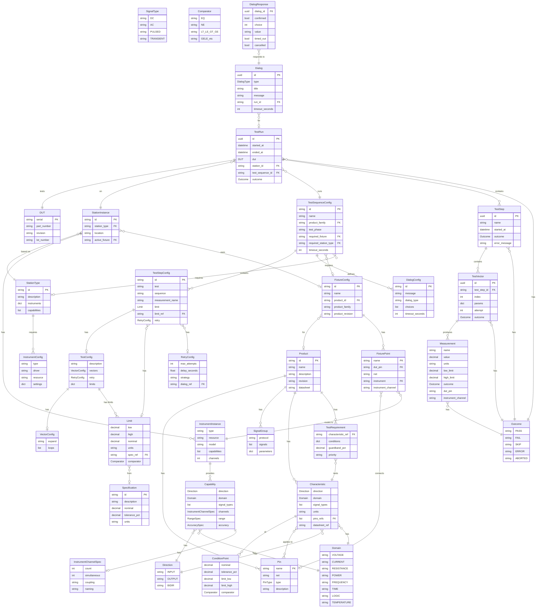

# Litmus Pydantic Models - Entity Relationship Diagram

This document shows the relationships between all Pydantic models in the Litmus codebase.

## Complete Models ERD



## Module Organization

| Module | Purpose | Key Models |
|--------|---------|------------|
| `litmus/capabilities/models.py` | Shared enums & capability specs | Direction, Domain, SignalType, Capability |
| `litmus/products/models.py` | Product specifications | Product, Pin, Characteristic, ConditionPoint |
| `litmus/config/models.py` | Configuration definitions | StationType, FixtureConfig, TestSequenceConfig, Limit |
| `litmus/data/models.py` | Test execution results | TestRun, TestStep, TestVector, Measurement |
| `litmus/dialogs/models.py` | Operator dialogs | Dialog, DialogResponse |

## Type vs Instance Models

```
┌─────────────────────────────────────────────────────────────────────────────┐
│                            TYPES (Definitions)                               │
│                        What CAN be done / What EXISTS                        │
├─────────────────────────────────────────────────────────────────────────────┤
│                                                                             │
│  ┌─────────────┐  ┌─────────────┐  ┌─────────────┐  ┌─────────────┐        │
│  │   Product   │  │ StationType │  │ FixtureConf │  │TestSequence │        │
│  │   ───────   │  │   ───────   │  │   ───────   │  │   Config    │        │
│  │ id: str     │  │ id: str     │  │ id: str     │  │ id: str     │        │
│  │ revision    │  │ instruments │  │ product_id  │  │ steps       │        │
│  │ pins        │  │ capabilities│  │ points      │  │ required_*  │        │
│  │ charact.    │  │             │  │             │  │             │        │
│  └─────────────┘  └─────────────┘  └─────────────┘  └─────────────┘        │
│        │                │                │                │                 │
│        │                │                │                │                 │
│        ▼                ▼                ▼                ▼                 │
├─────────────────────────────────────────────────────────────────────────────┤
│                          INSTANCES (Runtime)                                 │
│                      What IS happening / What EXISTS NOW                     │
├─────────────────────────────────────────────────────────────────────────────┤
│                                                                             │
│  ┌─────────────┐  ┌─────────────┐  ┌─────────────┐  ┌─────────────┐        │
│  │     DUT     │  │  Station    │  │  (Fixture   │  │   TestRun   │        │
│  │   ───────   │  │  Instance   │  │  Instance)  │  │   ───────   │        │
│  │ serial: str │  │ id: str     │  │   active    │  │ id: uuid    │        │
│  │ part_number │  │ station_type│  │   on the    │  │ dut         │        │
│  │ revision    │  │ instruments │  │   station   │  │ station_id  │        │
│  │             │  │ location    │  │             │  │ outcome     │        │
│  └─────────────┘  └─────────────┘  └─────────────┘  └─────────────┘        │
│                                                                             │
│        Specific         Physical          Currently         One test        │
│        device           bench with        installed         execution       │
│        being            real              fixture           with results    │
│        tested           instruments                                         │
│                                                                             │
└─────────────────────────────────────────────────────────────────────────────┘
```

## Data Flow

```
┌─────────────────────────────────────────────────────────────────────────────┐
│                          SPEC → RUNTIME FLOW                                 │
└─────────────────────────────────────────────────────────────────────────────┘

    Product.yaml                    Station.yaml              Fixture.yaml
    ────────────                    ────────────              ────────────
    ┌──────────┐                   ┌──────────────┐          ┌──────────────┐
    │ Product  │                   │StationInstance│          │ FixtureConfig│
    │ ─ pins   │◄──────────────────│ ─ instruments │◄─────────│ ─ points     │
    │ ─ chars  │      maps to      │ ─ location   │  routes   │ ─ product_id │
    └──────────┘                   └──────────────┘          └──────────────┘
         │                               │                          │
         │ defines                       │ has                      │ connects
         ▼                               ▼                          ▼
    ┌──────────┐                   ┌──────────────┐          ┌──────────────┐
    │Charactr- │                   │InstrumentInst│          │ FixturePoint │
    │ istics   │───────────────────│ ─ type       │◄─────────│ ─ dut_pin    │
    │ ─ limits │  requires caps    │ ─ resource   │  maps to │ ─ instrument │
    └──────────┘                   └──────────────┘          └──────────────┘
         │
         │ to_capability_requirement()
         ▼
    ┌──────────┐                                    TEST EXECUTION
    │Capability│                                    ──────────────
    │ ─ domain │                                   ┌──────────────┐
    │ ─ direct │                                   │   TestRun    │
    └──────────┘                                   │ ─ id: uuid   │
                                                   │ ─ dut        │
                                                   │ ─ outcome    │
    TestSequence.yaml                              └──────┬───────┘
    ─────────────────                                     │
    ┌──────────────────┐                                  │ contains
    │TestSequenceConfig│                                  ▼
    │ ─ steps          │────────────────────────►   ┌──────────────┐
    │ ─ required_*     │     executes as            │  TestStep    │
    └──────────────────┘                            │ ─ vectors    │
         │                                          │ ─ outcome    │
         │ contains                                 └──────┬───────┘
         ▼                                                 │
    ┌──────────────────┐                                   │ contains
    │  TestStepConfig  │                                   ▼
    │ ─ test           │                            ┌──────────────┐
    │ ─ limit          │                            │  TestVector  │
    └──────────────────┘                            │ ─ params     │
         │                                          │ ─ measurements│
         │ has                                      └──────┬───────┘
         ▼                                                 │
    ┌──────────────────┐                                   │ produces
    │      Limit       │                                   ▼
    │ ─ low/high       │────────────────────────►   ┌──────────────┐
    │ ─ units          │     checks against         │ Measurement  │
    └──────────────────┘                            │ ─ value      │
                                                    │ ─ outcome    │
                                                    └──────────────┘
```

## Capability Matching

The system uses capability matching to ensure stations can test products:

```python
# Product defines what it needs tested
product.characteristics["output_voltage"]
    → direction: OUTPUT (DUT provides voltage)
    → domain: VOLTAGE
    → signal_types: [DC]

# Characteristic converts to capability requirement
cap_req = char.to_capability_requirement()
    → direction: INPUT (flip! instrument must MEASURE)
    → domain: VOLTAGE
    → signal_types: [DC]

# Station instruments provide capabilities
station.instruments["dmm_main"]
    → capabilities: [
        Capability(direction=INPUT, domain=VOLTAGE, signal_types=[DC])
      ]

# Match: DMM can measure DC voltage ✓
```

---

## Data Models Field Reference

### Outcome

Test outcome per ATML/IEEE 1671 terminology.

```python
class Outcome(StrEnum):
    PASS = "pass"          # Test passed all limits
    FAIL = "fail"          # Test failed one or more limits
    SKIP = "skip"          # Test was skipped
    ERROR = "error"        # Test encountered an error
    ABORTED = "aborted"    # Test was aborted
    NOT_TESTED = "not_tested"  # Test was not executed
```

### Measurement

A single measurement with optional limit checking and full traceability.

| Field | Type | Description |
|-------|------|-------------|
| `name` | `str` | Measurement name (e.g., "output_voltage") |
| `value` | `Decimal | None` | Measured value |
| `units` | `str | None` | Units (e.g., "V", "mA", "%") |
| `low_limit` | `Decimal | None` | Lower limit for pass/fail |
| `high_limit` | `Decimal | None` | Upper limit for pass/fail |
| `nominal` | `Decimal | None` | Expected nominal value |
| `outcome` | `Outcome | None` | Pass/fail result |
| `spec_ref` | `str | None` | Reference to specification (e.g., "Section 7.2 @ 25°C") |
| `comparator` | `str | None` | ATML comparator type (default: "GELE") |
| `timestamp` | `datetime` | When measurement was taken |
| `dut_pin` | `str | None` | Which DUT pin was measured (e.g., "J1.3") |
| `instrument_name` | `str | None` | Station config name (e.g., "dmm_main") |
| `instrument_resource` | `str | None` | VISA address |
| `instrument_channel` | `str | None` | Channel on instrument (e.g., "CH1") |
| `fixture_point` | `str | None` | Fixture point name (e.g., "VOUT") |

**Comparators** (per ATML/IEEE 1671):

| Comparator | Pass Condition |
|------------|----------------|
| `GELE` (default) | `low <= value <= high` |
| `GELT` | `low <= value < high` |
| `GTLE` | `low < value <= high` |
| `GTLT` | `low < value < high` |
| `EQ` | `value == nominal` |
| `NE` | `value != nominal` |
| `GE` | `value >= low` |
| `GT` | `value > low` |
| `LE` | `value <= high` |
| `LT` | `value < high` |

### TestVector

A single execution of a test function with specific input parameters.

| Field | Type | Description |
|-------|------|-------------|
| `id` | `UUID` | Unique vector identifier |
| `test_step_id` | `UUID | None` | Parent TestStep ID |
| `index` | `int` | 0-based index in parameter expansion |
| `params` | `dict[str, Any]` | Input parameter values (e.g., `{"vin": 5.0, "load": 0.5}`) |
| `attempt` | `int` | Current attempt number (for retries) |
| `max_attempts` | `int` | Maximum attempts allowed |
| `outcome` | `Outcome` | Vector result |
| `measurements` | `list[Measurement]` | Values captured in this vector |
| `started_at` | `datetime` | When vector execution started |
| `ended_at` | `datetime | None` | When vector execution ended |
| `error_message` | `str | None` | Error details if failed |

### TestStep

A test step corresponding to a pytest test function.

| Field | Type | Description |
|-------|------|-------------|
| `id` | `UUID` | Unique step identifier |
| `name` | `str` | Test function name (e.g., "test_output_voltage") |
| `description` | `str | None` | Human-readable description |
| `started_at` | `datetime` | When step started |
| `ended_at` | `datetime | None` | When step ended |
| `outcome` | `Outcome` | Step result (worst of all vectors) |
| `vectors` | `list[TestVector]` | Test vectors executed |
| `error_message` | `str | None` | Error details if failed |

**Properties:**
- `total_vectors` - Number of vectors in this step
- `passed_vectors` - Number of passed vectors
- `failed_vectors` - Number of failed vectors

### DUT (Device Under Test)

| Field | Type | Description |
|-------|------|-------------|
| `serial` | `str` | Serial number (required) |
| `part_number` | `str | None` | Part/model number |
| `revision` | `str | None` | Hardware revision |
| `lot_number` | `str | None` | Manufacturing lot |

### TestRun

A complete test run with all steps and measurements.

| Field | Type | Description |
|-------|------|-------------|
| `id` | `UUID` | Unique run identifier |
| `started_at` | `datetime` | When run started |
| `ended_at` | `datetime | None` | When run ended |
| `dut` | `DUT` | Device under test info |
| `station_id` | `str` | Station that ran the test |
| `station_type` | `str | None` | Station type/template |
| `operator` | `str | None` | Operator name |
| `test_sequence_id` | `str` | Test sequence executed |
| `test_phase` | `str` | Test phase (default: "production") |
| `outcome` | `Outcome` | Overall run result |
| `steps` | `list[TestStep]` | Test steps executed |

### JSON Example

```json
{
  "id": "550e8400-e29b-41d4-a716-446655440002",
  "started_at": "2025-01-31T12:00:00Z",
  "ended_at": "2025-01-31T12:05:00Z",
  "dut": {
    "serial": "SN12345",
    "part_number": "PWR-CONV-001"
  },
  "station_id": "bench_001",
  "test_sequence_id": "full_validation",
  "outcome": "pass",
  "steps": [
    {
      "id": "550e8400-...",
      "name": "test_output_voltage",
      "outcome": "pass",
      "vectors": [
        {
          "index": 0,
          "params": {"vin": 5.0, "load": 0.5},
          "outcome": "pass",
          "measurements": [
            {
              "name": "output_voltage",
              "value": "3.31",
              "units": "V",
              "low_limit": "3.135",
              "high_limit": "3.465",
              "outcome": "pass",
              "spec_ref": "output_voltage @ tolerance_pct=5",
              "dut_pin": "J1.3",
              "instrument_name": "dmm"
            }
          ]
        }
      ]
    }
  ]
}
```
