# Litmus Pydantic Models - Entity Relationship Diagram

This document shows the relationships between all Pydantic models in the Litmus codebase. For conceptual framing of the capability-side models (`InstrumentCapability`, `ProductCharacteristic`, `SpecBand`, `Signal`, `Condition`, `Control`, `Attribute`, `ChannelTopology`), see [concepts/capability-model](../concepts/capability-model.md).

## Complete Models ERD

```mermaid
erDiagram
    %% ============================================
    %% CAPABILITIES MODULE (Shared Enums & Types)
    %% ============================================

    Direction {
        INPUT string
        OUTPUT string
        BIDIR string
        TRANSFORM string
    }

    MeasurementFunction {
        dc_voltage string
        ac_voltage string
        dc_current string
        ac_current string
        resistance string
        resistance_4w string
        frequency string
        waveform string
        dc_power string
        temperature string
        rf_power string
        rf_cw string
        digital_io string
        optical_power string
        etc string
    }

    Comparator {
        EQ string
        NE string
        LT_LE_GT_GE string
        GELE_etc string
    }

    MatchDepth {
        function string
        direction string
        range string
        accuracy string
        resolution string
    }

    SpecBand {
        when dict
        range RangeSpec
        value float_or_str
        units string
        accuracy AccuracySpec
        resolution ResolutionSpec
        qualifier SpecQualifier
    }

    Signal {
        range RangeSpec
        accuracy AccuracySpec
        resolution ResolutionSpec
        value float
        units string
        bands list
        qualifier SpecQualifier
    }

    Condition {
        range RangeSpec
    }

    Control {
        range RangeSpec
        options list
        units string
        default string
    }

    Attribute {
        value string
        units string
    }

    InstrumentCapability {
        function MeasurementFunction
        direction Direction
        signals dict
        conditions dict
        controls dict
        attributes dict
        channels list
        readback bool
    }

    InstrumentCatalogEntry {
        id string
        manufacturer string
        model string
        name string
        type string
        channels dict
        capabilities list
    }

    ChannelTopology {
        label string
        terminals list
        connector string
        ground string
    }

    %% ============================================
    %% PRODUCTS MODULE
    %% ============================================

    Product {
        id string PK
        name string
        part_number string
        base string
        description string
        revision string
        datasheet string
    }

    Pin {
        name string PK
        net string
        role PinRole
        description string
    }

    PinRole {
        signal string
        ground string
        power string
        reference string
    }

    SignalGroup {
        protocol string
        signals list
        parameters dict
    }

    ProductCharacteristic {
        function MeasurementFunction
        direction Direction
        units string
        pin string
        net string
        signal_group string
        datasheet_ref string
        signals dict
        conditions dict
        controls dict
        attributes dict
        bands list FK
    }

    %% ============================================
    %% CONFIG MODULE - Station & Instruments
    %% ============================================

    StationConfig {
        id string PK
        name string
        station_type string FK
        location string
        station_hostname string
        instruments dict
        supported_phases list
    }

    StationType {
        id string PK
        description string
        instruments dict
        capabilities list
    }

    StationInstrumentConfig {
        type string
        driver string
        resource string
        catalog_ref string
        mock bool
        channels dict
        description string
        mock_config dict
    }

    %% ============================================
    %% CONFIG MODULE - Fixtures
    %% ============================================

    FixtureConfig {
        id string PK
        name string
        product_id string FK
        product_family string
        product_revision string
    }

    FixtureConnection {
        name string PK
        dut_pin string FK
        net string
        instrument string FK
        instrument_channel string
        instrument_terminal string
    }

    %% ============================================
    %% TEST CONFIGURATION - sidecar YAML next to test files
    %% ============================================
    %% Tests are code-driven (pytest classes/functions in tests/test_*.py).
    %% A sidecar YAML co-located with each test file carries vectors,
    %% limits, mocks, retry, prompts as a recursive tests: tree.

    SidecarConfig {
        limits dict
        sweeps list
        mocks list
        characteristics list
        connections any
        retry RetryConfig
        prompts dict
        runner opaque
        tests dict
    }

    TestEntry {
        limits dict
        sweeps list
        mocks list
        characteristics list
        connections any
        retry RetryConfig
        prompts dict
        runner opaque
        tests dict
    }

    SweepEntry {
        params dict
    }

    MockEntry {
        target string
        return_value any
    }

    RetryConfig {
        max_retries int
        delay float
        on list
    }

    PromptConfig {
        id string PK
        message string
        prompt_type string
        choices list
        timeout_seconds int
    }

    Limit {
        low float
        high float
        nominal float
        units string
        spec_ref string FK
        comparator Comparator
    }

    %% ============================================
    %% DATA MODULE - Test Results
    %% ============================================

    TestRun {
        id uuid PK
        session_id uuid
        started_at datetime
        ended_at datetime
        dut DUT
        product_id string
        product_name string
        product_revision string
        station_id string FK
        station_name string
        station_type string
        station_location string
        station_hostname string
        fixture_id string
        test_phase string
        profile string
        profile_facets dict
        session_inputs dict
        operator_id string
        operator_name string
        git_commit string
        git_branch string
        git_remote string
        project_name string
        outcome Outcome
        steps list
        collected_items list
        custom_metadata dict
        environment_json dict
    }

    DUT {
        serial string PK
        part_number string
        revision string
        lot_number string
    }

    TestStep {
        id uuid PK
        name string
        step_path string
        parent_path string
        description string
        node_id string
        file string
        module string
        class_name string
        function string
        markers list
        started_at datetime
        ended_at datetime
        outcome Outcome
        vectors list
        error_message string
        instrument_arrays dict
    }

    TestVector {
        id uuid PK
        test_step_id uuid FK
        index int
        params dict
        observations dict
        stimulus list
        retry int
        max_retries int
        outcome Outcome
        measurements list
        started_at datetime
        ended_at datetime
        error_message string
    }

    StimulusRecord {
        param string
        value float
        units string
        instrument string
        resource string
        channel string
        dut_pin string
        fixture_connection string
    }

    Measurement {
        name string
        value float
        units string
        limit_low float
        limit_high float
        limit_nominal float
        limit_comparator string
        outcome Outcome
        dut_pin string
        instrument_name string
        instrument_resource string
        instrument_channel string
        fixture_connection string
    }

    Outcome {
        passed string
        failed string
        skipped string
        errored string
        aborted string
        terminated string
        done string
    }

    %% ============================================
    %% DIALOGS MODULE
    %% ============================================

    Dialog {
        id uuid PK
        type DialogType
        title string
        message string
        run_id string FK
        timeout_seconds int
    }

    DialogResponse {
        dialog_id uuid FK
        confirmed bool
        choice int
        value string
        timed_out bool
        cancelled bool
    }

    %% ============================================
    %% RELATIONSHIPS
    %% ============================================

    %% Product structure
    Product ||--o{ Pin : "has"
    Product ||--o{ SignalGroup : "has"
    Product ||--o{ ProductCharacteristic : "has"
    ProductCharacteristic ||--o{ SpecBand : "has specs"
    ProductCharacteristic }o--o{ Pin : "applies to"

    %% Capability relationships
    InstrumentCapability }o--|| Direction : "has"
    InstrumentCapability }o--|| MeasurementFunction : "has"
    Signal ||--o{ SpecBand : "bands"
    InstrumentCapability ||--o{ Signal : "has"
    InstrumentCapability ||--o{ Condition : "has"
    InstrumentCapability ||--o{ Control : "has"
    InstrumentCapability ||--o{ Attribute : "has"
    InstrumentCatalogEntry ||--o{ InstrumentCapability : "provides"
    InstrumentCatalogEntry ||--o{ ChannelTopology : "has channels"
    ProductCharacteristic }o--|| Direction : "has"
    ProductCharacteristic }o--|| MeasurementFunction : "has"

    %% Station structure
    StationType ||--o{ StationInstrumentConfig : "requires"
    StationConfig }o--|| StationType : "based on"
    StationConfig ||--o{ StationInstrumentConfig : "has"
    StationInstrumentConfig ||--o{ InstrumentCapability : "provides"

    %% Fixture structure
    FixtureConfig }o--o| Product : "for"
    FixtureConfig ||--o{ FixtureConnection : "has"
    FixtureConnection }o--o| Pin : "connects"
    FixtureConnection }o--|| StationInstrumentConfig : "routes to"

    %% Test configuration (sidecar YAML)
    %% TestEntry.tests is dict[str, TestEntry] (recursive per-class /
    %% per-method scope tree). Not drawn as a Mermaid self-edge because
    %% the routing reads as a phantom cross-relationship.
    SidecarConfig ||--o{ TestEntry : "tests:"
    SidecarConfig ||--o{ SweepEntry : "sweeps:"
    SidecarConfig ||--o{ MockEntry : "mocks:"
    SidecarConfig ||--o{ Limit : "limits:"
    SidecarConfig ||--o{ PromptConfig : "prompts:"
    SidecarConfig }o--o| RetryConfig : "retry:"
    Limit }o--o| ProductCharacteristic : "from"

    %% Test execution results
    TestRun ||--|| DUT : "tests"
    TestRun }o--|| StationConfig : "on"
    TestRun ||--o{ TestStep : "contains"
    TestStep ||--o{ TestVector : "contains"
    TestVector ||--o{ StimulusRecord : "has inputs"
    TestVector ||--o{ Measurement : "measurements"
    Measurement }o--|| Outcome : "has"
    TestVector }o--|| Outcome : "has"
    TestStep }o--|| Outcome : "has"
    TestRun }o--|| Outcome : "has"

    %% Dialog relationships
    Dialog }o--o| TestRun : "for"
    DialogResponse }o--|| Dialog : "responds to"
```



## Module Organization

| Module | Purpose | Key Models |
|--------|---------|------------|
| `src/litmus/models/enums.py` | Shared enum vocabulary | Direction, MeasurementFunction, Comparator, MatchDepth, TerminalRole |
| `src/litmus/models/capability.py` | Instrument capabilities + spec bands | InstrumentCapability, Signal, Condition, Control, Attribute, SpecBand, ChannelTopology |
| `src/litmus/models/catalog.py` | Instrument catalog entries | InstrumentCatalogEntry |
| `src/litmus/models/product.py` | Product specifications | Product, Pin, ProductCharacteristic, SignalGroup |
| `src/litmus/models/product_manifest.py` | Product release manifest | ProductManifest |
| `src/litmus/models/station.py` | Station configs + types | StationConfig, StationType, StationInstrumentConfig |
| `src/litmus/models/instrument.py` | Instrument runtime config | InstrumentConfig |
| `src/litmus/models/instrument_asset.py` | Calibration / asset records | InstrumentAsset |
| `src/litmus/models/project.py` | Project-level config | ProjectConfig, ProfileConfig |
| `src/litmus/models/test_config.py` | Sidecar test config (per test file) | SidecarConfig, TestEntry, SweepEntry, MockEntry, RetryConfig, Limit, FixtureConfig, FixtureSlot, FixtureConnection, SwitchRoute, PromptConfig |
| `src/litmus/data/models.py` | Test execution results | TestRun, TestStep, TestVector, Measurement |
| `src/litmus/api/dialogs/models.py` | Operator dialogs | Dialog, DialogResponse |

## Type vs Instance Models

```
┌─────────────────────────────────────────────────────────────────────────────┐
│                            TYPES (Definitions)                               │
│                        What CAN be done / What EXISTS                        │
├─────────────────────────────────────────────────────────────────────────────┤
│                                                                             │
│  ┌─────────────┐  ┌─────────────┐  ┌─────────────┐  ┌─────────────┐        │
│  │   Product   │  │ StationType │  │ FixtureConf │  │SidecarConfig│        │
│  │   ───────   │  │   ───────   │  │   ───────   │  │   ───────   │        │
│  │ id: str     │  │ id: str     │  │ id: str     │  │ tests: tree │        │
│  │ revision    │  │ instruments │  │ product_id  │  │ sweeps      │        │
│  │ pins        │  │ capabilities│  │ slots       │  │ limits      │        │
│  │ charact.    │  │             │  │             │  │ mocks       │        │
│  └─────────────┘  └─────────────┘  └─────────────┘  └─────────────┘        │
│        │                │                │                │                 │
│        │                │                │                │                 │
│        ▼                ▼                ▼                ▼                 │
├─────────────────────────────────────────────────────────────────────────────┤
│                          INSTANCES (Runtime)                                 │
│                      What IS happening / What EXISTS NOW                     │
├─────────────────────────────────────────────────────────────────────────────┤
│                                                                             │
│  ┌─────────────┐  ┌─────────────┐  ┌─────────────┐  ┌─────────────┐        │
│  │     DUT     │  │  Station    │  │  (Fixture   │  │   TestRun   │        │
│  │   ───────   │  │  Instance   │  │  Instance)  │  │   ───────   │        │
│  │ serial: str │  │ id: str     │  │   active    │  │ id: uuid    │        │
│  │ part_number │  │ station_type│  │   on the    │  │ dut         │        │
│  │ revision    │  │ instruments │  │   station   │  │ station_id  │        │
│  │             │  │ location    │  │             │  │ outcome     │        │
│  └─────────────┘  └─────────────┘  └─────────────┘  └─────────────┘        │
│                                                                             │
│        Specific         Physical          Currently         One test        │
│        device           bench with        installed         execution       │
│        being            real              fixture           with results    │
│        tested           instruments                                         │
│                                                                             │
└─────────────────────────────────────────────────────────────────────────────┘
```

## Data Flow

```
┌─────────────────────────────────────────────────────────────────────────────┐
│                          SPEC → RUNTIME FLOW                                 │
└─────────────────────────────────────────────────────────────────────────────┘

    Product.yaml                    Station.yaml              Fixture.yaml
    ────────────                    ────────────              ────────────
    ┌──────────┐                   ┌──────────────┐          ┌──────────────┐
    │ Product  │                   │StationConfig │          │ FixtureConfig│
    │ ─ pins   │◄──────────────────│ ─ instruments │◄─────────│ ─ connections│
    │ ─ chars  │      maps to      │ ─ location   │  routes   │ ─ product_id │
    └──────────┘                   └──────────────┘          └──────────────┘
         │                               │                          │
         │ defines                       │ has                      │ connects
         ▼                               ▼                          ▼
    ┌──────────┐                   ┌──────────────┐          ┌──────────────┐
    │Product   │                   │StationInstr  │          │FixtureConnct.│
    │Charact-  │───────────────────│ ─ type       │◄─────────│ ─ dut_pin    │
    │ istics   │  requires caps    │ ─ resource   │  maps to │ ─ instrument │
    └──────────┘                   └──────────────┘          └──────────────┘
         │
         │ direction pairing in matching service
         ▼
    ┌──────────────┐                                TEST EXECUTION
    │Instrument    │                                ──────────────
    │Capability    │                               ┌──────────────┐
    │ ─ function   │                               │   TestRun    │
    │ ─ direction  │                               │ ─ id: uuid   │
    └──────────────┘                               │ ─ dut        │
                                                   │ ─ outcome    │
    tests/test_*.py +                              └──────┬───────┘
    tests/test_*.yaml (sidecar)                           │
    ┌──────────────────┐                                  │ contains
    │  SidecarConfig   │                                  ▼
    │ ─ tests: tree    │────────────────────────►   ┌──────────────┐
    │ ─ sweeps         │     executes as            │  TestStep    │
    │ ─ limits, mocks  │     a pytest run           │ ─ vectors    │
    └──────────────────┘                            │ ─ outcome    │
         │                                          └──────┬───────┘
         │ recursive tests: → TestEntry                    │
         ▼                                                 │ contains
    ┌──────────────────┐                                   ▼
    │    TestEntry     │                            ┌──────────────┐
    │ ─ limits, sweeps │                            │  TestVector  │
    │ ─ mocks, retry   │                            │ ─ params     │
         │                                          │ ─ measurements│
         │ has                                      └──────┬───────┘
         ▼                                                 │
    ┌──────────────────┐                                   │ produces
    │      Limit       │                                   ▼
    │ ─ low/high       │────────────────────────►   ┌──────────────┐
    │ ─ units          │     checks against         │ Measurement  │
    └──────────────────┘                            │ ─ value      │
                                                    │ ─ outcome    │
                                                    └──────────────┘
```

## Capability Matching

The system uses capability matching to ensure stations can test products:

```python
# Product defines what it needs tested
product.characteristics["output_voltage"]
    → function: dc_voltage
    → direction: OUTPUT (DUT provides voltage)

# Matching wraps characteristics into CapabilityRequirement
# Direction stays as-is (OUTPUT) — pairing happens in capability_satisfies()

# Station instruments provide capabilities
station.instruments["dmm_main"]
    → capabilities: [
        InstrumentCapability(function=dc_voltage, direction=INPUT,
            signals={voltage: Signal(range=RangeSpec(min=0, max=1000))})
      ]

# Match: function ✓, direction pair (OUTPUT↔INPUT) ✓, range contains 3.3V ✓
```

---

## Data Models Field Reference

### Outcome

Test outcome per ATML/IEEE 1671 terminology.

```python
class Outcome(StrEnum):
    PASSED = "passed"          # All measurements within limits
    FAILED = "failed"          # One or more measurements out of limits
    SKIPPED = "skipped"        # Test was skipped (pytest.skip or marker)
    ERRORED = "errored"        # Test errored before pass/fail could be decided
    TERMINATED = "terminated"  # Run was terminated (e.g. keyboard interrupt)
    ABORTED = "aborted"        # Run was aborted by operator
    DONE = "done"              # Container outcome — work finished, no measurements
```

From `src/litmus/data/models.py`. The container ladder rolls the worst child up: `skipped < done < passed < failed < errored < terminated < aborted` (`skipped` and `done` rank below `passed` so a parent with one skipped child and one passing child still resolves to `passed`).

### Measurement

A single measurement with optional limit checking and full traceability.

| Field | Type | Parquet Column | Description |
|-------|------|----------------|-------------|
| `name` | `str` | `measurement_name` | Measurement name (e.g., "output_voltage") |
| `value` | `float | None` | `measurement_value` | Measured value |
| `units` | `str | None` | `measurement_units` | Units (e.g., "V", "mA", "%") |
| `limit_low` | `float | None` | `limit_low` | Lower limit for pass/fail |
| `limit_high` | `float | None` | `limit_high` | Upper limit for pass/fail |
| `limit_nominal` | `float | None` | `limit_nominal` | Expected nominal value |
| `outcome` | `Outcome | None` | `measurement_outcome` | Pass/fail result |
| `spec_ref` | `str | None` | `spec_ref` | Reference to specification |
| `limit_comparator` | `str | None` | `limit_comparator` | ATML comparator type (default: "GELE") |
| `timestamp` | `datetime` | `measurement_timestamp` | When measurement was taken |
| `dut_pin` | `str | None` | `dut_pin` | Which DUT pin was measured |
| `instrument_name` | `str | None` | `instrument_name` | Station config name |
| `instrument_resource` | `str | None` | `instrument_resource` | VISA address |
| `instrument_channel` | `str | None` | `instrument_channel` | Channel on instrument |
| `fixture_connection` | `str | None` | `fixture_connection` | Fixture connection name |

**Comparators** (per ATML/IEEE 1671):

| Comparator | Pass Condition |
|------------|----------------|
| `GELE` (default) | `low <= value <= high` |
| `GELT` | `low <= value < high` |
| `GTLE` | `low < value <= high` |
| `GTLT` | `low < value < high` |
| `EQ` | `value == nominal` |
| `NE` | `value != nominal` |
| `GE` | `value >= low` |
| `GT` | `value > low` |
| `LE` | `value <= high` |
| `LT` | `value < high` |

### TestVector

A single execution of a test function with specific input parameters.

| Field | Type | Description |
|-------|------|-------------|
| `id` | `UUID` | Unique vector identifier |
| `test_step_id` | `UUID | None` | Parent TestStep ID |
| `index` | `int` | 0-based index in parameter expansion |
| `params` | `dict[str, Any]` | Input parameter values (e.g., `{"vin": 5.0, "load": 0.5}`) |
| `retry` | `int` | 0-based retry counter (0 = first execution, N = Nth retry) |
| `max_retries` | `int` | Maximum retries allowed (0 = no retries; N = up to N retries beyond original) |
| `outcome` | `Outcome` | Vector result |
| `stimulus` | `list[StimulusRecord]` | Input signal paths for traceability |
| `measurements` | `list[Measurement]` | Values captured in this vector |
| `started_at` | `datetime` | When vector execution started |
| `ended_at` | `datetime | None` | When vector execution ended |
| `error_message` | `str | None` | Error details if failed |

### StimulusRecord

Records the signal path for an input stimulus (for traceability).

| Field | Type | Description |
|-------|------|-------------|
| `param` | `str` | Parameter name (e.g., "vin", "load") |
| `value` | `float | None` | Value commanded |
| `units` | `str | None` | Units (e.g., "V", "A") |
| `instrument` | `str | None` | Instrument name (e.g., "psu_main") |
| `resource` | `str | None` | VISA address at test time |
| `channel` | `str | None` | Channel on instrument (e.g., "CH1") |
| `dut_pin` | `str | None` | DUT pin driven |
| `fixture_connection` | `str | None` | Fixture routing connection |

In Parquet output, each StimulusRecord becomes dynamic columns with `in_` prefix:
- `in_vin`, `in_vin_instrument`, `in_vin_resource`, `in_vin_channel`, `in_vin_dut_pin`, `in_vin_fixture_connection`

### TestStep

A test step corresponding to a pytest test function.

| Field | Type | Description |
|-------|------|-------------|
| `id` | `UUID` | Unique step identifier |
| `name` | `str` | Test function name (e.g., "test_output_voltage") |
| `step_path` | `str` | Hierarchical step identifier (parametrize / class / module path) |
| `parent_path` | `str` | Step path of the parent node (empty for root) |
| `description` | `str | None` | Human-readable description |
| `node_id` | `str | None` | pytest node id (e.g., `tests/test_x.py::TestRails::test_rail[5V]`) |
| `file` | `str | None` | Source file path |
| `module` | `str | None` | Python module name |
| `class_name` | `str | None` | Test class name (if the test is a method) |
| `function` | `str | None` | Test function name |
| `markers` | `str | None` | Serialized pytest markers applied to this step |
| `started_at` | `datetime` | When step started |
| `ended_at` | `datetime | None` | When step ended |
| `outcome` | `Outcome | None` | Step result (worst of all vectors) |
| `vectors` | `list[TestVector]` | Test vectors executed |
| `error_message` | `str | None` | Error details if failed |
| `instrument_arrays` | `dict[str, list] | None` | Per-step instrument-array snapshots (driver, resource, role, etc.) |

**Properties:**
- `total_vectors` - Number of vectors in this step
- `passed_vectors` - Number of passed vectors
- `failed_vectors` - Number of failed vectors

### DUT (Device Under Test)

| Field | Type | Description |
|-------|------|-------------|
| `serial` | `str` | Serial number (required) |
| `part_number` | `str | None` | Part/model number |
| `revision` | `str | None` | Hardware revision |
| `lot_number` | `str | None` | Manufacturing lot |

### TestRun

A complete test run with all steps and measurements.

| Field | Type | Description |
|-------|------|-------------|
| `id` | `UUID` | Unique run identifier |
| `session_id` | `UUID | None` | Session this run belongs to |
| `started_at` | `datetime` | When run started |
| `ended_at` | `datetime | None` | When run ended |
| `dut` | `DUT` | Device under test info |
| `product_id` | `str | None` | Product ID from spec |
| `product_name` | `str | None` | Human-readable product name |
| `product_revision` | `str | None` | Spec revision |
| `station_id` | `str` | Station that ran the test |
| `station_name` | `str | None` | Human-readable station name |
| `station_type` | `str | None` | Station type/template |
| `station_location` | `str | None` | Physical location |
| `station_hostname` | `str | None` | Hostname of the station machine |
| `fixture_id` | `str | None` | Fixture identifier |
| `test_phase` | `str` | Test phase (e.g. `production` / `characterization` / `development`) |
| `profile` | `str | None` | Active profile name |
| `profile_facets` | `dict[str, str]` | Facet keys resolved for the active profile |
| `session_inputs` | `dict[str, Any]` | Required-input values captured at session start |
| `operator_id` | `str | None` | Operator ID |
| `operator_name` | `str | None` | Human-readable operator name |
| `git_commit` | `str | None` | Git commit hash at test time |
| `git_branch` | `str | None` | Git branch at test time |
| `git_remote` | `str | None` | Git remote URL at test time |
| `project_name` | `str | None` | Project name from `litmus.yaml` |
| `outcome` | `Outcome` | Overall run result |
| `steps` | `list[TestStep]` | Test steps executed |
| `collected_items` | `list[CollectedItem]` | Items pytest collected for this run |
| `custom_metadata` | `dict[str, Any]` | Custom fields from run_context |
| `environment_json` | `dict[str, Any]` | Python/OS/litmus version + lockfile fingerprint |

Config files (station, fixture, product spec) are tracked via git — the `git_commit` column identifies the exact state.

### JSON Example

```json
{
  "id": "550e8400-e29b-41d4-a716-446655440002",
  "started_at": "2025-01-31T12:00:00Z",
  "ended_at": "2025-01-31T12:05:00Z",
  "dut": {
    "serial": "SN12345",
    "part_number": "PWR-CONV-001"
  },
  "station_id": "bench_001",
  "station_type": "validation_bench",
  "product_id": "power_board",
  "product_name": "3.3V Power Converter",
  "operator_id": "jane.doe",
  "git_commit": "abc123def456",
  "custom_metadata": {
    "operator_badge": "EMP-12345",
    "fixture_serial": "FIX-001"
  },
  "outcome": "passed",
  "steps": [
    {
      "id": "550e8400-...",
      "name": "test_output_voltage",
      "outcome": "passed",
      "vectors": [
        {
          "index": 0,
          "params": {"vin": 5.0, "load": 0.5},
          "stimulus": [
            {
              "param": "vin",
              "value": 5.0,
              "units": "V",
              "instrument": "psu_main",
              "resource": "TCPIP::192.168.1.100::INSTR",
              "channel": "CH1",
              "dut_pin": "VIN"
            }
          ],
          "outcome": "passed",
          "measurements": [
            {
              "name": "output_voltage",
              "value": 3.31,
              "units": "V",
              "limit_low": 3.135,
              "limit_high": 3.465,
              "limit_nominal": 3.3,
              "limit_comparator": "GELE",
              "outcome": "passed",
              "spec_ref": "output_voltage",
              "dut_pin": "J1.3",
              "instrument_name": "dmm_main",
              "instrument_resource": "TCPIP::192.168.1.101::INSTR"
            }
          ]
        }
      ]
    }
  ]
}
```

## Context (Execution Module)

The `Context` class provides hierarchical context with scoped inheritance:

- **Run level**: Data visible to all steps and vectors
- **Step level**: Data visible to all vectors in that step
- **Vector level**: Data visible only to that vector

Data set at parent level is inherited by children. Children can override parent values locally.

```python
from litmus.execution.harness import Context, TestHarness

harness = TestHarness(step_name="my_test")

# Run-level context - persists across all steps
harness.run_context.configure("operator", "jane")

with harness.step():
    # Step-level context - visible to all vectors in this step
    harness.context.configure("fixture.id", "FIX-01")

    with harness.run_vector(vector) as tv:
        # Vector-level context - inherits from step and run
        harness.context.observe("temp_probe.temp", 24.8)

        # Merged inputs: {"operator": "jane", "fixture.id": "FIX-01", "temp": 25}
        print(harness.context.params)
```

### Context API

```python
# Configuration (→ in_* columns)
context.configure("psu.voltage", 5.0)

# Observations (→ out_* columns)
context.observe("temp_probe.temp", 24.8)

# Bulk operations
context.configure_all({"psu.voltage": 5.0, "eload.current": 0.8})
context.observe_all({"temp_probe.temp": 24.8, "humidity": 45.2})

# Read values (checks parent chain)
voltage = context.get_param("psu.voltage")
temp = context.get_observation("temp_probe.temp")

# Last + change detection across the prev-context chain
prev_v = context.last("psu.voltage")
changed = context.changed("psu.voltage")

# Merged properties
all_inputs = context.params              # All inputs, merged with parent chain
all_outputs = context.observations       # All outputs, merged with parent chain

# Create child context
child = context.child()
```

Defined in `src/litmus/execution/harness.py`. There is no `context.set` / `context.get` / `context.update` / `context.set_in` / `context.set_out` — use the methods above.

### RunContext (Legacy)

The `RunContext` class provides RunContext-compatible API for custom metadata:

```python
def test_with_metadata(run_context, psu, dmm):
    # Add custom fields - these become Parquet columns
    run_context.set("operator_badge", "EMP-12345")
    run_context.set("fixture_serial", "FIX-001")
    run_context.set("ambient_temp", 23.5)

    # Retrieve values
    badge = run_context.get("operator_badge")

    # Normal test code...
```

Custom metadata is stored in `TestRun.custom_metadata` and denormalized onto every measurement row in Parquet for easy querying.
