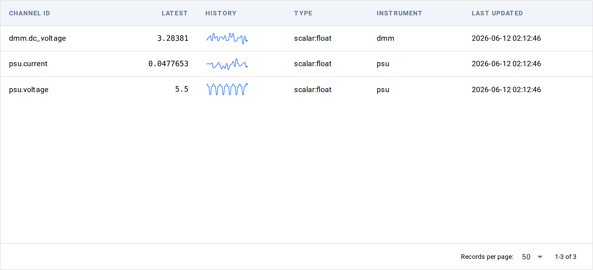

# Channels — list view

**URL:** `/channels`

Every channel TesterKit has seen — streaming numeric / array signals
captured during test runs (scope traces, PSU readback, sensor logs).
Each row shows a live sparkline of the last 50 samples and the
latest value; values update in place as new samples arrive. Click a
row to drill into the [single-channel chart](detail.md).

## Table

A count above the table tells you how many channels have been seen.

| Column | What it shows |
|---|---|
| Channel ID | The channel's identifier — typically `<instrument-role>.<signal>` or `<channel-name>` |
| Latest | The most recent sample, with units appended when known. `—` when no samples yet. |
| History | An inline sparkline of the last 50 samples (or `—` for series with fewer than 2 samples). |
| Type | Sample data type (e.g. `scalar:float`, `array:float`) from the channel descriptor |
| Instrument | The instrument role this channel belongs to, when known |
| Last updated | When the most recent sample arrived, in browser-local time |

The table is dense — rows are about 30 pixels tall; sparklines
render inside the row at 80×24 pixels.

## Filters

A filter card above the table narrows the list: **Channel ID contains**,
**Type**, **Instrument**, and a **Since / Until** date window, plus a
**Refresh** button. When you arrive from a run (via its detail page), a
banner scopes the list to that session with a Clear button.

## Live updates

The view refreshes live as channels appear and update — no manual
reload needed. Cells re-render in place; unchanged rows don't repaint,
so the view stays calm during quiet periods. If live events aren't
available, the page falls back to polling every couple of seconds.

## Empty state

When no channels have been written yet, the table is replaced with a card
explaining how channels get populated: "Channels appear once a test
writes to the channel store (e.g. `context.observe('scope', value)`
or instrument observers)."

## Underlying data

Channel samples are stored separately from runs and measurements.
Programmatic access goes through `ChannelStore`
(`from testerkit.data.channels.store import ChannelStore`); there is no
first-class CLI equivalent today.

## Common tasks

- **Watch a sensor live during a test** — open `/channels`, find the
  row, watch the Latest column and sparkline update.
- **Drill into one channel's full history** — click any row to open
  the [single-channel detail](detail.md) with a full chart + raw data
  table + session/date filters.

## See also

- [Channel detail](detail.md) — the per-channel view you reach by
  clicking a row
- [Concepts → Data stores](../../../concepts/data/data-stores.md) — why
  ChannelStore is separate from EventStore and the parquet runs index
