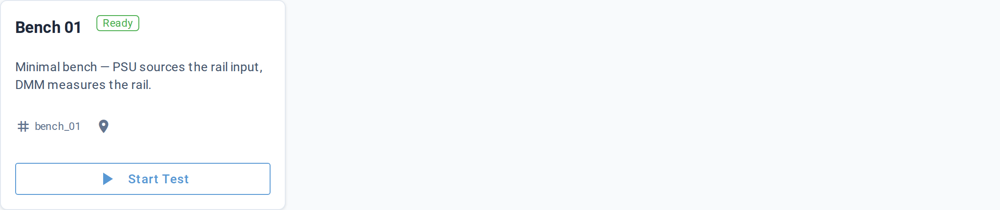
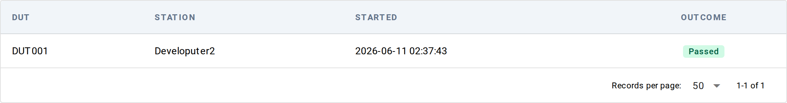

# Dashboard

**URL:** `/`

The home page. Two short sections: configured stations as cards, and
recent runs as a compact table. For a fresh install with neither
stations nor runs, the page swaps to a three-step Getting Started
card instead.

## Stations

One card per station configured in the project. Each card shows:

| Element | What it shows |
|---|---|
| Title | Station name (falls back to station id when name isn't set) |
| Status badge | A green outlined `Ready` badge |
| Description | The station's description, when set |
| Identifier row | Station id + location, prefixed with tag and pin icons |
| Start Test button | Jumps to `/launch?station=<id>` ([Launch Test](launch.md), prefilled with this station) |

When no stations are configured but runs exist, the section renders
"No stations configured." as italic placeholder text.

## Recent Runs

A 10-row table of the most recent finished runs across the project,
queried via the same query class the [Results list](results/list.md)
uses. In-flight runs (still waiting on `RunEnded`) are NOT shown
here — open the Results list to see them. The Dashboard's table is
deliberately a quick-glance summary.

| Column | What it shows |
|---|---|
| DUT | DUT serial number |
| Station | Station hostname (the machine an operator recognizes), not the internal station id |
| Started | Run start timestamp, browser-local time |
| Outcome | Final outcome value |

Click a row to open the [Results detail](results/detail.md) for that run.

When no runs have been recorded yet, the section renders "No test
runs yet." as italic placeholder text.

## Getting Started (empty state)

When the project has **neither stations nor runs**, the page swaps
to a Getting Started card with three numbered steps:

1. **Create a station** — buttons for "New Station" (jumps to the
   create-station form) and a one-liner pointing at `litmus station
   init` on the CLI
2. **Write a test** — `litmus new-test <name>` command snippet
3. **Run it** — `pytest --mock-instruments` command snippet

Below the steps, a hint card points at `litmus init --starter` for
authors who'd rather start from a fully populated example project.

## Live updates

The Dashboard reads its data once on first paint via background
fetches that don't block the page; subsequent visits re-fetch. The
view does not currently subscribe to live events — refresh the
browser to pick up new runs or station changes.

## Underlying data

- Stations come from the local project's `stations/` directory
- Recent runs come from the same runs index as [Results list](results/list.md)

## Common tasks

- **Open a station's launch form** — click `Start Test` on the station card
- **Drill into the latest run** — click any row in Recent Runs
- **Bootstrap a fresh project** — follow the three steps in the
  Getting Started card

## See also

- [Launch Test](launch.md) — start a new test session
- [Results list](results/list.md) — full run history beyond the 10
  shown here
