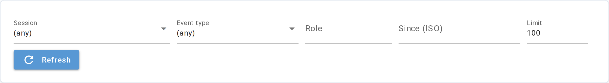
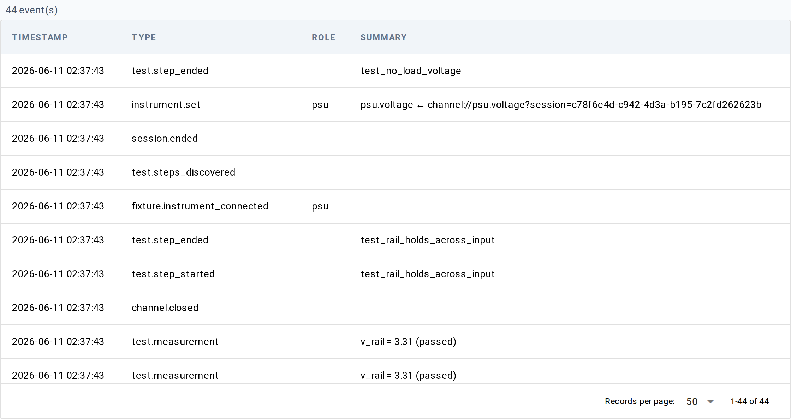

# Events

**URL:** `/events`

Browse the event log — the append-only stream of everything Litmus
records: session lifecycle, run lifecycle, test step starts and ends,
measurements, channel starts, instrument writes, operator dialogs, and
diagnostics. The Results pages roll events up into runs; this page
shows them raw.

Use it to debug timing ("why did this run pause for 4 seconds?"),
trace instrument activity ("what did the DMM actually do during this
test?"), or audit dialog responses ("did the operator confirm
calibration before that batch?").

## Filters

| Filter | What it does | Notes |
|---|---|---|
| Session ID | Restrict to events for one session | Free-text. Full or short (first 8 chars) UUID works. |
| Event type | Pick one of 15 curated event types, or `(any)` for all | The event log can hold any event type; this dropdown lists the categories worth a one-click filter — it is **not exhaustive**. Other event types (e.g. `fixture.uut_scanned`, `route.*`, `site.*`, `channel.*`) only appear under `(any)`. See the [Event types reference](../data/event-types.md) for the full list. |
| Role | Filter by instrument role (e.g. `dmm`, `psu`) | Free-text. |
| Since (ISO) | Earliest event timestamp | ISO-8601 string. |
| Limit | Maximum events fetched | Default 100, range 1–10,000. |
| Refresh | Force a re-fetch | Filter changes already auto-refresh. |

## Table

One row per event, newest first. Above the table a count tells you
how many events matched.

| Column | What it shows |
|---|---|
| Timestamp | When the event was recorded, in browser-local time |
| Type | Event type (e.g. `channel.started`, `test.measurement`) |
| Role | Instrument or fixture role for events that carry one; otherwise blank |
| Summary | A type-specific one-liner — channel name for channel starts, measurement name + value + outcome for measurements, station id for session events, UUT serial for run events, step name for step events |

Click a row to open a detail dialog showing the full event JSON
(every field on the event record).

When no events match, the table area shows "No events match the
current filters." instead.

## Bookmarkable URL state

All filters serialize to query parameters so a URL captures the view:

| Parameter | Meaning |
|---|---|
| `session_id` | Session UUID filter |
| `event_type` | One of the dropdown values (or omitted for `(any)`) |
| `role` | Instrument role filter |
| `since` | ISO-8601 lower bound |
| `limit` | Result cap (omitted at default 100) |

## Underlying data

The page reads from the event log — the same append-only stream every
other view reads from. There is no first-class CLI equivalent today;
events are observable in aggregate via the Runs / Metrics CLIs, and
raw events can be read programmatically — see
[Querying events](../../how-to/data/querying-events.md).

For the schema of each event type, see
[Event types reference](../data/event-types.md).

For how the event log works, see
[Concepts → Event log](../../concepts/data/event-log.md).

## Common tasks

- **Why did this run pause?** — Filter by Session ID, sort by
  timestamp, look for gaps between consecutive `test.step_*` events.
- **Did the operator confirm before the batch?** — Filter event type
  to `dialog.opened` then `dialog.responded`, narrow by Session ID.
- **Which channels did this test actually touch?** — Filter event
  type to `channel.started`, scoped by Session ID.

## See also

- [Results detail](results/detail.md) — the same events grouped into
  a single run's tabs
- [Event types reference](../data/event-types.md)
- [Concepts → Event log](../../concepts/data/event-log.md)
