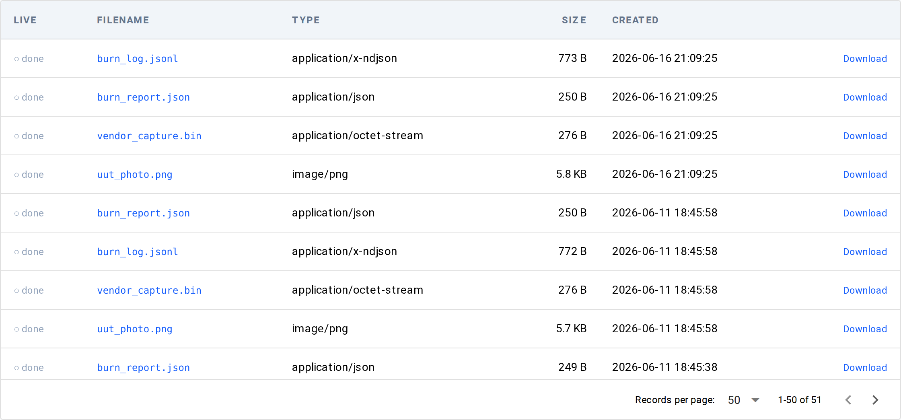

# Files

`/files` lists the artifacts in the FileStore — images, waveforms, byte
streams, and any other file a test recorded via `observe(name, value)` or
`files.write(...)`. Each row links to a per-artifact detail page with an
inline viewer and a download button.

Reach it from the **Files** entry under DATA STORES in the sidebar.

## Filters

Filter widgets render above the table:

- **Type** — dropdown of the MIME types (or file extensions) actually present,
  `(any)` by default.
- **Filename contains** — case-insensitive substring match on the filename.
- **Since / Until** — created-at date window.
- **Session** — set only by deep-links from a run (`/results/{run_id}` →
  Files), shown as a banner with a Clear affordance. There is no session
  picker; operators scope by date / name / MIME, not by session UUID.

## Table

One row per artifact:

| Column | Meaning |
|--------|---------|
| Live | `● live` while the artifact is still being written (a stream), `○ done` once finalized. |
| Filename | The artifact's name (the `name` passed to `observe` / `files.write`, plus the format's extension). |
| Type | The recorded MIME type, or the file extension when the sidecar MIME is absent. |
| Size | Human-readable file size. |
| Created | When the artifact was written. |
| Download | A link that saves the artifact. |

Clicking a row opens `/files/{date}/{session_id}/{filename}`.

## Detail page — viewer + download

The detail page shows a metadata card (MIME, extension, size, modified,
and the session it belongs to) and an **inline viewer chosen by file
type**. Supported viewers:

- **Image** (`.png`, `.jpg`, …) — rendered inline.
- **Video** (`.mp4`, `.webm`) — played inline.
- **JSON** — pretty-printed.
- **JSONL** (`.jsonl`, `.ndjson`) — one row per line in a table.
- **CSV** — parsed into a table.
- **Text** (`.txt`, `.log`, `.md`) — shown as plain text.
- **NPZ** — a `Waveform` chart.
- **NPY** — array stats.
- Anything else, or files over the viewer size cap — a **hex / download**
  fallback.

The **Download** button saves the artifact rather than rendering it
inline; it works on every deployment.

## Bookmarkable URL state

The list mirrors its filters into the URL (`?mime=`, `?name=`, `?since=`,
`?until=`, `?session_id=`), so a filtered view is shareable. The detail page's
URL is the artifact's full key — `/files/{date}/{session_id}/{filename}`.

## Underlying data

Rows come from the **FileStore catalog** (the `litmus_files` MCP tool and
`GET /api/files/catalog` expose the same list), never from a directory scan.

## See also

- [How-to: capture an artifact](../../how-to/data/capture-an-artifact.md) — `observe` / `files.write` / `files.stream`
- [Concepts: the three verbs](../../concepts/data/three-verbs.md) — how `observe` routes a file to the FileStore
- [Channels](channels/list.md) — the time-series sibling store
