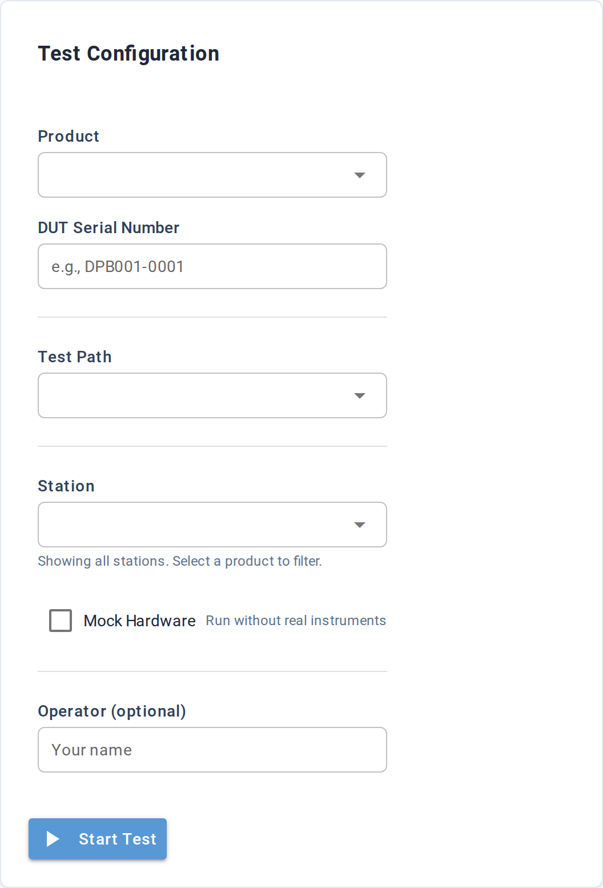

# Launch Test

**URL:** `/launch`

A single-form view for starting a test session from the browser
instead of the command line. Fill in the form, click Start Test, and
the page redirects to the live monitor at `/live/{run_id}`.

The form takes a Part, DUT Serial, Test Path, Station, optional
Operator name, and a Mock Hardware checkbox.

## Form

| Field | Purpose | Required |
|---|---|---|
| Part | The DUT part / part the test targets. Dropdown is populated from the project's `parts/` directory. Selecting a part filters the Station dropdown to compatible stations. | optional |
| DUT Serial Number | The serial number stamped on the unit you're about to test (e.g. `DPB001-0001`). Free-text. | yes |
| Test Path | Which test file or directory to run. Dropdown is populated from tests Litmus discovered in the project. | yes |
| Station | Which station to run on. Dropdown is filtered by the selected Part when one is selected; otherwise shows every station. A hint line below the dropdown tells you what's filtered ("3 compatible station(s)" / "Showing all stations. Select a part to filter." / "No compatible stations - consider mock mode"). | yes |
| Mock Hardware | When checked, runs against mock-instrument stand-ins instead of real hardware. Useful for dry runs and CI. | optional |
| Operator | Your name. Stamped on the run record for traceability. | optional |
| Start Test button | Submits the form. Validates required fields, starts the run via the API, then redirects to `/live/{run_id}`. |

If DUT Serial or Station is empty, the form pops "Please fill in
required fields". If Test Path is empty, the form pops "Select a
test directory". Either way the form stays on the page so you can
fix the input and retry.

## Pre-fill via URL

The Dashboard's station cards link here with the station pre-filled
(`/launch?station=<id>`). The Part field accepts the same query
parameter (`part=<id>`), and `mock=1` pre-checks the Mock Hardware
box. Useful for bookmarking a specific test setup.

| URL parameter | Pre-fills |
|---|---|
| `part` | The Part dropdown |
| `station` | The Station dropdown |
| `mock` | Set to `1` to pre-check Mock Hardware |

## After Start Test

Successful submit redirects to `/live/{run_id}` — the live monitor
view for the new session. From there, the run progresses through
`RunStarted`, step events, measurements, and finally `RunEnded`, at
which point the [Results detail](results/detail.md) page becomes
the canonical view.

A failure (network error, missing station, etc.) pops an error
toast and stays on the form so you can fix the input and retry.

## Underlying data

Stations come from the same `discover_stations` query the Dashboard
uses. Parts come from the project's `parts/` directory. Tests
come from the project's `tests/` directory (`discover_tests`).

The "compatible stations" filter behind the Part dropdown uses
the [capability matching](../../concepts/configuration/capabilities.md) machinery
— a station is compatible with a part when its instruments cover
every required characteristic of the part.

## Common tasks

- **Run a quick smoke test on this bench** — select Station, leave
  Part blank, pick a Test Path, check Mock Hardware, Start.
- **Production launch** — select Part first (filters stations),
  pick a compatible Station, enter DUT Serial, leave Mock unchecked,
  enter your name as Operator, Start.

## See also

- [Dashboard](dashboard.md) — the start screen that links here
- [Concepts → Capabilities](../../concepts/configuration/capabilities.md) — how
  the station-compatibility filter is computed
