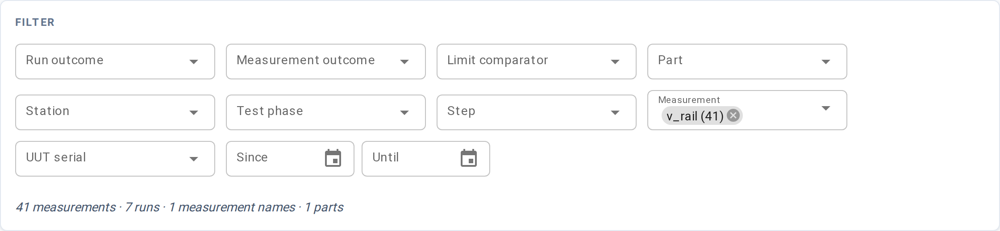
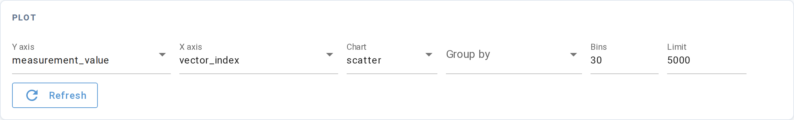
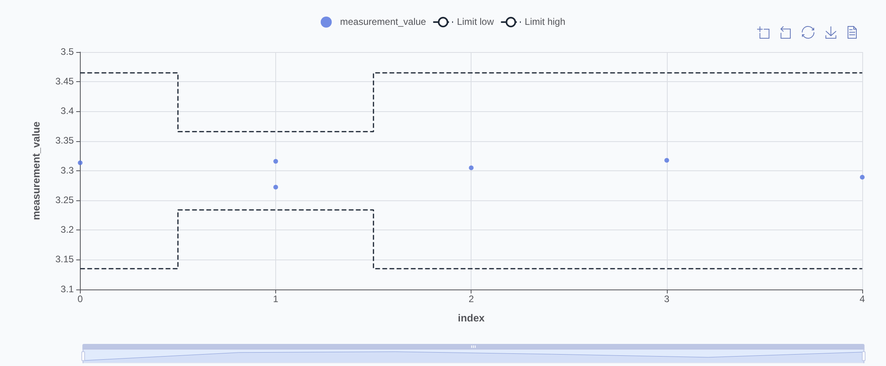

# Measurements

**URL:** `/explore`

A chart-based view of every measurement Litmus has recorded — filter,
scope, and plot. The table-based
[Results detail Measurements tab](results/detail.md#measurements) is
scoped to one run; this view spans the whole index, lets you filter
on any facet, and renders the result as a chart.

Use it to ask questions like "what did `vout` look like across
production runs on bench-3 last week?", "did this measurement
drift when we changed lots?", or "how is the limit margin
distributed for `iq` across all UUTs?"

When no measurements have been recorded yet, the page shows a
quick-start card with a minimal `verify` call that will populate it.

## Filter section

A row of facet widgets, each populated from values actually present
in the index. Changing any facet re-fetches the other facets' option
lists to reflect what remains available under your current selections
(Tableau-style cross-filtering).

| Facet | Filters by | Widget |
|---|---|---|
| Run outcome | The run's overall outcome (`passed`, `failed`, ...) | Multi-select |
| Measurement outcome | The individual measurement's outcome | Multi-select |
| Limit comparator | How the measurement is checked (`GELE`, `LE`, ...) | Multi-select |
| Part | UUT part number | Multi-select |
| Station | Which station ran the test | Multi-select |
| Test phase | The `test_phase` stamped on the run (`production`, `validation`, `characterization`, or any project-defined string) | Multi-select |
| Step | The step name the measurement belongs to | Multi-select |
| Measurement | The named measurement (`vout`, `iq`, ...) | Multi-select |
| UUT serial | A specific unit | Multi-select |
| Date range | Run start date Since / Until | Date pickers |
| Role | Whether the field is an `input`, `output`, or `measurement` | Multi-select |

A count below the row shows how many measurement rows the current
filter set matches, along with the number of distinct runs, measurement
names, and parts in scope.

## Plot controls

The PLOT card sits above the chart and decides what gets drawn.

| Control | What it does |
|---|---|
| Y axis | Which field to plot vertically. Required. Fixed columns (e.g. `measurement_value`, `vector_index`) appear by their plain name. Recorded input and output fields appear as `<name> (input)` or `<name> (output)`. |
| Y type | Appears only when the selected Y field has more than one observed value type in the data (e.g. a field recorded as both `scalar:float` and `scalar:int`). Pick the type to resolve ambiguity. Hidden when unneeded. |
| X axis | Which field to plot horizontally. Same choices as Y. Required for scatter, line, and bar; ignored for histogram. |
| X type | Same as Y type, for the X field. Hidden when unneeded. |
| Chart | One of `scatter` (default), `line`, `bar`, or `histogram`. |
| Group by | Optional. Plots one series per distinct value of the chosen column — e.g. group by `uut_serial` to show one line per UUT. Accepts fixed columns and input/output fields. |
| Bins | Histogram bin count. Range 2–200, default 30. |
| Limit | Maximum row count fetched. Range 10–100,000, default 5,000. |
| Refresh | Force a re-fetch. Filter and control changes already trigger a re-fetch automatically; use this to pick up new runs that arrived while the page was open. |

When Y is unset (or X is unset for scatter, line, and bar), the chart
area shows a placeholder until both are selected.

### Axis field vocabulary

The dropdown lists two kinds of entries:

- **Fixed columns** — system columns with a single stable name, such as
  `measurement_value`, `run_started_at`, `vector_index`, `uut_serial`.
  These appear by their plain column name. Identity and admin columns
  (run IDs, file paths, etc.) are excluded.

- **Input and output fields** — fields your tests recorded via
  `configure()` (inputs) and `observe()` (outputs). These appear as
  `<name> (input)` or `<name> (output)` — for example, `vin (input)` or
  `v_rail (output)`. The label reflects the field's role, not a
  prefix attached to the name.

The [Role facet](#filter-section) in the filter row lets you narrow the
axis options and data scope to a specific role (input / output /
measurement) before plotting.

## Chart

Interactive chart of the filtered rows. The chart kind matches the
PLOT control:

- **Scatter** — one point per measurement row at `(x, y)`
- **Line** — points sorted by X and connected
- **Bar** — bars at each distinct X value, height = average Y at that X (per group)
- **Histogram** — distribution of the Y field alone (X is ignored), bucketed by Bins count

When the Measurement filter is narrowed to exactly one measurement and Y
is `measurement_value`, a scatter or line chart overlays that
measurement's limit band as two dashed lines — the low and high bounds
from the most recent finalized run that carries limits. A constant limit
draws flat; a condition-indexed limit (one limit per vector) draws as a
step band tracking the X axis.

When the result set exceeds Limit, only the first Limit rows are
returned. Tighten the filter set or raise Limit if the chart looks
truncated; very large limits slow rendering.

The chart toolbar (top-right corner) provides box-zoom, reset-zoom,
save-as-PNG, and raw-data view.

## Live updates

The view subscribes to `run.ended` events and re-fetches the active
chart when a run finishes. No manual reload needed.

## Bookmarkable URL state

Every facet, axis selection, and chart setting lives in the URL so a
URL captures the exact view.

| Parameter | Meaning |
|---|---|
| Per-facet | Each multi-value facet repeats its column name as a query key (e.g. `?measurement_name=vout&measurement_name=iq`) |
| `since`, `until` | Date range, `YYYY-MM-DD` (omitted when blank) |
| `y` | Y axis when a fixed column is selected (e.g. `?y=measurement_value`) |
| `y_name`, `y_role` | Y axis when an input or output field is selected (e.g. `?y_name=vin&y_role=input`) |
| `y_value_type` | Y type override — only present when a polymorphic field requires disambiguation |
| `x`, `x_name`, `x_role`, `x_value_type` | Same scheme for X axis. `x` and related params are omitted when chart is histogram. |
| `group_by`, `group_by_name`, `group_by_role` | Selected group-by field (same fixed/field split as Y/X). Omitted when blank. |
| `chart_type` | `scatter` (default — omitted), `line`, `bar`, or `histogram` |
| `role` | Role facet selection — one `role=` key per selected role value. Omitted when blank. |
| `bins` | Histogram bin count (omitted at default 30) |
| `limit` | Max row count fetched (omitted at default 5,000) |

Defaults are stripped from the URL to keep it short.

## Common tasks

- **Distribution of one measurement** — set the Measurement facet to
  one value, Y to `measurement_value`, Chart to `histogram`. The spread
  shows across all runs in scope. Use Measurement outcome to isolate
  failures.
- **One measurement across UUTs over time** — set the Measurement
  facet, Y to `measurement_value`, X to `run_started_at`, Group by
  `uut_serial`. One line per unit.
- **Swept input vs measured output** — set Y to the output field
  (`v_rail (output)`), X to the input field (`vin (input)`). Chart
  shows the transfer curve across all runs.
- **Compare lots** — apply a Date range filter bracketing the lot, or
  group by a lot-correlated column such as `uut_lot_number`.

## See also

- [Results detail → Measurements tab](results/detail.md#measurements)
  — per-run measurement view
- [Metrics → Ppk](metrics.md#ppk) — process performance ranking
  across the same data
- [Query API reference](../query-api.md) — the `MeasurementsQuery`
  class this page calls
