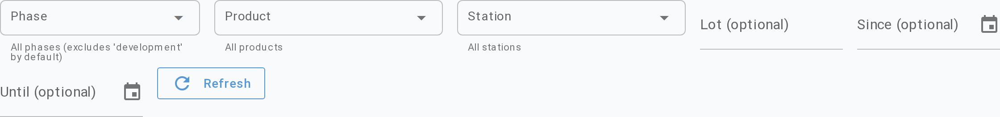
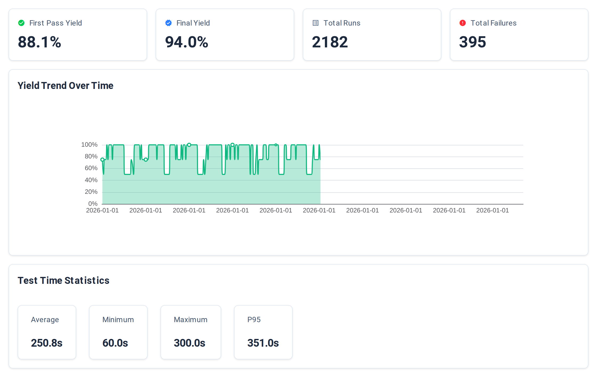
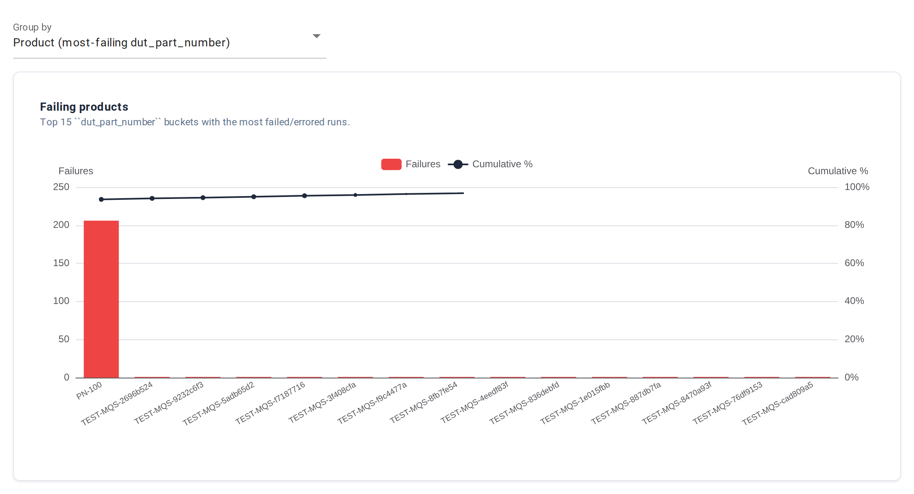
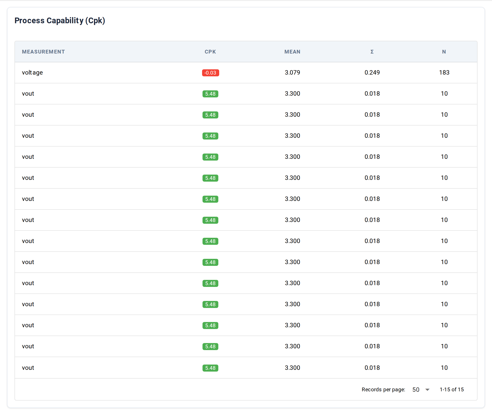

# Metrics

**URL:** `/metrics`

The Metrics view answers fleet-level questions across all runs in
the index. Six tabs share one filter bar: Yield, Pareto, Cpk,
Retest, Time loss, Assets.

## Filter bar

| Control | What it filters | Notes |
|---|---|---|
| Phase | Test phase (`development`, `validation`, `characterization`, `production`) | Multi-select. Defaults to "all phases except `development`" — set it explicitly to include dev runs. |
| Product | DUT part number | Multi-select. Populated from runs in the index. |
| Station | Station hostname | Multi-select. Populated from runs in the index. |
| Lot (optional) | Lot identifier | Free-text. Leave blank for all. |
| Since (optional) | Earliest run start, `YYYY-MM-DD` | Date picker, or type the date directly. |
| Until (optional) | Latest run start, `YYYY-MM-DD` | Date picker, or type directly. |
| Refresh | Force a re-fetch of the active tab | Filter changes already re-fetch automatically; use Refresh only to pick up new runs that arrived while the page was open, or when the live event subscription isn't running. |

All filters apply to every tab except Assets, which is keyed by
instrument role + resource rather than by run context.

The active tab fetches its data once and caches the result. Switching
to a tab you've already loaded reuses the cached result; changing any
filter clears all caches so every tab re-fetches on next visit.

## Tabs

The filter bar is shared. Each tab below shows a different lens on
the same filtered set of runs.

### Yield

The default landing tab. Three blocks stacked vertically.

**Summary cards** (top row, 4 cards):

| Card | Meaning |
|---|---|
| First Pass Yield | Percentage of DUT serials that passed on their first run |
| Final Yield | Percentage of DUT serials that ultimately passed (first run or any retest) |
| Total Runs | Run count in the filtered window |
| Total Failures | Run count with outcome `Failed` only. Errored runs are tracked separately under [Time loss](#time-loss); they don't roll into this count. |

**Yield Trend Over Time** — line chart of yield percentage bucketed
by day. The window's resolution is always daily; longer ranges show
more daily points, not a coarser bucket.

**Test Time Statistics** — 4 cards summarising per-run duration:
Average, Minimum, Maximum, P95.

### Pareto

Bar chart of failure counts grouped by one of three lenses
selectable via the **Group by** dropdown above the chart (URL
parameter: `pareto_group`):

| Group | Bars show |
|---|---|
| Product | Most-failing DUT part numbers |
| Step | Most-failing test / step names across the filtered runs |
| Measurement | Top 15 measurements with the most failures. Limited to limit-bearing measurements. Bars are labelled `step_name: measurement_name` so the same measurement name under different steps shows as distinct bars. |

The leftmost bar is the biggest single contributor to lost yield.

### Cpk

Process Capability index per measurement — how much margin each
measurement has against its limits. Top 15 measurements ranked by
Cpk ascending (**worst Cpk first**, so the table opens on what
needs attention).

| Column | What it shows |
|---|---|
| Measurement | Measurement name |
| Cpk | Cpk value. Color-coded: green ≥ 1.33, orange ≥ 1.00, red < 1.00. `N/A` (grey) when Cpk can't be computed — typically zero variance across samples, or no limits configured on the measurement. |
| Mean | Sample mean |
| σ (sigma) | Sample standard deviation |
| n | Sample count |

A measurement that doesn't appear in this table either has no
limits configured or has fewer than 10 samples in the filtered
window (the minimum-sample threshold for Cpk calculation).

### Retest

Bar chart + table of retest activity per daily period:

| Column | What it shows |
|---|---|
| Period | Daily bucket |
| Serials | Distinct DUT serials tested in the day |
| Retested | DUT serials that ran more than once |
| Rate | `Retested / Serials` as a percentage |
| Avg attempts | Currently displays `0.0` for all rows — the source query emits a mean-retries metric under a key the renderer doesn't read. Tracked as a known UI bug; the column will populate once the renderer is fixed. |

When no rows exist, the tab shows a message about how retest data is
populated.

### Time loss

Stacked-bar chart + table of wall-clock time spent per daily period,
split by outcome:

| Column | What it shows |
|---|---|
| Period | Daily bucket |
| Total (s) | Total wall-clock test time in the day |
| Pass (s) | Time spent on passing runs |
| Fail (s) | Time spent on failed runs |
| Error (s) | Time spent on errored runs |

The chart's stacked bars use green / red / amber for pass / fail /
error.

### Assets

Per-instrument utilization across the selected date window. Phase /
Product / Station filters don't apply here — instruments are keyed
by role + resource, not by run context.

| Column | What it shows |
|---|---|
| Role | Instrument role (e.g. `dmm`, `psu`) |
| Resource | VISA / SCPI / serial resource string |
| Sessions | Distinct connect-to-disconnect intervals in the window |
| Connected (s) | Total seconds the instrument was connected |
| Share | Percentage of total instrument-connected time in the window |

A blank `Since` means "no lower bound" — Litmus uses every event it
has. A blank `Until` means "up to right now."

When the window is empty (no instrument lifecycle events recorded),
the tab shows a message about how the data is populated.

## Bookmarkable URL state

Every filter and the active tab serialize to query parameters, so a
URL captures the exact view:

| Parameter | Meaning |
|---|---|
| `phase` | Repeat for each selected phase: `?phase=production&phase=validation` |
| `product` | Repeat per selected product |
| `station` | Repeat per selected station |
| `lot` | Lot filter value |
| `since`, `until` | Date range, `YYYY-MM-DD` |
| `tab` | `Yield` (default), `Pareto`, `Cpk`, `Retest`, `Time loss`, or `Assets` |
| `pareto_group` | `product`, `step`, or `measurement` (only meaningful on the Pareto tab) |

Sharing a Cpk URL with the Pareto group set has no effect — irrelevant
parameters are ignored by tabs that don't use them.

## Underlying data

The page reads from the same runs / measurements index as the
[Results list](results/list.md), with per-tab aggregation queries
running on demand when the tab loads. When a run finishes, the page
picks up the new data automatically (it watches for `run.ended`) —
no Refresh needed.

CLI equivalents per tab, all accepting the same filter flags
(`--phase`, `--product`, `--station`, `--since`, `--until`, `--lot`)
and `--json` for machine-readable output:

| Tab | CLI |
|---|---|
| Yield (cards + Test Time Statistics) | [`litmus metrics summary`](../cli.md#cli-metrics-summary) |
| Yield Trend Over Time chart | [`litmus metrics trend`](../cli.md#cli-metrics-trend) |
| Pareto | [`litmus metrics pareto`](../cli.md#cli-metrics-pareto) |
| Cpk | [`litmus metrics cpk`](../cli.md#cli-metrics-cpk) |
| Retest | [`litmus metrics retest`](../cli.md#cli-metrics-retest) |
| Time loss | [`litmus metrics time-loss`](../cli.md#cli-metrics-time-loss) |
| Assets | (no CLI equivalent yet) |

The same queries are available as Python classes in the analysis
module — useful for embedding metrics into a notebook or a custom
report.

## Common tasks

- **Find the dominant failure mode** — Pareto tab, set Group by to
  `Step`, then `Measurement`. The leftmost bar is the biggest single
  source of failures.
- **Spot a measurement riding the limit** — Cpk tab, scan for orange
  or red chips (Cpk < 1.33). Note the measurement name, then open
  the [Results list](results/list.md), drill into a recent run, and
  search the Measurements tab for that name to see the actual values.
  (The Cpk table itself doesn't link out.)
- **Justify a new station** — Time loss tab, sum the fail + error
  columns over the last month. Compare with the cost of operator
  rework.
- **Share an investigation snapshot** — set the filters, copy the
  URL, paste it into a chat or ticket. The recipient sees the same
  view.

## See also

- [Results list](results/list.md) — the run-level table this rolls up from
- [`litmus metrics` CLI group](../cli.md#cli-metrics) — per-subcommand
  links are in [Underlying data](#underlying-data) above
- [Concepts → Outcomes](../../concepts/outcomes.md) — how
  pass / fail / error are decided in the first place
