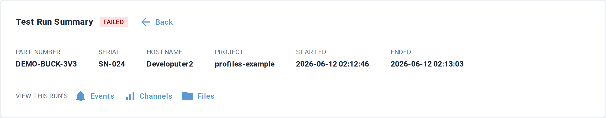
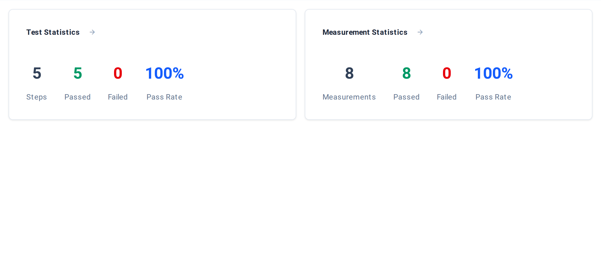
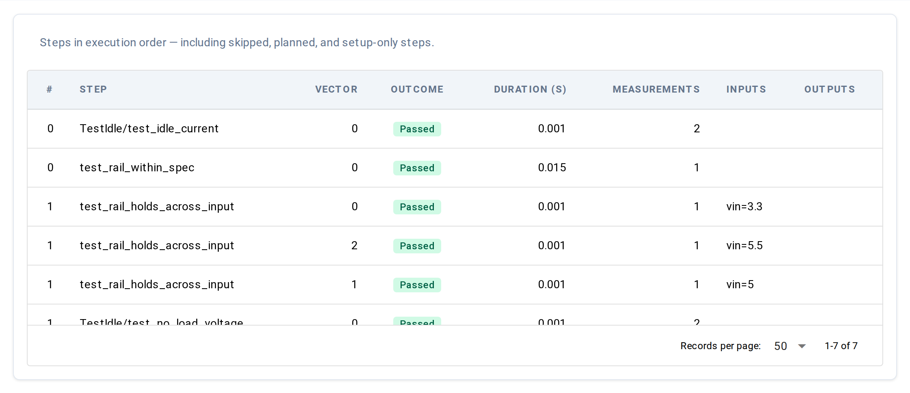
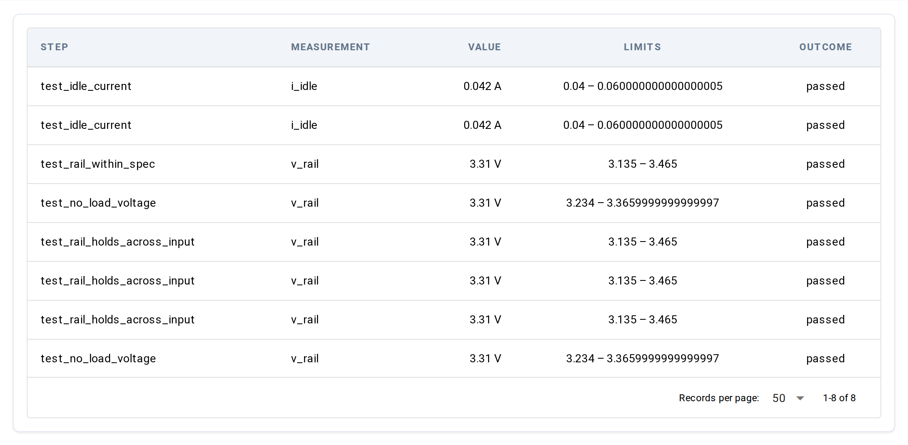

# Results — single run detail

**URL:** `/results/{run_id}`

The detail view is what you land on after clicking a row in the
[Results list](list.md). It shows everything TesterKit recorded for one
run: a sticky summary header, an Overview with stats, and tabs for
Steps, Measurements, the Execution Timeline (multi-site runs only),
and UUT History.

You can also leave it open during a run to watch progress live — the
status chip shows a "Live" indicator and the tables fill in as steps
and measurements arrive. See [Live updates](#live-updates) below.

If the run ID in the URL doesn't resolve, the page shows a
"Run not found." card with a link back to the list.

## Summary header

The header sticks to the top of the viewport as you scroll the tab
content. It carries:

| Element | What it shows |
|---|---|
| Title | The static label `Test Run Summary` |
| Outcome chip | Colored chip showing the current status. For finished runs the chip reads the final outcome (`PASSED`, `FAILED`, `ERRORED`, `SKIPPED`, `TERMINATED`, `ABORTED`, or `DONE`). For in-flight runs the chip reads `RUNNING`, and an animated blue dot + `Live` label appears next to it. |
| Back button | Returns to the [Results list](list.md) (`/results`) |
| Part Number | UUT part number stamped on the run |
| Serial | UUT serial number |
| Hostname | Station hostname that ran the test |
| Project | Project name from `testerkit.yaml` |
| Started | Run start timestamp, rendered in browser-local time |
| Ended | Run end timestamp, `—` while the run is in-flight (replaced live when the `run.ended` event arrives) |
| View this run's… | Buttons that open the **Events**, **Channels**, and **Files** screens filtered to this run's session |

## Tabs

Below the header, a tab strip switches between five views. The
Execution Timeline tab only appears for multi-site runs (sessions
with at least one measurement that carries a `site_index`).

| Tab | What's there |
|---|---|
| Overview | Two stats cards summarising steps and measurements |
| Steps | The step table — one row per step execution, in execution order |
| Measurements | The measurement table — one row per recorded measurement |
| Execution Timeline | (multi-site only) Gantt-style chart of all sites in the parallel session, with this run's site highlighted |
| UUT History | A short list of other runs for the same UUT serial |

The active tab is mirrored into the URL (`?tab=Steps`, `?tab=Measurements`,
etc.), so a bookmark lands the reader back on the same tab.

### Overview

Two cards. Each is clickable — click anywhere on a card to jump to
the corresponding tab.

**Test Statistics:**

| Stat | Meaning |
|---|---|
| Steps | Total step count for the run |
| Passed | Steps whose outcome is *not* `Failed`. Note this counts `Errored`, `Skipped`, and in-flight steps as passed too — it's a `total − failed` calculation, not "judged passed." |
| Failed | Steps whose outcome rolled up to `Failed` |
| Pass Rate | `Passed / Steps`, rendered as a percentage rounded down (e.g. `99.7%` shows as `99%`). Shown only when the run has at least one step. |

**Measurement Statistics:**

| Stat | Meaning |
|---|---|
| Measurements | Total measurement count for the run |
| Passed | Measurements with outcome `Passed` |
| Failed | Measurements with outcome `Failed` |
| Pass Rate | `Passed / Measurements`, rendered as a percentage rounded down. Shown only when the run has at least one measurement. |

### Steps

One row per step execution, in execution order — including skipped,
never-run, and setup-only steps.

| Column | What it shows |
|---|---|
| # | Sequence-relative position within the parent step. Sweep variants of the same step share this number, distinguished by Vector. |
| Step | Sequence-qualified path (e.g. `TestPowerSequence/test_efficiency`). Falls back to the step name when no path is recorded. |
| Vector | Which sweep variant. `0` for non-swept steps; otherwise `0..N-1` across the variants of a step. |
| Outcome | Colored chip showing the step's outcome. Beyond the final-state vocabulary listed for the header chip, step rows can also show `RUNNING` (step in flight), `WAITING` (queued / setup-only), and `NEVER RAN` (collected but never started). |
| Duration (s) | Wall-clock duration in seconds, formatted to 3 decimals. `—` when the step hasn't finished. |
| Measurements | Number of measurements recorded inside this step |
| Inputs | Commanded sweep parameters for this step / vector, rendered as compact `key=value` pairs (bare parameter names, e.g. `freq=1000.0, level=-10.0`). Blank for non-swept steps. |
| Outputs | Recorded vector-level observations for this step / vector, in the same compact `key=value` form. Blank when none were stamped. |

Empty steps render the `No steps recorded yet.` message in the table
body until the first row arrives.

### Measurements

One row per recorded measurement. Use this view when you care about
the values themselves, not the step structure around them.

| Column | What it shows |
|---|---|
| Step | The step name this measurement belongs to |
| Measurement | The measurement name passed to `verify` or `measure` |
| Value | Measured value with units appended (e.g. `3.31 V`). `—` when the measurement recorded no value (errored). |
| Limits | The low–high band the value was checked against (e.g. `3.135 – 3.465`). `—` when no limit was active. |
| Outcome | Colored chip showing the measurement outcome |

Below the table, an **Artifacts** card appears only when at least one
measurement carries an attached artifact (waveforms, screenshots,
logs, files). Each measurement with artifacts gets a row of buttons
you can click to download or view inline.

Empty measurements render the `No measurements recorded yet.` message
until the first row arrives.

### Execution Timeline (multi-site only)

The Execution Timeline tab only appears for multi-site parallel
sessions — runs where at least one measurement carries a `site_index`.
It loads on demand: the first time you click the tab, the chart
fetches the session's full step list and draws a Gantt of every
site's activity, with this run's site highlighted.

For single-site runs (the common case) the tab is hidden entirely.

### UUT History

A short table of other runs for the same UUT serial — useful for
"is this unit's last 5 runs all green?" checks. Loads on demand on
first click. Up to 10 rows, drawn from the project's most recent
100 runs — older history for the same UUT isn't shown here. Click
any row to jump to that run's detail page.

When no other runs exist for the UUT serial within that window, the
tab body shows `No other runs found for UUT: <serial>`.

## Live updates

When you open the page on an in-flight run, four event types feed
live updates:

- `run.ended` — flips the status chip from `RUNNING` to the final
  outcome, fills in the `Ended` timestamp, and stops the Live indicator
- `test.step_started` and `test.step_ended` — refresh the Steps table
  and the Overview stats
- `test.measurement` — refreshes the Measurements table and the
  Overview stats

Once the run ends, the page stops watching for updates and keeps the
final values. If live updates aren't available when the page loads,
the page stays static — refresh manually to see new rows.

## Underlying data

The detail view shows the run header/status, its steps, and its
measurements — the same run data as the [Results list](list.md), with
the step and measurement detail. The same data is available from the
CLI and Python:

- [`testerkit show {run_id}`](../../cli.md#cli-show) — pretty-printed
  overview; `-f json` for machine-readable, `-f html`/`pdf` for a
  rendered report
- [`testerkit export {run_id} -f csv|json|stdf|hdf5|tdms|mdf4`](../../cli.md#cli-export)
  — dump the run in a downstream-tool format

For the Python equivalents, see [`RunsQuery` and friends](../../data/query-api.md).

For the underlying schemas, see
[Models reference → `RunSummary`](../../data/models.md#model-runsummary),
[`TestStep`](../../data/models.md#model-teststep), and
[`Measurement`](../../data/models.md#model-measurement).

## Common tasks

- **Drill into a failing measurement** — open the Measurements tab,
  scan for `FAILED` chips, then jump to the UUT History tab to see
  whether the prior run for the same UUT had the same failure.
- **Pull a waveform or log** — Measurements tab, scroll to the
  Artifacts card below the table, click the artifact button.
- **Watch a long test live** — open the detail page during the run
  and leave it; the chip shows `RUNNING` with a Live dot, and tables
  fill in as steps and measurements arrive.

## Bookmarkable URL state

The active tab is mirrored into the URL via the `tab` query parameter:

| URL | Tab |
|---|---|
| `/results/{run_id}` | Overview (default) |
| `/results/{run_id}?tab=Steps` | Steps |
| `/results/{run_id}?tab=Measurements` | Measurements |
| `/results/{run_id}?tab=Execution%20Timeline` | Execution Timeline (multi-site only) |
| `/results/{run_id}?tab=UUT%20History` | UUT History |

Bookmarking the URL bookmarks the run + the open tab.

## See also

- [Results list](list.md) — the table you came from
- [`testerkit show` CLI](../../cli.md#cli-show) — the same data over the
  command line
- [Concepts → Outcomes](../../../concepts/execution/outcomes.md) — what each
  outcome value means and how rollups work
- [Concepts → Step hierarchy](../../../concepts/execution/step-hierarchy.md) —
  how classes, methods, and vectors nest in the Steps table
