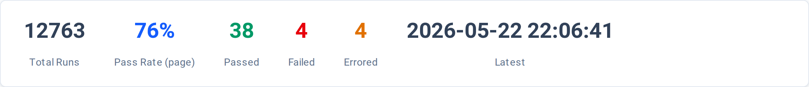
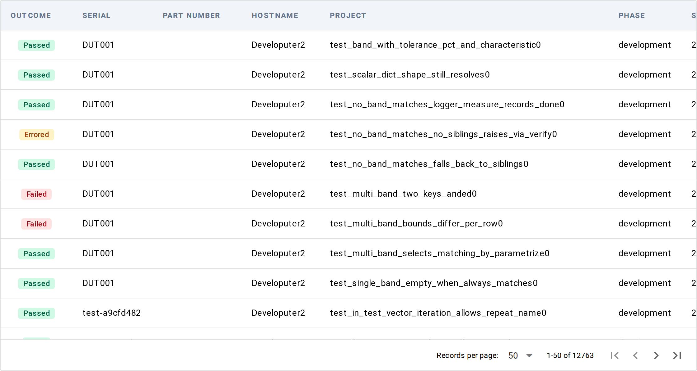

# Results — list view

**URL:** `/results`

Every Litmus run lands in this table — finished and in-flight side by
side — sorted by start time, newest first. The view has two parts: a
stats strip above the table and the table itself.

Use it to find a specific run by serial, scan today's pass rate, drill
into a failing run, or watch a station's activity live.

## Stats row

When the table has rows, a card strip above the table summarises the
current page's outcomes:

| Stat | Meaning |
|---|---|
| Total Runs | Total run count across all runs Litmus has recorded — not just the visible page. |
| Pass Rate (page) | Percentage of rows on the visible page with outcome `Passed`. |
| Passed | Rows on the visible page with outcome `Passed` (green chip). |
| Failed | Rows on the visible page with outcome `Failed` (red chip). |
| Errored | Rows on the visible page with outcome `Errored` (amber chip). |
| Latest | Start time of the first row on the visible page under the current sort. Under the default sort (Started, newest first) this is the newest start; under any other sort it's the start time of whichever row appears first. |

The rates and counts (except Total Runs) follow pagination — flip to
the next page and the numbers reflect that page's outcomes.

## Table

Click a row to open the run's detail page at `/results/{run_id}`.

| Column | What it shows | Sortable |
|---|---|---|
| Outcome | Colored chip — Passed, Failed, Errored, Skipped, Aborted, Terminated, Done, or Running for in-flight runs | yes |
| Serial | DUT serial number stamped on the run | yes |
| Part Number | DUT part number | yes |
| Hostname | Station hostname that ran the test | yes |
| Project | Project name from `litmus.yaml` | yes |
| Phase | Test phase facet (e.g. `development`, `production`, `characterization`) | yes |
| Started | Run start timestamp, rendered in browser-local time | yes |
| Steps | Total step count for the run | yes |
| Meas | Total measurement count for the run | yes |
| Ended | Run end timestamp, blank for in-flight runs | no |

The table body scrolls, the header stays pinned. Click a sortable
column header to sort by that column; the sort applies to all runs in
the index, not just the visible page (the next page reflects the
sorted order). Cells with no value (e.g. a run with no part number
stamped) render blank.

The pagination footer at the bottom shows the current range
(`1-50 of N`) and a rows-per-page selector with options of 10, 25, 50,
100, and "all."

## Live updates

The table watches the event log for run starts and ends and refreshes
itself — no manual reload needed. Updates are scoped to the project's
data directory (`data_dir` in `litmus.yaml`, or the default Litmus
home if unset). Runs from other projects pointing at a different data
directory don't appear here.

## Empty state

When the table has no rows, the stats strip is hidden and a single
card appears with a "Launch a Test" button that jumps to the Launch
Test view (`/launch`). Fresh installs always start in this state.

## Underlying data

The table reads from the runs index Litmus maintains in the background
under the project's data directory. Each row corresponds to one Litmus
run — the same record you get from:

- `litmus runs` on the command line
- `litmus runs --json` for machine-readable output
- `RunsQuery` in the [Python query API](../../query-api.md)

For the full schema of one run row, see
[Models reference → `RunSummary`](../../models.md#model-runsummary).
For the underlying event log Litmus materialises run rows from, see
[Concepts → Event log](../../../concepts/event-log.md).

## Common tasks

- **Find a flaky test** — sort by Outcome, then scan for tests that
  appear with both `Passed` and `Errored` outcomes across recent runs.
- **Compare two runs from the same DUT** — sort by Serial, open the
  two run detail pages in adjacent tabs.
- **Watch live activity** — leave the view open during a test run;
  the table auto-refreshes on `run.started` / `run.ended` events.

## Bookmarkable URL state

This view does not currently encode filters or pagination in the URL —
the page always opens with the default sort (Started, newest first)
and the default 50-rows-per-page. Bookmarking the URL bookmarks the
landing state, not the current view.

## See also

- [`litmus runs` CLI](../../cli.md#cli-runs) — the same data over the
  command line
- [Concepts → Outcomes](../../../concepts/outcomes.md) — what each
  outcome value means and how rollups work

The per-run detail view you reach by clicking a row gets its own
reference page in an upcoming commit.
